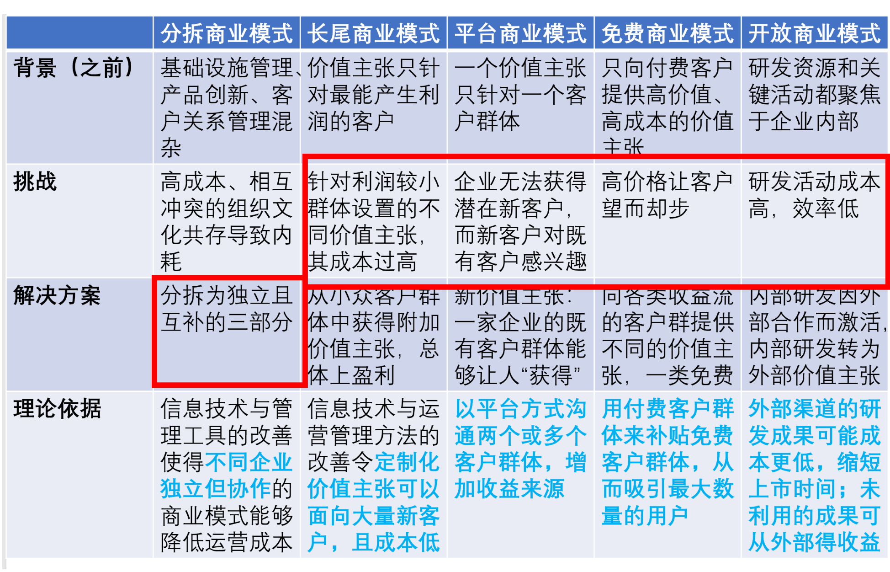

Exam1-商业模式
---

# 1. 商业模式画布
1. 客户细分
   1. 目标人群、取舍与细分
   2. 条件：新供给、新分销、新模型、利润率不同、特殊改进
   3. 群体划分：大众市场、小众市场、求同存异的客户群体、多元化的客户群体、多边平台
2. 价值主张
   1. 有价值的产品和服务
   2. 让事情更简单(保姆式服务、便利性、价格)、更复杂(定制)、更透明(风控)
3. 渠道通路
   1. 价值主张通过沟通、分发以及销售渠道传给客户
   2. 知名度-评价-购买-传递-售后
4. 客户关系
   1. 以客户群为单位建立
   2. 驱动
      1. 开发新的客户
      2. 留住原有的客户
      3. 增加销售量
   3. 客户关系类型：私人服务、专属私人服务、自助服务、自动化服务、社区、与客户协作
5. 收益来源：
   1. 用户真正愿意付费的点
   2. 收入来源
      1. 资产销售
      2. 使用费
      3. 会员费
      4. 租赁
      5. 许可使用费
      6. 经纪人佣金
      7. 广告费用
6. 核心资源
   1. 保证运行的最重要资产(品牌也算)
   2. 核心资源
      1. 实物资源
      2. 知识性资源
      3. 人力资源
      4. 金融资源
7. 关键业务
   1. 为实现供给和支付所需要完成的关键业务活动
   2. 关键业务类型
      1. 生产
      2. 解决方案
      3. 平台/网络
8. 重要合作
   1. 供应商和合作伙伴网络
   2. 分类
      1. 非竞争者的战略联盟
      2. 竞争者的战略联盟(合作)
      3. 为新业务建立合资公司
      4. 为可靠供应商建立供应商和采购商关系
   3. 动机
      1. 优化以及规模效应
      2. 降低风险和不确定性
      3. 特殊资源及活动的获得
9. 成本结构
    1. 固定成本
    2. 可变成本
    3. 规模经济
    4. 范围经济

# 2. 商业模式类型
1. 分拆商业模式
   1. 客户关系管理
   2. 新产品开发
   3. 基础设施管理
2. 多边平台商业模式：**两个或更多独立但相互依存**的客户群体连接到一起。
   1. 价值主张：
      1. 吸引用户
      2. 群体配对
      3. 平台交易降低成本
   2. 核心是贴补正确的客户群
   3. 关键活动 
      1. 平台管理
      2. 服务实现
      3. 平台升级
   4. 先吸引某一个群体加入平台，明确群体加入平台的目的。
3. 免费商业模式
   1. 在免费商业模式，至少有一个关键的客户群体是可以持续免费地享受服务。
   2. 三种：
      1. 广告商业模式
      2. 免费增值：保险
      3. 诱饵&陷阱：专利阻断
4. 长尾商业模式：二八定律，图书、乐高
   1. 生产工具的普及
   2. 销售渠道的普及
   3. 连接供需双方的搜索成本降低
5. 开放商业模式：系统性与外部伙伴合作，宝洁、葛兰素史克、连接器
   1. "由外到内"：将外部的理念、技术或知识产权引入内部
   2. "由内到外"：将内部的知识产权或技术，特别是闲置资产向外出售

# 3. 商业模式设计
1. 客户洞察
   1. 看：描述该客户在她所处的环境中所**看到的东西**，同类产品、朋友、看我们的产品
   2. 听：描述环境如何**影响到这个客户**
   3. 想&感受：尝试勾勒你的**客户思维**的过程，重要、打动
   4. 说&做：想象客户可能的**言辞**，或公共场合的**行为**(本产品尚无出现)
   5. 痛点：**已遭受的挫折、正遇到的阻碍、怕承担的风险**
   6. 收益：**预期成就、成功衡量标准、实现目标所采用的策略**
2. 构思
   1. 灵感、构思、实施
   2. 头脑风暴法
   3. 资源驱动、供给驱动、客户驱动、财务驱动、多点驱动
   4. 如果...会怎么样？
3. 视觉化思考
   1. 识别各个元素的关系，形成共同理解
   2. 过程：理解、对话、探索、沟通
   3. 便利贴 + 绘画
   4. 作用
      1. 理解商业模式的本质
      2. 提升对话效率
      3. 探索创意
      4. 提升沟通
4. 模型构建
   1. 控制规模
      1. 随手素描
      2. 精心描绘的画布
      3. 商业案例
      4. 实地验证
5. 讲故事
   1. 公司视角
   2. 客户视角
   3. 未来视角
6. 场景
   1. 不同客户结构
   2. 未来环境
   3. 为故事补充场景
      1. 了解与评估
      2. 购买
      3. 获得
      4. 交互
      5. 售后
      6. 评价与复购

# 4. 战略
1. 商业模式环境
   1. 宏观经济影响：全球市场、资本市场、大宗商品和其他资源、经济基础设施
   2. 市场影响力：市场问题、分类、需求与诉求、切换成本(转向竞争对手)、收入影响力
   3. 行业影响力：竞争对手、新进入者、替代品和竞品、利益相关者
   4. 关键趋势：行业管理趋势、技术趋势、社会文化趋势、社会经济趋势
2. 评估商业模式(SWOT)
   1. 价值主张：**用户需求、网络效应(相互关联促进)、强耦合、用户满意**
   2. 成本/收入:**利润高、收入可预期、收入可持续、收入多样化、支出前有进账、抓住客户意愿、想要的和提供的一致**
   3. 基础设施：**竞争对手复制、需求可预期、合适时间部署合适资源、有效执行关键业务、难以被复制、质量高、内外平衡、必要合作、合作关系**
   4. 客户界面：**用户流失、用户分类、新用户、渠道有效率、有效果、触达效果好、客户可以轻易接触渠道、渠道被高度整合、渠道规模经济、渠道匹配客户群体、客户关系强、切换成本高绑定关系、品牌强**
   5. 评估优势、劣势、风险、机遇都基于上面四部分
   6. 威胁
      1. **对价值主张的威胁(可替代性)**
      2. **对成本/收入的威胁(利润的威胁、是否单一、缩水、无法预测、无法支撑)**
      3. **对基础设施的威胁(供应不足、干扰、合作关系波动)**
      4. **客户界面上的威胁(市场竞争、渠道威胁、客户关系恶化)**
   7. 机会
      1. **价值主张中的机会(整合、服务化与拓展)**
      2. **成本/收入中的机会(可重复、交叉销售、开源节流)**
      3. **基础设施中的机会(强化核心、减轻负担、转让闲置)**
      4. **客户界面的机会(增长的市场、客户细分、渠道优化与去中间商，客户关系加强与取舍)**
3. 从商业模式角度看蓝海战略
   1. 蓝海战略：通过**根本性的差异化**来创造全新的行业，而不是通过**模仿现有商业模式在当前行业中竞争**(价值创新)
   2. 四项行动架构：增加价值、减少成本
      1. 删除
      2. 削减
      3. 提升
      4. 创造
   3. 三个视角出发
      1. 客户群体
      2. 价值主张
      3. 成本
   4. 蓝海精神：持续打造和运营产品体系
4. 管理多种商业模式
   1. 成功应对如何在实施和管理新商业模式的同时维持现有的商业模式这个挑战的组织被称为:**二元组织**。
   2. 双变量准则：冲突程度、战略相似性

# 5. 商业模式设计
1. 设计与创新：满足、投放、改进、创造市场
2. 动员：项目合法性、管理利益、跨职能团队、引导决策者
3. 理解：绘制并评估当前商业模式、跳出现状看问题、不要局限于当前的客户群体、展示进展
4. 设计：避免对大胆想法的遏制、参与式设计、思考新旧模式之间的关系、避免聚焦短期利益
5. 实施：管理路障、项目赞助人、新旧商业模式关系、内部沟通
6. 管理：商业模式管理机制、管理协同和冲突、商业模式组织、空杯心态

# 6. 五个课题
1. 超越经济效益的商业模式
2. 三重损益的商业模式
3. 在组织中执行商业模式