Lecture1-导论
---

# 1. 什么是软件

## 1.1. 组成成分的角度
1. 软件:代码 + 文档
2. 代码:算法 + 数据结构
3. 算法:有穷明确可行的指令集+计算平台
4. 数据结构:数据元素之间的逻辑结构与物理结构
5. 计算平台:编译器+操作系统/操作系统+硬件

## 1.2. 从问题求解的角度
1. 作为一种复杂的信息制品，软件是对客观事物的深度抽象与建模，且同时包含了对复杂客观世界的**问题空间**与**解空间**的具体描述

# 2. 问题域与解系统

## 2.1. 问题域
1. 问题产生地:当**现实的状况与人们期望的状况产生差距**时，就产生了问题。
2. 要解决问题，就需要**改变现实当中某些实体的状态或改变实体状态变化的演进顺序**，使其达到期望的状态或演进顺序。
3. 这些实体和状态构成了问题解决的基本范围，称为该问题的问题域（Problem Domain）

## 2.2. 解系统
1. 软件系统通过影响问题域，能够帮助人们解决问题，称为解系统。
   1. **问题域是自治的，它有自己的运行规律，而且这些规律不会因解系统的引入而发生改变**
   2. 用户应关注问题域，开发者应以问题域为中心思考

## 2.3. 例子
1. 扇贝(一个背英文单词的APP)
2. 扒手、修车

## 2.4. 软件解决问题的基础：模拟与共享

1. 软件系统能够与问题域进行交互和相互影响的原因在于，**软件系统中的某些部分对问题域中的某些部分的具有模拟特性**
   1. 软件系统当中含有问题域某些部分的模型（或模拟），常见的模型包括数据模型、对象模型、处理模型等。 
   2. 问题域中的某些信息能够和模型中的信息建立映射关系
2. 软件可以分为面向专业用户的纯工具型软件、面向普通用户的纯工具软件和应用型软件和应用型软件。
   1. 专业用户：软件具有功能的复杂性和使用的高效性
   2. 普通用户：软件以功能的有用性为首要成功标准
3. 模拟性:
   1. 目的性
   2. 正确性
   3. 现实可理解性
4. **这些通过映射建立的共同知识，就是问题域和解系统之间的共享现象**
   1. 利用数据表模拟库存与金额、坐标模拟位置、账户登录模拟开锁或授权，像素模拟图形、流数据模拟音频视频、ai模型模拟智力
   2. 游戏中的PVE与PVP互动、支付软件中的转账与支付、各种匹配、调度与推荐算法（游戏对手、商品、打车、短视频、信息流、相亲）

# 3. 需求

## 3.1. 需求的两个维度

### 3.1.1. 需求(要求，问题域端)
1. 直接需求:是直接涉及到需求，加上检查
2. 间接需求:是在外部解决问题的需求，吹走没有东西的盒子
3. 不切实际的需求

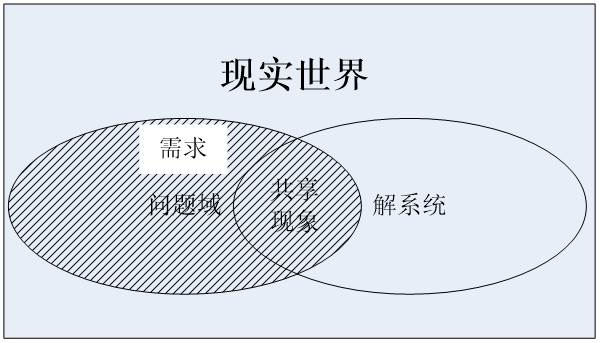

### 3.1.2. 需求规格说明(解系统端)
1. 数据：现实世界的模型
2. 功能：对模型的操作，将结果反馈回现实世界，（辅助）解决问题
   1. 过程式分析：以功能分解为核心
   2. 面向对象分析：以封装的数据与对数据的操作为核心

## 3.2. 需求的四个基本概念：
1. 问题域
2. 需求
3. 解系统
4. 需求规格说明

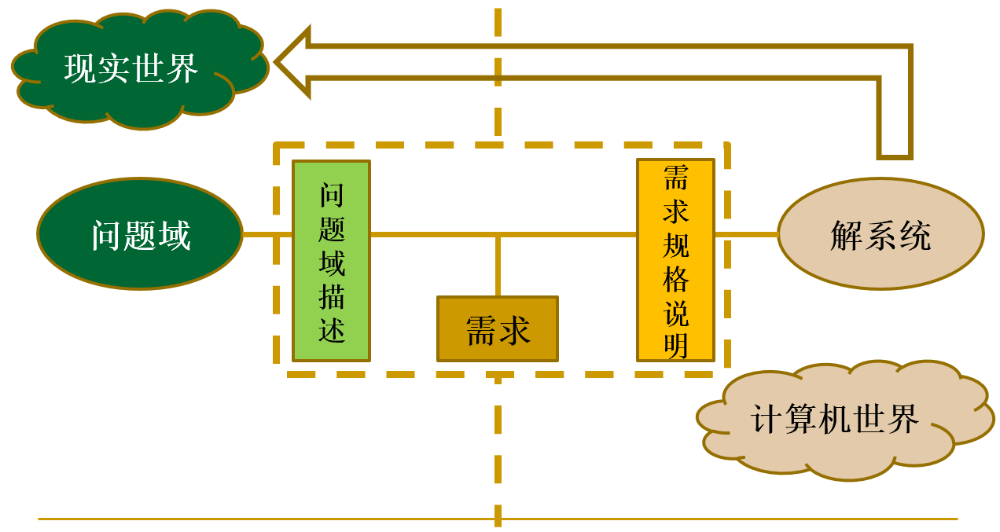

## 3.3. 什么是需求(IEEE)
1. 用户为了解决问题或达到某些目标所需要的条件或能力；
2. 系统或系统部件为了满足合同、标准、规范或其它正式文档所规定的要求而需要具备的条件或能力；
3. 对1或2中的一个条件或一种能力的一种文档化表述。

## 3.4. 需求的重要性

### 3.4.1. 年代的软件生产状况调查 Standish Group 1995
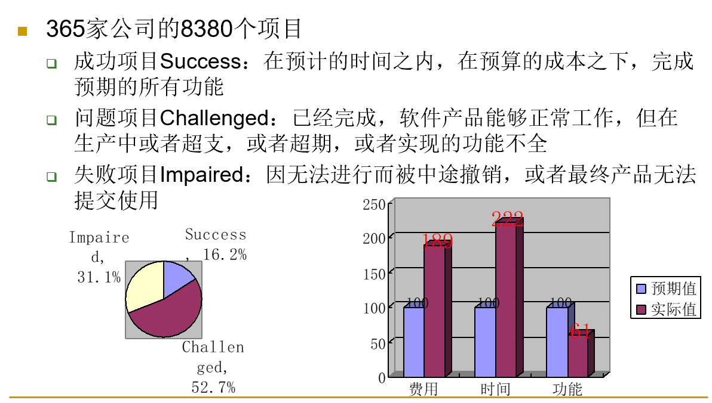

>需求开发影响

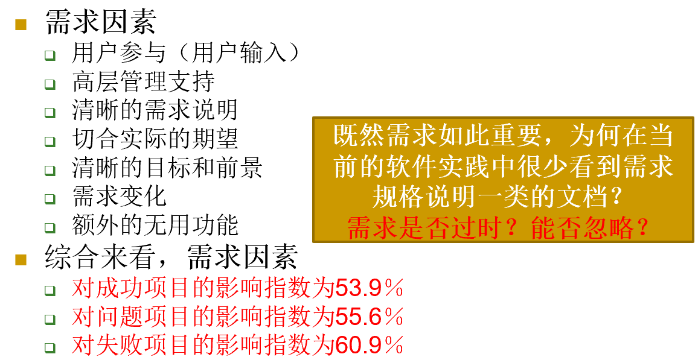

### 3.4.2. 当前需求的重要性 -《Are requirements alive and kicking?》 YES 2010
1. 03年时，需求专家尚未意识到敏捷开发带来的颠覆式变革
   1. 正式的需求文档、需求归约说明（SRS）逐渐较少出现
   2. 系统复杂性升高，开发迭代加快，软件维护成为最主要的开发活动
2. 然而，**需求依然是沟通客观世界与计算机世界的唯一渠道**
   1. 只要人类还试图掌握程序运行的方向与原因，需求就无法被忽略
   2. 需求依然存在于其它类型的系统功能文档中：“shall” statements, use cases, sketches, user stories, acceptance tests, formal logic, goal models, state charts，release notes，issues，commit logs
3. 主流开发方式变化对需求开发与管理所带来的挑战：
   1. 分布式开发与外包导致团队交流困难
   2. 代码自动生成、自适应软件、安全攸关软件对需求质量的高要求
   3. **每次功能迭代都必须考虑新功能对已有系统功能与实现的影响**

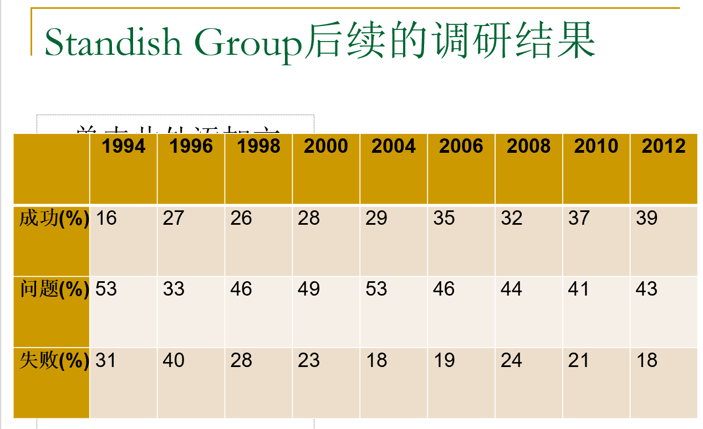
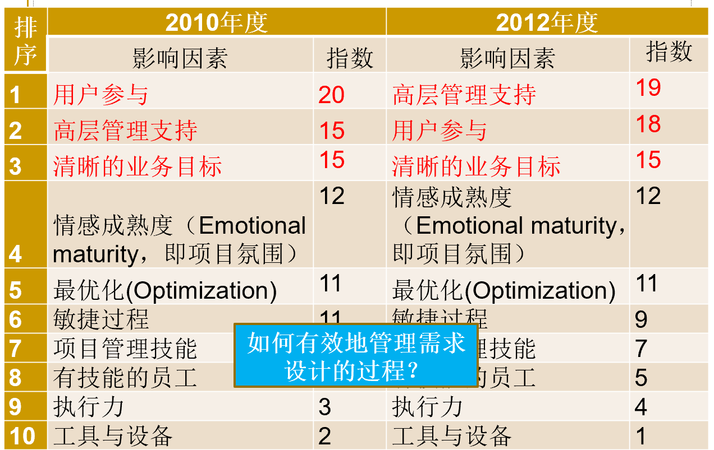

## 3.5. 需求工程的概念
1. 是软件工程的一个分支
   1. 它关注于软件系统所应予实现的现实世界目标、软件系统的功能和软件系统应当遵守的约束
   2. 同时它也关注以上因素和准确的软件行为规格说明之间的联系
   3. 关注以上因素与其随时间或跨产品族而演化之后的相关因素之间的联系
2. **学生容易忽略需求工程重要性（求解的问题明确，项目规模小，非真实世界应用）**
   1. “开发软件系统最为困难的部分就是**准确说明开发什么**。最为困难的概念性工作便是**编写出详细技术需求，这包括所有面向用户、面向机器和其它软件系统的接口**。同时这也是一旦**做错，将最终会给系统带来极大损害的部分，并且以后再对它进行修改也极为困难。**” Frederick Brooks[Brooks1987]

## 3.6. 需求工程与系统工程
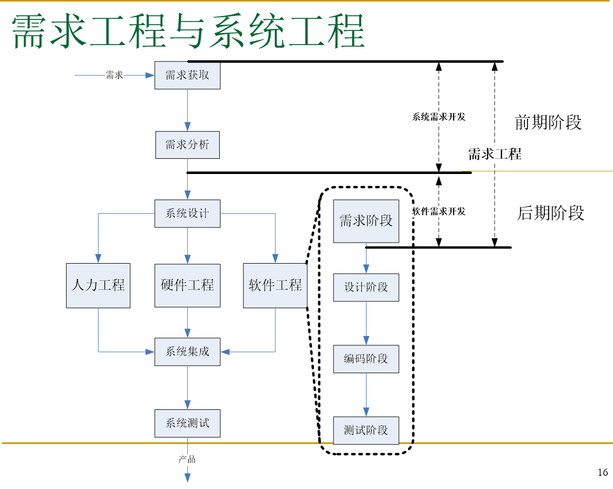

## 3.7. 需求错误的高代价性
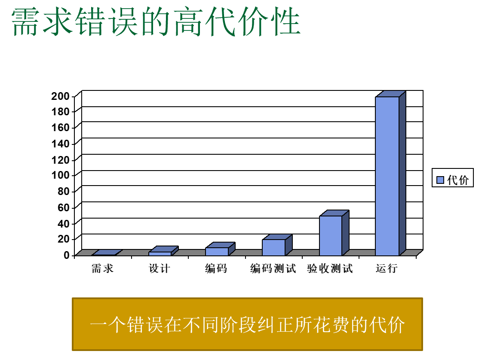

>Win XP -> Win 7/Win 8 的失败 -> Win 10

## 3.8. 需求工程的基本活动与实质
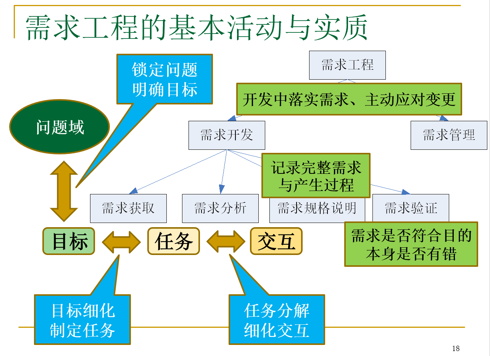

1. 绿色和蓝色都是创造性的活动。

## 3.9. 需求工程活动的困难性
1. **问题域、目标、任务、交互的相互转化**（广义的设计）是**创造性的活动**
   1. 每个案例都有其独特性，不可复用，接近于艺术
   2. 需要对问题所在的领域有着深刻的认识
   3. **需要掌握一套设计思维与辅助工具，并多多练习**
2. 编程与设计方面的能力不能直接用于需求分析 
   1. **设计和编程都有构建高质量（健壮性、可维护性、适应性等等）软件的共同目标**，而且使用相同的概念和组织机制保证了从设计到编程的平滑过渡，所以，结构化与OO思维在设计领域也取得了成功 
   2. 但是**需求分析**除了拥有构建高质量软件的目标之外，还有一个更加重要的目标是**理解现实（“出圈”） 中的非技术性和社会性因素**
3. **文档撰写、功能验证、基线管理**需要丰富的开发与管理经验
   1. 资（nian）深（mai）程序员与新（nian）手（qing）程序员最大的区别

# 4. 课程关联
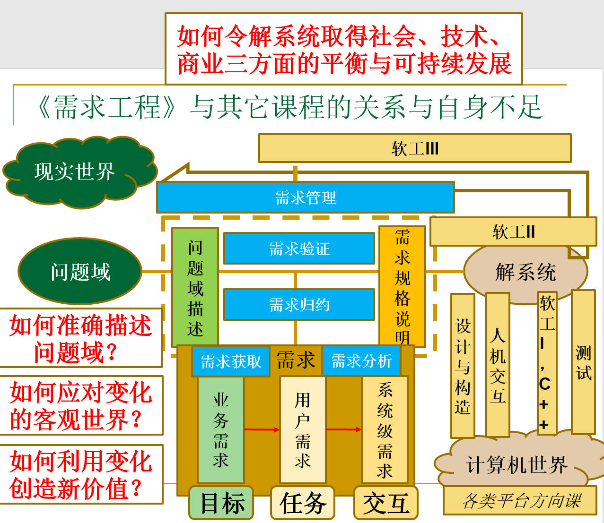

# 5. 非技术性和社会性因素带来的需求工程困难
1. 以“企业”为中心的软件反映了软件规模日益扩大
   1. 所有的公司都将要成为软件公司
   2. 一个可持续发展的公司必须追求用户、技术、企业三者的平衡
   3. 这要求软件必须能够帮助解决企业内组织机构、业务流程、利益获取与分配的各种问题，最终实现降本增效。

# 6. 商业模式

## 6.1. 从业务转向“人”：商业模式的重构
1. 背景：信息互联技术近四十年的高速发展
   1. 信息技术服务的边界成本接近于零:倾向于取得垄断地位，庞大流量所带来的印钞机式的盈利模式
   2. 人与人互联的成本极大地降低:实质上改变了人类社会的组织形式（社交、企业、政治）
2. 促使软件设计从针对企业已有的业务转向面对企业产品的（潜在）用户群体
   1. 新技术与社会变革导致商业模式上大量“以旧换新”
      1. 构建新商业模式时必须完成新价值主张与用户概况的对接
      2. 新商业模式可以是来自于新企业，也可以源于既有组织
      3. 移动互联网产品：产品直接服务于普罗大众（无明确对象）

## 6.2. 商业模式原理
1. 商业模式定义：一个商业模式描述的是一个组织创造、传递以及获得价值的基本原理，其本质在于价值的流动
2. 价值创造与流动过程
   1. 企业或组织通过提出的产品或服务主张某种价值（问题解决），并寻找到愿意为该价值主张的“付费”的客户群体。
   2. 价值主张传导到客户需要建立渠道通路并维持客户关系
   3. 价值主张往往需要“上游”的核心资源和关键合作（成本来源）

## 6.3. 需求设计也需要掌握商业模式设计
1. 需求开发也需要一套可以简单描述和操控的商业模式分析工具，并具备商业模式思维
   1. 通过分析工具全面、系统、准确地刻画问题域:**为后续目标、任务、交互的逐层转化以及相应的归约描述、验证、管理服务**
   2. 更好地做到以“人”为中心的设计，平衡用户、技术、商业三者的关系，实现企业或组织的可持续发展:**创新创业、互联网产品设计、开发团队内部沟通**
   3. 应对愈发成熟的信息科技加速下沉到传统业务领域所带来的挑战与机遇:**软件逐步成为所有公司的核心，并围绕软件开发设置组织部门（新岗位）**
   4. 追求“设计思维” ：以人为根本，构建功能性与情感意义兼具的创意:**产品“质感”与“情怀”的来源，“人民追求更高水平生活”，供给侧改革**

## 6.4. 商业模式画布概览
1. 从左到右实现价值的构建、主张与传递
   1. 左侧构建价值，产生成本，代表理性
   2. 右侧主张价值，获取收益，代表感性

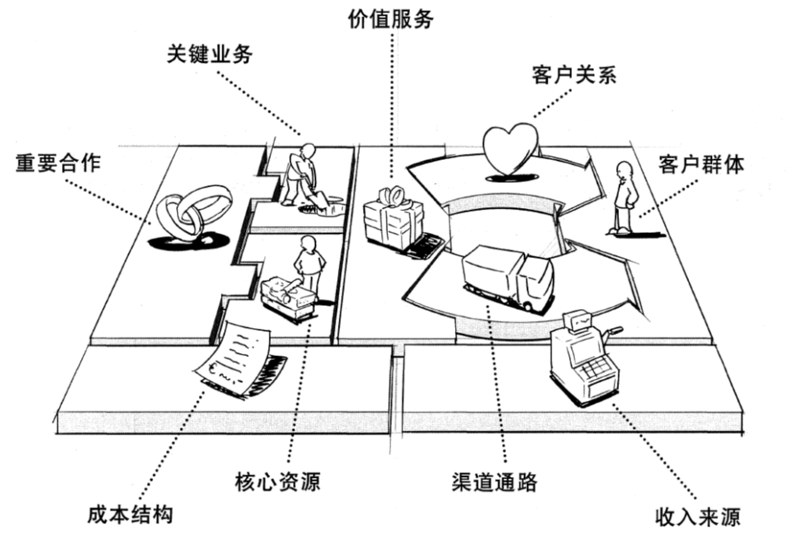

## 6.5. 围绕商业模式的基本活动
1. 画布：基本模型与工具
2. 类型：利用画布分析常见的商业模式
3. 设计：商业模式的构建手段
4. 战略：商业模式的环境、评估、规划、管理
5. 流程：完整的商业模式设计流程

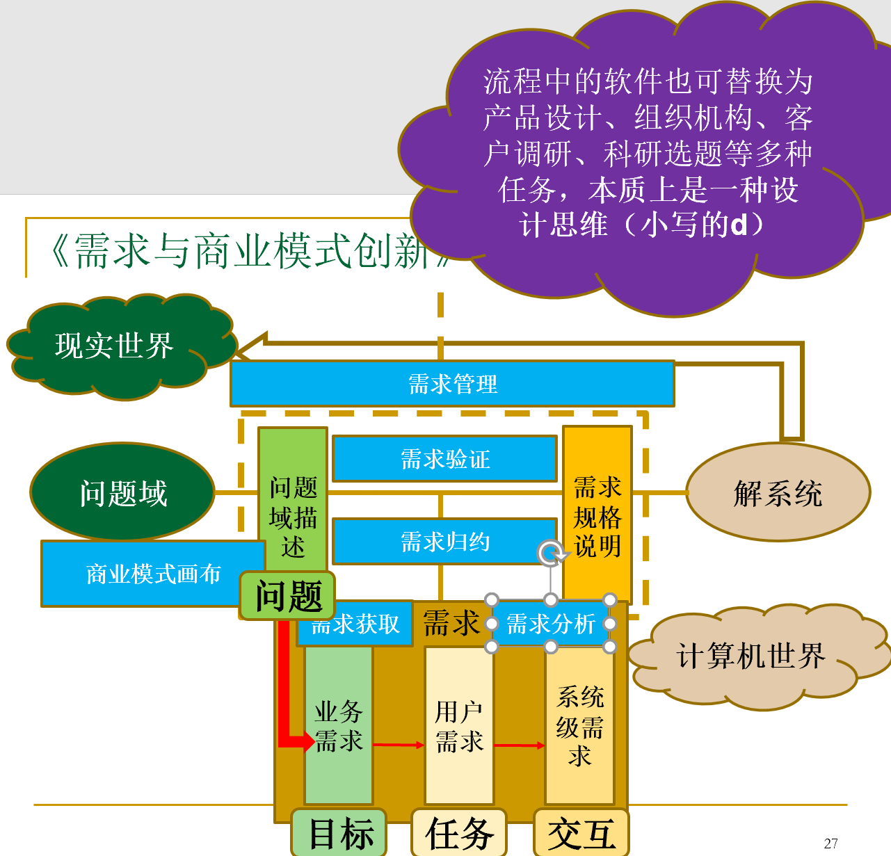
