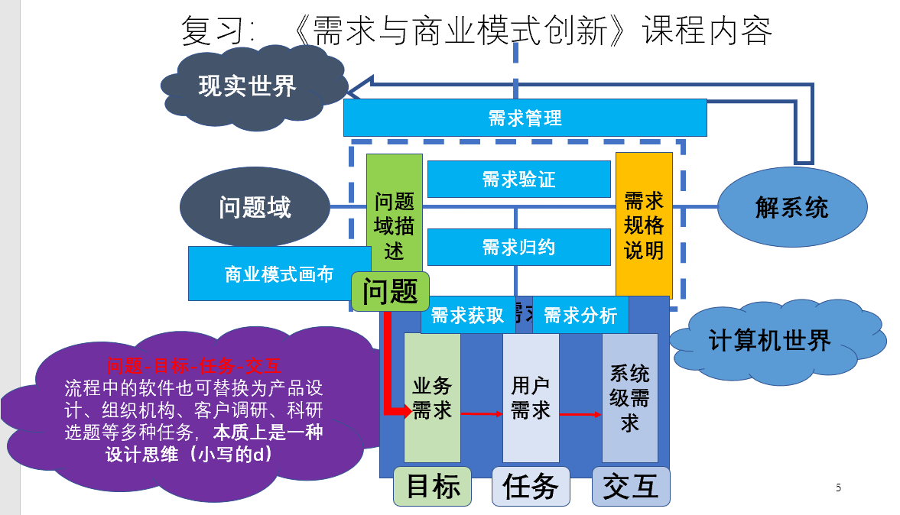
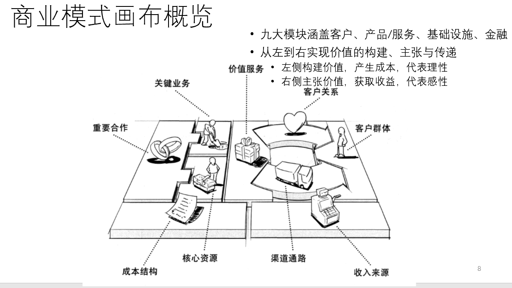
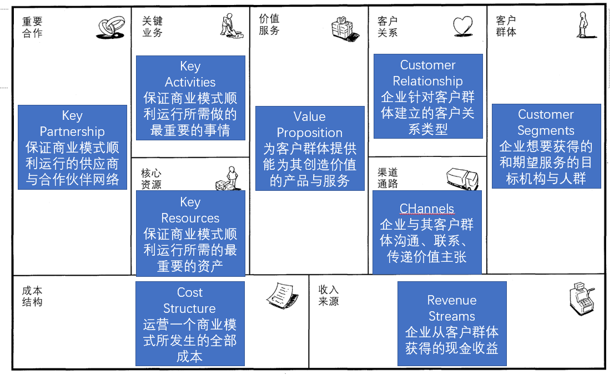

商业模式画布
---

# 1. 复习

## 1.1. 需求的两个维度
1. 需求(要求，问题域端)
   1. 直接需求、间接需求
   2. 不切实际的期望
2. 需求规格说明(解系统端)
   1. 数据：现实世界的模型
   2. 功能：对模型的操作，将结果反馈回现实世界，在问题域内通过改变状态或演进顺序解决问题
      1. 过程式分析：以功能分解为核心
      2. 面向对象分析：以封装的数据与对数据的操作为核心

## 1.2. 需求设计+商业模式设计(不考)
1. 需求开发也需要一套可以简单描述和操控的商业模式分析工具，并具备商业模式思维
   1. **客户问题域**:通过分析工具全面、系统、准确地刻画问题域
      - 为后续目标、任务、交互的逐层转化以及相应的归约描述、验证、管理服务
   2. **综合商业性**:更好地做到以"人"为中心的设计，平衡用户、技术、商业三者的关系，实现企业或组织的可持续发展
      - 创新创业、互联网产品设计、开发团队内部沟通
   3. **拥抱新机遇**:应对愈发成熟的信息科技加速下沉到传统业务领域所带来的挑战与机遇
      - 软件逐步成为所有公司的核心，并围绕软件开发设置组织部门(新岗位)
   4. **提升设计感**:追求"设计思维" ：以人为根本，构建功能性与情感意义兼具的创意
      - 产品"质感"与"情怀"的来源，"人民追求更高水平生活"，供给侧改革

## 1.3. 《困在系统里的外卖骑手》
1. 外卖配送时间被系统不断压缩
2. 为何能够引发热议？文章本身在暗示什么？
   1. 不能将问题转移到用户和外卖骑手之间，而是外卖骑手和平台之间
3. 饿了么的回应为何要比美团差？饿了吗与美团的定位变化
   1. 饿了吗是可以选择再给5/10分钟
   2. 美团允许你选择什么时候使用弹性8分钟

# 2. 我们想要的商业模式
1. 目标1：人人都能理解，容易达成共识
2. 目标2：易于建模和操作
3. 目标3：依然具有分析复杂情况的能力

# 3. 商业模式画布

# 4. 第三次课讨论
1. 被"懂王"祝福和逼捐的TK，起诉成功且改名的Wechat
   1. 使用50亿美元来捐助教育
   2. wechat和TikTok不同，Tiktok是第一个真正走到海外，收割了大量金钱的。
   3. TikTok的广告费用能超过1000亿美元(有流量)
2. "周末网上出差":4-6小时系统地的调研一个或多个产品
   1. 推荐资源:公司主页、新浪/搜狐财经、36氪、百度资讯、谷歌或bing、公司财报、财经自媒体(小心软文，有一些研报的分析还不错)
   2. 可以通过查备案号
   3. 资讯最后成为了百度的自己的产品推广的地方
3. 以产品体验与分析的视角使用自己最常用的App