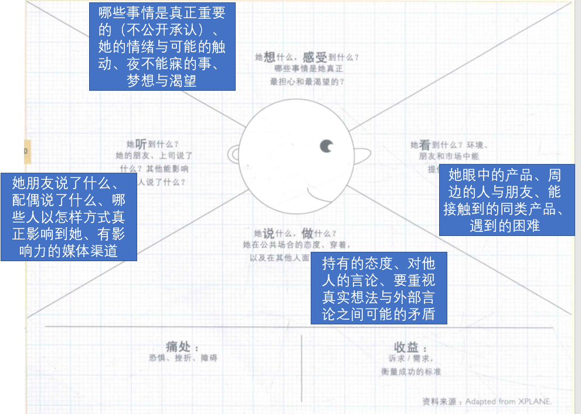
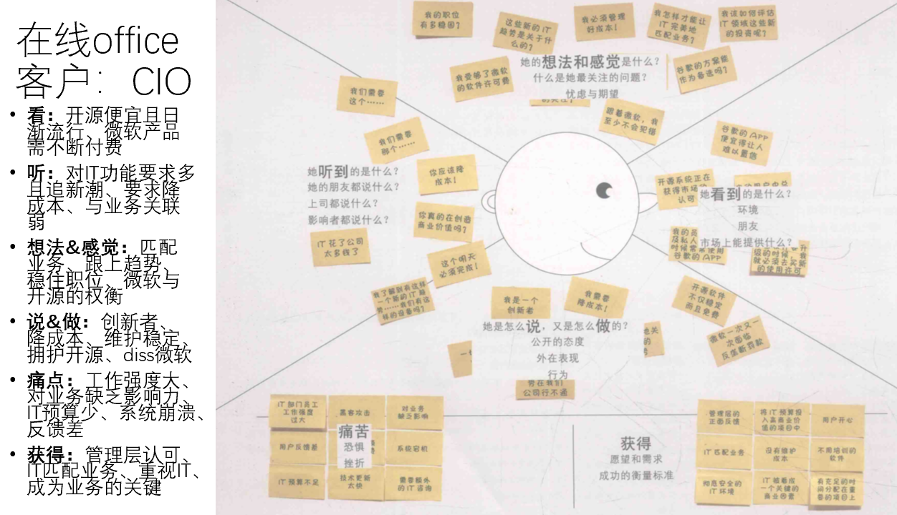
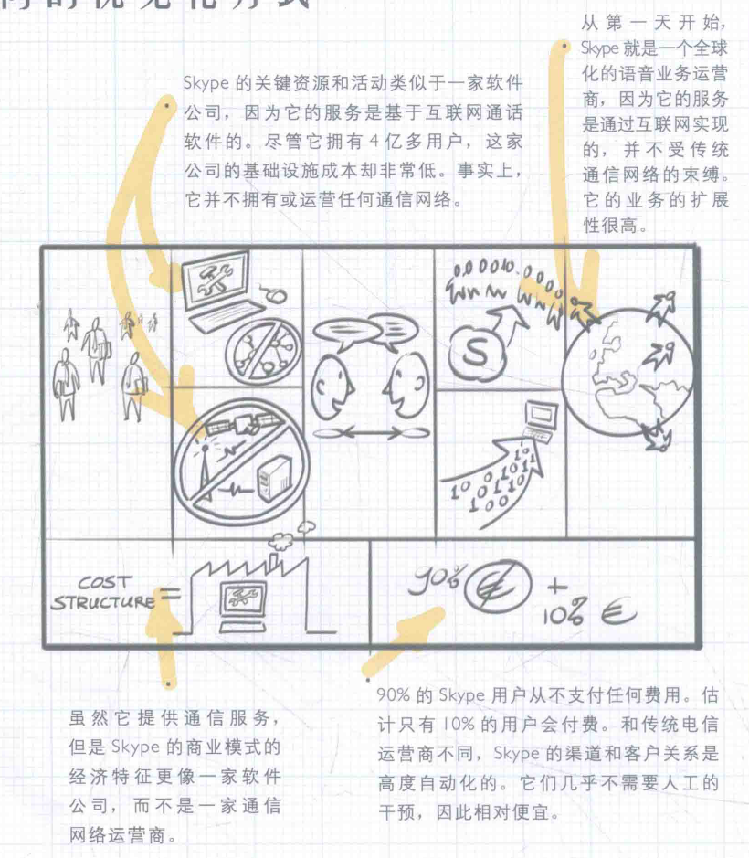
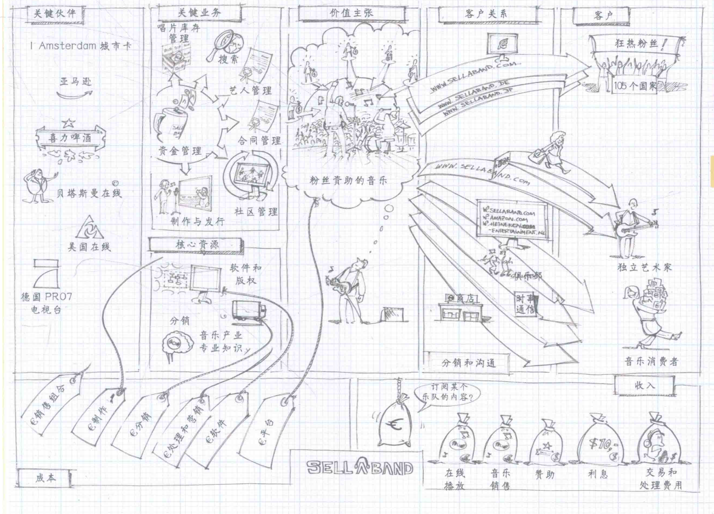
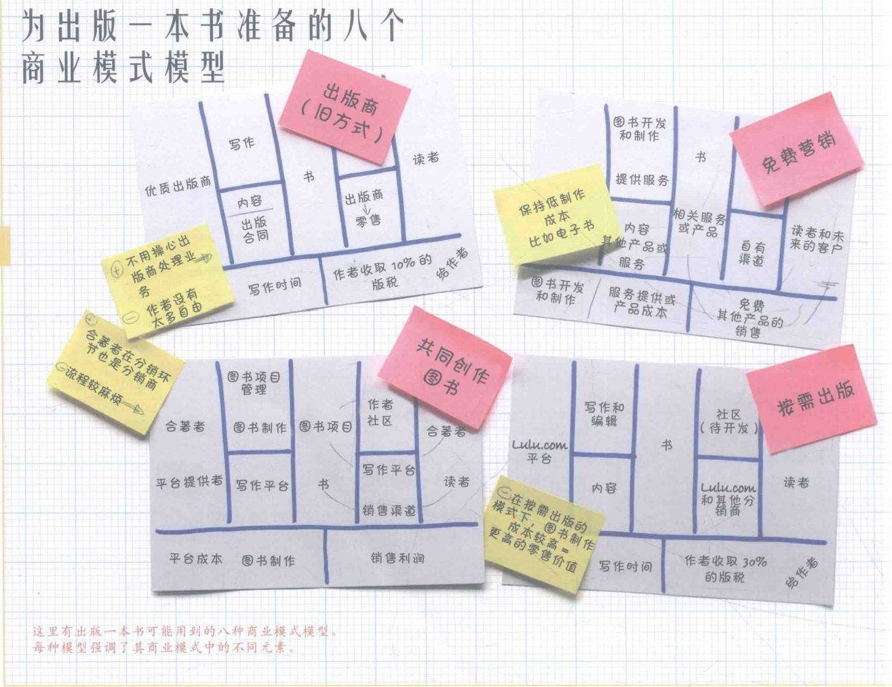

Book3-设计
---

# 1. 设计师
1. 作为设计师
   1. 必须执着地探究各种可能性，知道创造出崭新的设计，发现从未被人开发的领域，或者实现想要的功能。
   2. 设计师的工作：挑战思维边界、创造新选择、最终为用户创造价值。
2. 设计师需要：专业的辅助工具与方法，以及工作态度（thinking，思维）
   1. 商务人士每日工作：设计组织架构、战略、商业模式、流程和项目
   2. 必须考虑复杂因素：竞争对手、技术、法律环境，将设计工具与商业技巧（领域知识）相结合
   3. 需要想象“不存在的东西”，却往往要在非常严苛的条件之下进行
3. 设计的三个相互重叠的空间:灵感、构思、实施

# 2. 商业模式设计方法
1. 客户洞察
2. 构思
3. 视觉化思考
4. 模型构建
5. 讲故事
6. 场景

# 3. 客户洞察
> 客户视角是商业模式设计的指导性原则。客户的观点决定了我们选择的价值主张、渠道、客户关系和收益来源。

1. 透彻的观察，发现情感的源泉，发现内在的内容、意义与本质
2. 企业一般会在市场研究上投入重金，但它们最终设计产品、服务和商业模式的时候往往又会忽略客户的观点，比如法兰琳卡的广告"我们恨化学"
3. 成功的创新依赖于对客户深入的理解，包括环境、日常工作、担忧和渴望。

## 3.1. 客户洞察的第一个难点：对客户透彻的理解
1. 难点在于对客户透彻的理解，商业模式设计必须基于这个理解。在产品和服务设计领域，很多业界领先的企业都通过与社会学家一起合作来加深他们的理解。
2. 客户洞察的手段(交谈而不是询问)：安排高管会见客户、与销售团队交流、参观店铺。
3. 需要人类学、社会学理论(笼统的人)的知识。

## 3.2. 客户洞察的第二个难点：企业需要关注、忽略哪些客户
1. 企业是否能够清楚需要关注哪些客户、忽略哪些客户，坚持以客户为中心。
2. 在很多情况下，能够来动未来增长的那些客户往往并不是今天的金牛客户，商业模式创新不能仅仅聚焦现有的客户群体，必须着眼于新客户。

## 3.3. 客户洞察的移情图
1. 很少有人能够享受到社会学家团队的专业服务，但任何人审视商业模式的时候都可以对其中涉及的客户群体简单的画像。

### 3.3.1. 移情图的使用步骤
1. 首先，找到你的商业模式中你想要服务的所有可能的客户群体，从中挑出三个最有希望的客户群体，选择一个作为第一个画像的对象。
2. 先给客户起名，然后识别出人口统计学特征，比如收入、婚姻状况等


3. 参考移情图，然后给命名好的客户建立档案
   1. 看：描述该客户在她所处的环境中所看到的东西
   2. 听：描述环境如何影响到这个客户
   3. 想&感受：尝试勾勒你的客户思维的过程
   4. 说&做：想象客户可能的言辞，或公共场合的行为
   5. 痛点：已遭受的挫折、正遇到的阻碍、怕承担的风险
   6. 收益：预期成就、成功衡量标准、实现目标所采用的策略

### 3.3.2. 移情图绘制的关注点
1. 他看到什么:描述客户在他所处的环境中看到的东西
   1. 他看来我们产品如何
   2. 他周围有谁
   3. 谁是他的朋友
   4. 他每天接触到什么样的同类产品
   5. 他会遇到什么困难
2. 他听到什么:描述环境是如何影响这个客户的
   1. 他的朋友说了什么？
   2. 他的配偶说了什么？
   3. 哪些人能够真正以什么方式影响到他？
   4. 哪些媒体渠道对他是有影响力的？
3. 他真正想到和感受到什么:尝试勾勒出你的客户思维的过程
   1. 哪些事情对他是重要的(包含不公开承认的)
   2. 想象他的情绪，什么事情会触动他？
   3. 哪些事情会让他夜不能寐？
   4. 尝试描述他的梦想和渴望
4. 他说什么和做什么:想象这位客户可能说的话，或者他可能在公共场合表现出的行为
   1. 他持有什么样的态度？
   2. 他会对其他人说什么？
   3. 客户的言论往往不一定是他的真实的想法或感受，要注意其中的冲突
5. 客户的痛处是什么?
   1. 他最大的挫折是什么？
   2. 有哪些障碍阻碍着他实现个人诉求？
   3. 哪些风险是他害怕承担？
6. 客户期望的收益是什么？
   1. 哪些成就是他真正想要或需要的？
   2. 他如何来权衡成功？
   3. 思考一下他可能会采取哪些策略来达成目的

|                      |                      |
| -------------------- | -------------------- |
|  |  |

### 3.3.3. 通过移情图来了解一个B2B领域的客户
1. 2008年10月，微软发布了网上Office办公软件服务，可以通过浏览器使用Office全家桶，客户群体就是企业的首席信息官(CIO)



## 3.4. 客户洞察补充:变需要为需求(人为核心)
1. 洞察力是设计思维的关键来源之一:重视人的行为，而不是判断
2. 从设计到设计思维的演化，本质上是由创造产品演化到分析人与产品的关系，进而演化到人与人的关系，这个时代颠覆性商业模式产生的原因：信息技术极大地降低了交流成本，改变了社会组织
3. 设计思维的任务：观察结果转为洞察，洞察再转为改善人们生活的产品和服务，
   1. 观察：关注人们没有去做和说的，重视边缘地带的表现（例：一个工具是否能让小学生顺利使用）
   2. 观察向洞察的转化需要：专业领域知识，深入到具体场景中去观察人的具体行为
4. 换位思考：一种心理习惯，促使我们体会到每个人的感受，而不是将他们当做小白鼠或实验偏差
   1. 第一层：功能：与观察的用户互换身份
   2. 第二层：认知：体会用户的感受与“潜在需求”
   3. 第三层：情感：寻找能触动和推动目标人群的想法
   4. 拓展针对个人的换位思考（到群体）
5. 帮助人们发掘未能意识到的潜在需求，是设计思考者面临的挑战，将用户引入设计：against user 到 for user 到 with user

```md
1. 细致观察并接纳目标客户的行为
2. “笼统的人”与“具体的人”和场景相结合
3. 功能、认知、情感逐渐深入的换位思考以及拓展
4. 将用户引入设计
```
# 4. 构思
1. 一个能够产生大量商业模式创意，并成功识别出其中最佳创意的流程被称作构思（ideation）
   1. 大多数行业只有一种主流商业模式的现状已经改变，同一个市场中会有多种商业模式进行竞争，行业之间的界限也正变得模糊甚至消失
   2. 创造新商业模式时需要忽略现状并停止对操作性问题的担忧
   3. 商业模式创新不是抄袭经典或者对标“友商”，而是创造新机制来满足那些未被满足的、新的或者隐藏在背后的客户需求
2. 构思的两个步骤：
   1. 生成大量创意->对创意进行整合并挑选
   2. 生成阶段要重视数量；可行的创意可以是颠覆性的，也可以是领域的扩展
3. 提出新创意的两个出发点
   1. 从画布中寻找创新的焦点
   2. 不断提出“如果...会怎样”的问题
4. 构思的三个空间：相互重叠
   1. 灵感：从各个可能的源头收集
   2. 构思：将灵感转为想法
   3. 实施：把最佳想法发展成考虑全面的具体实施计划
5. 项目情绪图与乐观精神
   1. 希望 到 （恐慌） 到 洞见 到 信心
   2. 设计思维与设计团队需要乐观精神，乐观需要信心，信心需要信任
6. 发散思维与汇聚思维
   1. 发散创造选项，汇聚做出选择
   2. 集体思维倾向于汇聚，并得出唯一的结果；发散思维是创新的途径而不是障碍；汇聚中淘汰有希望的想法是痛苦的
7. 分析与综合
   1. 分析是对复杂问题的分解，综合可视作从大量数据中总结出有意义模式的过程，本质是一种创造
   2. 若“原始资料”能被纳入前后一致、令人鼓舞的叙事中，则能引发更高层次的整合
8. 头脑风暴法
   1. 一种需要训练的、有条理的方法，是创造想法的最好选择
   2. 重要规则：暂缓评论、异想天开、不要跑题、借“题”发挥

## 4.1. 创新团队
1. 创新小组选取了不同经验和背景的专业人士作为成员，虽然他们在每个领域都是有一定成就的专家，但是他们不是以技术专家的身份加入小组，而是对现状不满意的消费者。

## 4.2. 产生新的商业模式创意
1. 目前行业之间的界限在主键模糊，同一个市场中会有不同单的商业模式相互竞争。
2. 商业模式创新是挑战传统思维，设计出原创的模型。
3. 构思过程:
   1. 生成创意:数量为重点
   2. 整合创意:把创意讨论、合并、组合并甄选出少数可行的创意。
4. 商业模式的9个模式的任何一个都可以作为创新的起点。

## 4.3. 商业模式创新的焦点

| 不同驱动 | 描述 |
|- | - |
| 资源驱动 | 来源于组织现有的基础设施或合作伙伴资源。企业由此出发延伸或改变商业模式，比如亚马逊的云计算服务、高传输低时延的5g网络 |
| 供给驱动 | 创造全新的价值主张，并影响商业模式的其他模块，例子是墨西哥水泥生产商4h(业界的1/12)运到工地、云端的全托管机器学习与自动调优、云游戏 |
| 客户驱动 | 基于客户需求、可获得性或者便利性的提升。和其他类型的创新一样，这种创新也会影响到商业模式的各个模块，比如23andMe的个人DNA测试服务（从医疗与研究领域转来）、付费自习室：价值主张-（成年人）沉浸式学习空间；收入来源：5-20元/小时租赁 |
| 财务驱动 | 由新的收益来源、定价机制或者被缩减的成本结构所驱动的创新，同样也会对商业模式的其他模块产生影响，比如施乐复印机从卖设备转向复印机出租（月费95美元，含2000份复印，超出5美分每张）、IBM服务器从软件+硬件转型为开源+咨询+硬件 |
| 多点驱动 | 全球的专业建筑工具生产商，从出售变为出租工具“卖产品”转为“卖服务”、B站：与共青团及官媒的合作、内容从二次元到多圈融合、从内容转向社交（陪伴）、高粘性用户的游戏运营与内容驱动直播 |

1. 4个焦点中的每一个都可以作为重大商业模式变革的起点，有力地影响商业模式中其他模块，当然也可能会是关注多种焦点。
2. SWOT分析可以帮助我们找到变革的起点

## 4.4. 问题:如果...会怎么样？
1. 有效地激活思维：用此类问题打破在设计过程中遇到的现有商业模式的束缚，并使更多新奇的、难以执行的主张闯入我们的思维
2. 基本类型:从0到1，调整/转向
3. 此类问题只是思考的起点，需要继续构建基于假设的商业模式：如果某些问题找不到答案，则有可能是思维太过于激进，或未能找到一个合适的商业模式来承载
   1. 如果家具买家从大型仓库挑上平板打包好的家具部件，然后回到家自己组装？改变了消费模型。
   2. 如果制造商不买汽车，而是提供代步服务？戴姆勒公司
   3. 如果航空公司不用为它们的飞机购买引擎，而是根据运行时间付费呢?劳斯莱斯飞机发动机公司
   4. 如果全球打电话就免费呢?Skype
   5. 如果人们之间可以借款，而不用去银行贷款呢？Zopa公司
   6. 如果学生无法到校又要不停课会怎样：教学信息送出去 + 学生反馈收回来

## 4.5. 构思的流程
1. 团队组建:我们团队是否足够多样化?
   1. 资历、年龄、经验水平、业务领域、客户知识、专业技能
   2. 除了“创意天才”，更需要多样化创新团队
   3. 成员多样化：业务单元/领域不同、年龄/资历水平不同、文化背景不同、经验互补（例：美团成长期重要人物 – 原阿里“中供铁军”骨干干嘉伟）
   4. 要引导积极倾听，并考虑在关键会议上引入一个中立的引导员或主持人
2. 钻研:在生成商业模式创意之前，我们必须钻研哪些知识?
   1. 总体研究、研究客户和潜在客户、详细调查新技术和评估现有的商业模式
   2. 创新所需要的知识：总体研究、客户与潜在客户、新技术调研、现有商业模式评估等
3. 开拓:我们针对商业模式的每个模块做哪些创新?
   1. 尽可能开拓解决方案的范围，以产生尽可能多的创意，重在创新，避免过早谈论价值
   2. 重要的是数量，而不是质量
4. 甄选标准:我们为商业模式创意排序的最重要标准是什么?
   1. 预期实施时间、潜在收入、可能的客户阻力、对竞争优势的影响
   2. 在业务背景下包含：预期实施时间、潜在收入、可能的客户阻力、对竞争优势的影响
5. 构建模型:对于每一个进入短名单的创意，它完整的商业模式是怎么样的？
   1. 团队要在标准中，必须有能力从若干创意中整理出一个最优创意的短名单，由此来构建3-5个创新的商业模式。
   2. 确立标准后从创意中整理一个最优短名单，由此构建3-5个创新的商业模式，再利用画布进行勾勒和讨论

## 4.6. 组建一个多样化的团队
1. 构思是一个团队任务，商业模式创新是通过开大商业模式的模块和在模块之间创建连接来创造新的价值。这有可能涉及画布的所有的九个模块，可以是分配渠道、收益来源或关键资源。
2. 商业模式创新团队必须拥有多样化背景的团队成员。
   1. 来自不同的业务单元
   2. 年龄不同
   3. 专业领域不同
   4. 资历水平不同
   5. 经验互补
   6. 文化背景不同

## 4.7. 头脑风暴的规则
1. 保持聚焦:首先要精确地表达当前的问题，在理想情况下，必须和客户需求有关、不要跑题太远、将讨论拉回到开始问题。
2. 执行规则:在一开始就阐明头脑风暴的规则并坚决执行。
   1. 不要过早下结论
   2. 每次一个人讲，不要七嘴八舌
   3. 追求数量
   4. 视觉化
   5. 鼓励疯狂的创意
3. 视觉化思考:将创意写下来或者画在每个人都看到的地方，有一个搜索创意的好方法并写到便利贴上，然后贴到墙上
4. 准备:通过对当前问题进行钻研来为头脑风暴做好准备，这些钻研活动可以是团队的一次实地考察以及与客户的讨论等任何形式的对你的问题描述的钻研活动。
5. 无声的头脑风暴、笨牛训练。

## 4.8. 热身:笨牛训练
1. 一般是用来给团队热身。
2. 具体做法:指导一个成员根据一个实体(如牛奶)的几种商业模式
   1. 首先定义一些特征(生产牛奶，从早到晚，会发出牛叫的声音等)
   2. 然后根据特征来创造一个基于牛奶的创新的商业模式
3. 可以有效地帮助人们摆脱日常的业务惯例，进入真正头脑风暴的状态。

# 5. 视觉化思考

## 5.1. 视觉化思考的实例
1. 背景:14个来自惠普公司的各个不同部门，都是负责信息管理工作。他们聚集在这里来参加为期一天的讨论会，期望真正讨论出一个全球化企业应该如何管理信息流的蓝图。
2. 通过在海报上勾勒草图来讨论信息共享、识别各个元素之间的关系、补充缺失的部件，并且对很多问题产生了共同的理解。
3. 关键:人们没有必要直到自己充分理解后才画草图，不管我们画的草图有多么初级和业余，它都能帮助我们更好的描述、讨论和理解问题，尤其是那些性质复杂的问题。

## 5.2. 视觉化思考的价值
1. 视觉化思考工具:图片、草图、结构图和便利贴等视觉工具来构建和讨论各种含义。
2. 视觉化思考使得团队有了一个可以固定的东西来完成讨论，而不再局限在抽象思维。
3. 视觉化思考的四个流程：理解、对话、探索、沟通。
4. 商业模式的讨论需要视觉化思考：抽象的东西具体化、复杂的概念简单化
   1. 商业模式是一个由许多模块以及模块之间的复杂关系组成的复杂概念，其内部元素相互影响，但只有作为一个整体系统时才有意义
   2. 视觉化能够一目了然的刻画商业模式的主旨，并具象化其中的隐含假设
   3. 视觉化能够使商业模式变的明确，为团队讨论提供一些概念性的锚点，使讨论从抽象思维落实到具体、形象的东西
   4. 视觉化既能找出已有模式中的逻辑缺陷，又能在设计全新模式时更容易地添加、删除和移动相关的图片化概念
5. 视觉化思考使用的两项技术与四个流程
   1. 如何使用便利贴 与 如何将草图与商业模式画布结合
   2. 四个流程：理解、对话、探索、沟通

## 5.3. 视觉化的实现：便利贴+绘画
1. 便利贴的重要性：随意的添加、删除、移动（在画布上的位置）
   1. 三个指导方针：粗的马克笔(避免写的太多)、只写一项元素、只用少量文字抓住关键点
   2. 便利贴的绘制、添加、删除和移动能够有效组织人们参与讨论，反映了商业模式的动态变化过程，与结果同样重要
   3. CRC卡片（正面对象状态+行为与协作者，背面简短描述）、Story Card（正面故事描述，背面故事实现的理由）
2. 绘画的强大表现力：人对图像的反应要比文字强烈的多
   1. 最简陋的素描也能让事物变得具体和易于理解：如情绪、比例等
   2. 帮助向别人解释和沟通你的商业模式，容易激发起建设性的讨论与创意
   3. 可用于勾勒一个典型客户与他所处的环境，也可用于勾勒出客户群体的需求和任务

## 5.4. 四种辅助以视觉化思考方法的流程

### 5.4.1. 理解商业模式的本质
1. 视觉化的语言:商业模式画布作为一张概念图，可以为你提供一个视觉的和文字的指引，帮助你画出商业模式中需要的所有信息。
2. 抓住全貌:将画布的所有的元素都描绘出来后，这个草图可以让客户很快的理解到所有的信息。
3. 看到关联:理解一个商业模式，要同时把握组成元素和元素之间的关联关系。

### 5.4.2. 提升对话效率
1. 共同的参照点:图形可以转化隐含的假设为具体的信息，以提高对话效率，使得商业模式成为一个有形和固定的事务。商业模式成为一个有形和固定的事物，为讨论的参与者提供一个始终可以回溯的参照点。
2. 统一的语言:商业模式画布是一个统一的视觉化语言，保证有效的创意的交流。
3. 一致的理解:直观的商业模式最能够达成一致的理解。

### 5.4.3. 探索创意
1. 激发创意:可以从任何以一个角落开始绘画。
2. 演习:你可以通过移除或添加某个元素，然后讨论商业模式的变化，引发冲击。

### 5.4.4. 提升沟通
1. 统一公司内部的理解:一张图可以保证员工对这个商业模式有统一的理解。
2. 内部推销:在组织内部，创意和计划往往需要通过内部多层次的“推销”才能获得相应的支持和资助，用画图来讲故事比用文字来讲故事更加有效。
3. 外部推销:企业家必须把新商业模式的计划推销给外部团体。

## 5.5. 为不同的需求采取不同的视觉化方式
1. 根据母校不同，视觉化的商业模式需要展示出不同程度的细节，比如Skype要区别开与传统运营商的显著差异。
2. Skype的商业模式画布



3. Scllaband(众筹方式支撑独立音乐人的平台)的商业模式画布



## 5.6. 讲述一个视觉化故事
1. 绘制你的商业模式:文字填充、便利贴与元素
2. 用图形描绘每一个商业模式元素:简单、准确、易懂
3. 设计故事主线:粘贴便利贴顺序、尝试不同主线
4. 讲述故事:根据便利贴上的图画一张一张讲解模式故事

## 5.7. 视觉化作用
1. 理解商业模式的本质
   1. 视觉化的语言：画布是一张概念图，其功能类似于具有语法规则的视觉化语言，提供了视觉和文字的指引，帮助画出模式中所需的所有信息
   2. 抓住全貌：画布的草图能够为观众提供足够的信息理解全貌，而不被过多的细节影响理解
   3. 看到关键：一定要理解元素/模块之间的关联关系
2. 提升对话效率
   1. 共同的参照点：将头脑中不言而喻的主观假设具象化，并将大量内容固化成为可回溯的参照点（人类的短时记忆只能保留有限数量的想法）
   2. 统一的语言：利用图形和画布帮助不同参与者聚焦，特别是来自不同领域的人
   3. 一致的理解：帮助不同部门的人将其深入理解的部分表达出来，再一起形成整体的洞察与一致的理解
3. 探索创意
   1. 激发创意：模糊的想法-随着灵感发挥-有机地整合成一幅图画
   2. 演习：视觉化的模型帮助思考部分元素的改变引发的系统性冲击
4. 提升沟通
   1. 统一公司内部的理解：用图画在组织内形成共识，朝一个战略方向前进
   2. 内部推销：好的图画使组织的现状、需要做的事情、怎么做、未来会怎样等方面变得易于沟通，从而赢得组织内部的理解和支撑
   3. 外部推销：提升向投资人或潜在合作伙伴推销成功的概率

## 5.8. 根据不同目标展示出不同的视觉化细节
> Skype与传统运营商的不同

1. 基础设施成本低
2. 成本结构像IT公司
3. 面向全球化语音服务
4. 渠道与客户关系高度自动化，只有约10%用户付费

# 6. 模型构建
1. 模型构建是探索过程的核心，能帮助参与者更清楚地认识到最初对情况的理解的漏洞。

## 6.1. 模型构建的价值
1. 与视觉化思考一样，模型构建可以让抽象的概念具象化，有助于探索新的创意。
   1. 在产品、架构和交互设计上得到广泛应用，但在商业管理领域不太常用
   2. 这里的“模型”：用于讨论、探究或概念验证的工具，目标是探索未来潜在的商业模式（不等于软工领域的模型或原型），可以是草图、画布或财务报表
2. 模型是帮助我们探索不同的商业模式方向的工具，利用商业模式模型，我们可以创造和巧妙地处理一个商业模式模型中的结构、关系和逻辑方面的问题
   1. 建模-（疑问点明确化、视觉化）:添加、删除或修改元素-观察结果
   2. 不同规模（抽象层面）的模型上进行互
   3. 有助于获得突破性的商业模式，同时能够有效控制细节。
3. 不要过分强调市场调研(细节)，我们目标是构建有潜力的商业模式或开发新的市场。


## 6.2. 设计态度
1. 过早地止步于某个创意，你会爱上他。
2. 过早地开始优化某个创意，你会被他牵绊，变得很难在继续探索，继续寻找更好的创意。
3. 从做决定的思维转化为创造多种可选方案来选择的思维。
4. 专注探索，全面考虑，快速放弃，选出值得优化的想法，接受不确定性

## 6.3. 构建不同规模的模型
1. 随手描绘:勾勒和推销一个粗略的创意:勾勒想法、包含价值主张、包含主要受益来源
2. 精心描绘的画布:探索实现该创意所需的因素:描绘整张画布、商业逻辑、预估市场潜力、理解商业模式画布各个模块之间的关系、做一些基本的“事实查证”工作
3. 商业案例:检查该创意的可存活度，将详细的画布转化为财务表格，估计盈利潜力、包含关键数据、计算成本和收入、估算盈利潜力、不同假设场景模拟
4. 实地验证:调查客户的可接受度和可行性

## 6.4. 控制规模
> 通过绘制很多（粗略的和细致的）模型来代表各种战略选择，再通过对每个模型添加和移除元素的方式来探索新想法

1. 随手素描（napkin sketch）：勾勒和推销一个粗略的主意：勾勒想法，含价值主张和主要收益来源
2. 精心描绘的画布（elaborated canvas）：探索实现该创意所需的因素：完整画布，商业逻辑思考，市场潜力预估、理解模块之间联系、“事实查证”
3. 商业案例（business case）：检查该创意的可存活度：全面画布，关键输入、核算成本与收入、估算利润潜力、模拟财务场景
4. 实地验证（field-test）：调查客户的可接受度和可行性：准备合情合理的商业案例，站在客户角度进行实地验证，验证价值主张、渠道、定价机制等实际市场中的元素

## 6.5. 为出版一本书准备的八个商业模式模型



## 6.6. 征集:一个全新的咨询公司商业模式
1. 小时和项目收费已经成为了过时的部分，需要资讯的创新的商业模式
2. 过程
   1. 识别主要问题
      1. 考虑典型的战略咨询顾客
      2. 选择客户群体和行业
      3. 描述与战略咨询相关的5个最大的问题
   2. 发掘可能的方法
      1. 再次深度审视你选择的5个问题
      2. 尽可能多地发掘资讯商业模式的创意
      3. 挑出你认为最好的5个创意(不一定是最现实的)，参考构思流程
   3. 建立商业模式模型
      1. 从5个创意中挑出3个最不同的
      2. 在3张商业模式画布上画出这三个商业模式概念模型的各个元素模块。
      3. 注明每个模型的优劣

## 6.7. 补充:用手来思考
1. 必须给创造性团队时间、空间和预算去犯错：在模型构建（原型）阶段尽可能地去试错
2. 模型，不求精细，胜在快速
   1. 早期的模型应该是快速的、粗糙的、便宜的（苹果鼠标：走珠+黄油盘）
   2. 适可而止：模型的目的是赋予想法具体的外形，了解该想法的长处和弱点，从而为更详细、更精密的下一代模型寻找方向（最终转向具体设计）
3. 现场制作模型
   1. 灰度上线、A/B与内测；依赖复杂社会互动的服务更需要使用现场模型
   2. 网络模拟空间（喜达屋酒店雅乐轩品牌下的虚拟酒店）

# 7. 讲故事
1. 重要的是:触手可及的故事。
2. 将故事是一种被低估和未被充分利用的艺术，让新商业模式变得触手可及。
3. 借助商业模式画布强大的解释能力，讲故事能让听众暂时放下对陌生事物的怀疑。
4. 在讲故事的时候，我们可以从商业模式画布的9个方面展开讲述。

## 7.1. 讲故事的价值和目的
1. 故事是一个理想的热身工具，为深度讨论商业模式与其内在逻辑做好准备：将故事与画布结合，利用叙事性克服听众对不熟悉模式的抵触，放下对陌生事物的怀疑

## 7.2. 为什么要讲故事
1. 介绍新想法，尝试融入组织战略:管理层可能对数字和事实感兴趣，但正确的故事更能获得他们的关注，尝试融入组织战略
2. 向投资人推销，争取外部资源(是什么、为谁服务、如何获得收益):假如你是一个企业家，你要抓住机会向投资人或者其他的潜在鼓动推销你的创意和商业模式，他们更关心如何为客户创造价值，如何赚钱。
3. 吸引员工:必须要能够说明协作者能够参与进来，人们必须透彻理解新的商业模式并明白它对自身的影响，相对于逻辑，人们更容易被故事打动，把自己的商业模式的逻辑编织成一个引人入胜的故事，会让听众更容易接受，抓住组员的注意力和好奇心，为下一步探讨准备
4. 让未来触手可及：激发创意、辩证变革。

## 7.3. 让商业模式栩栩如生
让故事简单，我们只设计一个故事主角，根据受众不同，我们可以设计不同视角的故事主角。

### 7.3.1. 公司视角
1. 员工观察员
2. 通过以员工的视角讲述一个故事来解释一个商业模式。以员工的视角来展示这个新的商业模式为什么是有价值的。
   1. 员工经常观察到的新商业模式所解决的客户问题
   2. 新商业模式比旧商业模式更好利用资源、业务和伙伴关系（降本增效、开源节流）。
3. 员工承载组织的内部工作和商业模式，展示了转向一个新的商业模式的原因

### 7.3.2. 客户视角
1. 客户工作
2. 通过以客户的视角讲述一个故事来讲述一个传奇故事，展示她面临的挑战和必须要完成的工作。
   1. 客户面临的挑战与必须完成的工作，展示出你的组织如何为她创造价值。
   2. 描述她得到的东西、这些东西如何融入其生活，如何融入她的生活
   3. 她愿意为哪些东西掏钱
   4. 为故事增加一些戏剧性和情感因素
3. 注意包含情节和细节，包含需要的资源、通过的活动
4. 故事需要真实可信，避免油腔滑调或居高临下的口吻。

## 7.4. 让未来触手可及
1. 故事拉近了现实和科幻小说之间的距离。
2. 激发创意:让听众真横看到为什么需要开发一个新的商业模式，这个故事可以在组织角度来讲，又可以站在客户角度来讲。
3. 辩证变革:如果组织很清楚未来的竞争态势将如何眼睛，这样的背景下，讲故事目的是为了展示新商业模式如何能完美地帮助组织在新的格局中竞争。这个故事主角可以是一个客户、一个员工或者是一位高管。

## 7.5. 故事的构思
尽可能地让故事简单，只设计一个故事主角，根据受众的不同，可以采用不同视角的故事主角。

## 7.6. 故事构思的方法

|            | 图片和旁白                                     | 视频                                                             | 角色扮演                                   | 文字和图片                                         | 连环图画                                         |
| ---------- | ---------------------------------------------- | ---------------------------------------------------------------- | ------------------------------------------ | -------------------------------------------------- | ------------------------------------------------ |
| 描述       | 用一张或多张图片来讲述一个主角的故事和他的环境 | 用视频来讲述一个主角的故事和他的环境可以拉近现实与幻想之间的举例 | 让人们扮演故事中的主角，构建逼真形象的场景 | 用文字和一到数张图片来讲述一个主角的故事及他的环境 | 用一系列的卡通图片来栩栩如生地讲述一个主角的故事 |
| 何时用?    | 小组讨论或会场讲演                             | 向一大群听众广播或内部有重要财务意义的决策                       | 相互描述新开发的商业模式创意的研讨会       | 向一大群听众汇报或广播                             | 向一大群听众汇报或广播                           |
| 时间和成本 | 低                                             | 中/高                                                            | 低                                         | 低                                                 | 低/中                                            |

## 7.7. 阿里和B站利用美股上市敲钟嘉宾讲故事


# 8. 场景
1. 搭建一个物理环境来给用户带来一个独立体验。
2. 将模型构建中明确的方向具体化，从而给出有见地的设计
3. 场景可以让抽象的事物变得具体。

## 8.1. 第一种场景:不同的客户结构
1. 产品或服务将被如何使用
2. 什么样的客户会用到它们
3. 客户的担忧、诉求和目标
4. 以上都是基于客户洞察而产生的。
5. 结合客户洞察描绘出独特、具体的图景

## 8.2. 第二种场景:未来环境
1. 描述一个商业模式未来可能的竞争环境
2. 为了想象未来可能的具体细节，战略研究领域将这种联系归为“场景规划”的课题

## 8.3. 探索创意
1. 客户场景能够知道我们进行商业模式的设计，帮助我们识别很多问题，比如那些渠道更合适，最应该建立什么的客户关系，客户最有可能为哪些问题的解决方案买单。

## 8.4. GPS提供定位相关服务的三个不同场景
1. 移动电话运营商提供的基于GPS的送货路线规划能力
2. 基于GPS的提供旅行服务的手机(提供定制化旅行建议、个性化的旅行向导)
3. 基于GPS的工作列表，提醒用户什么时候去哪里检查突然或葡萄质量。

## 8.5. 为故事补充场景
> 一对结婚25年、有三个孩子的美国二线城市夫妻（科技粉），使用基于GPS的手机APP获得定制化的旅行建议，在巴黎愉快度过了一个二人专属的长周末
   
1. 了解与评估：机上杂志
2. 购买与传递：戴高乐机场（落地）租赁
3. 交互：传统地图服务+设备内嵌的语音向导，提供特定地址的相关故事与背景信息
4. 售后：（未出现，可能出现的故障，人工确认，内容推荐等）
5. 评价与复购：梦想退休后到巴黎定居，并适应法国文化
6. 更丰富的途径，更详细的交互，更全面的售后，更深入的评价与复购

## 8.6. 探索创意(以定位服务为例)
1. 送货上门：路线规划，按月付费？渠道？其它设备与软件？
2. 酒庄经营者：土地管理，按月付费？渠道？其它设备与软件？
3. 旅行者：定制化旅行建议，专属设备还是APP？航空公司能否作为渠道？吸引怎样的内容合作伙伴？客户可能买单的价值主张？

## 8.7. 未来的场景
1. 医药行业就是一个迫切需要创新商业模式的行业，场景能够激发人们跳出框框思考。
2. 首先，设计出很多的场景，描绘出未来的医药行业，最好让专家来进行描绘。
3. 如果，需要对行业做更深的研究，那么我们需要发现很多的驱动因素，并开发出不同的场景。
   1. 私人定制化药品的出现和治疗向预防的转型。
   2. 医疗诊断学的发展，人们重新刷新的成本认识。
4. 根据上面的三个驱动来获取四个不同的场景
   1. 一切照旧:治疗仍然是核心收入来源
   2. 我的药物:治疗仍然是核心收入来源
   3. 健康的病人:继续向预防转型
   4. 再造医药行业:私人定制化和预防性药物成为医药行业的新增长点。

## 8.8. 讲故事与场景补充：将人放在想法的中心
1. 场景说明：讲故事+场景
   1. 虚构人物+统计学要素+日常生活+可信场景
   2. 促使人成为想法的中心，防止迷失在机械的、程序的或美学的细节中
   3. 美国动车Acela的乘客体验：10个乘车步骤中8个与火车落座无关
2. 角色扮演：发掘生活内在脚本
   1. 可以依照情节利用即兴表演来探索某个想法
   2. 万豪长住酒店TownePlace利用旧仓库“舞台”营造“家”的感觉
3. 构造场景为顾客打造体验，制作用户体验蓝图
   1. 美国全食超市：在商店中营造完整的“健康生活方式”，甚至现场烹饪
   2. 体验蓝图：人与人互动的细节+情绪因素，并找出最有意义的时间点
      1. 优质的开始体验、巅峰体验、结束体验
      2. 万豪酒店的“舒口气时刻”：找到蓝图中最有意义的时间点
   3. 指导方针：1. 消费者积极参与；2. 可信、真实、吸引人的体验往往来自于企业自身的体验型文化；3. 场景中与客户的接触点必须做到深思且精确


## 8.9. 未来场景和新商业模式
1. 根据两个或多个主要标准开发一系列的未来场景。
2. 为每种场景描述一个故事，其中列举出该场景的主要元素。
3. 研讨会:为每种场景开发一个或多个合适的商业模式。
4. 商业研讨会开始前，各种场景必须被开发出来，帮助小组成员最大限度地理解未来的所有可能。