Book4-战略
---

# 1. 垃圾分类推广落地时所暴露出的设计缺乏
1. 核心问题:面向垃圾处理流程，缺乏居民视角的洞察
2. 高强度工作压力与繁琐投放之间的矛盾
   1. 投放流程单一化
   2. 未通过视觉化思想与模型构建的方法探索其他形式的可能性
   3. 宣传中以垃圾处理方的故事为主
   4. 缺乏对具体场景的构思与推演(分类-分类+分时+固定地点)

# 2. 引入:是什么在阻碍你绘制商业模式画布的道路?
1. 未能理解现有的商业模式
2. 缺乏一种语言来讨论商业模式的创新
3. 制约我们想象设计新商业模式的限制因素
4. 让每一个人都参与，花时间培训员工，培训他们学会如何和所有的利益相关者沟通这个新商业模式。
5. 事实证明顾客会问很多，但是一旦他们能洞察他们的业务，他们倾向于简洁。
6. 没有从传统的直线思维方式转变为全面和系统的思维方式
7. 胜者的关键是主要的利益相关者都彻底地理解并推行这个商业模式。
8. 缺乏远见和糟糕的管理
9. 大型成功企业最大障碍是不愿意冒险去做任何可能危及他们当前模式的事情。
10. 当前的成功阻止了这些公司自我探索。

# 3. 战略
1. 商业模式环境
2. 评估商业模式
3. 从商业模式的视角看蓝海战略
4. 管理多种商业模式

# 4. 商业模式环境:背景、设计动力和限制
1. 商业模式是在特定的环境下被设计和执行的。
   1. 日益复杂的经济环境(比如网络商业模式)
   2. 更大的不确定性(比如技术创新)
   3. 严峻的市场颠覆(比如经济动荡、颠覆性的新价值主张)，使得不断地审视环境比以前任何时候都重要。
2. 为了更好地理解你的商业模式"设计空间"，我们建议简要地从四个主要领域勾勒你的环境
   1. 市场影响力
   2. 行业影响力
   3. 关键趋势
   4. 宏观经济影响
3. 绘制出自己的商业模式环境并考虑这些趋势对企业的未来的意义。

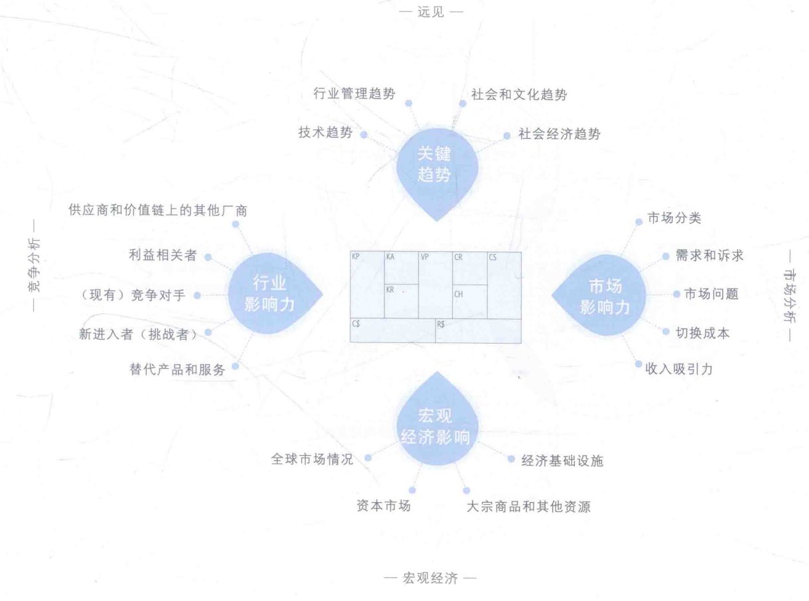

| 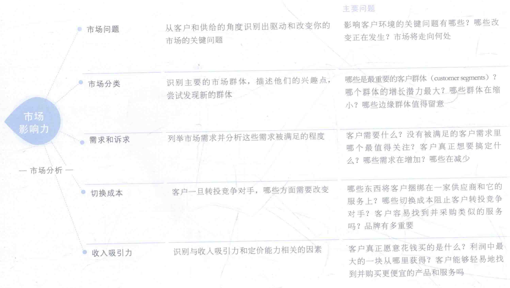 |  |
| -------------------- | -------------------- |
|  | 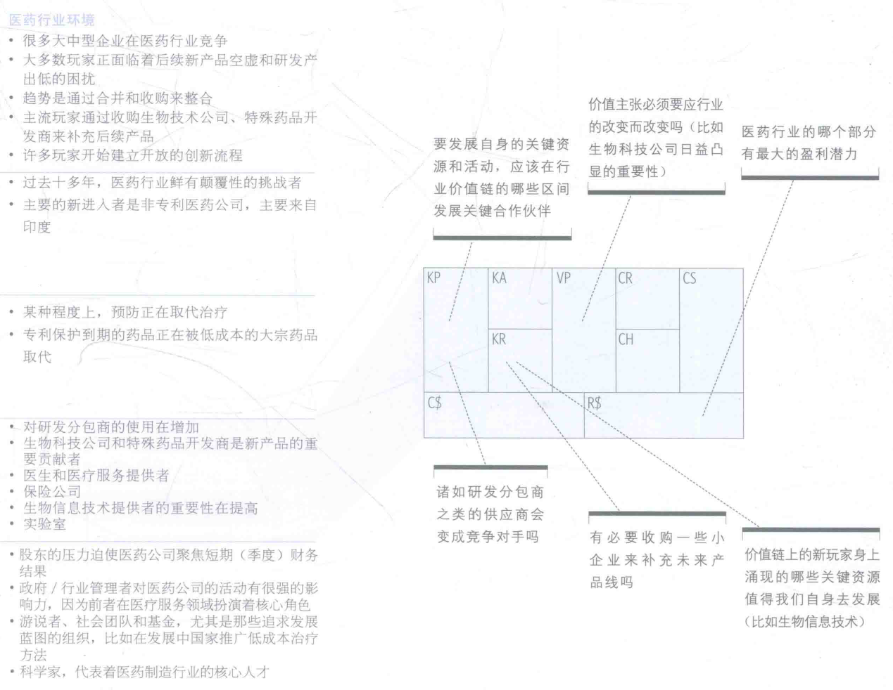 |
| 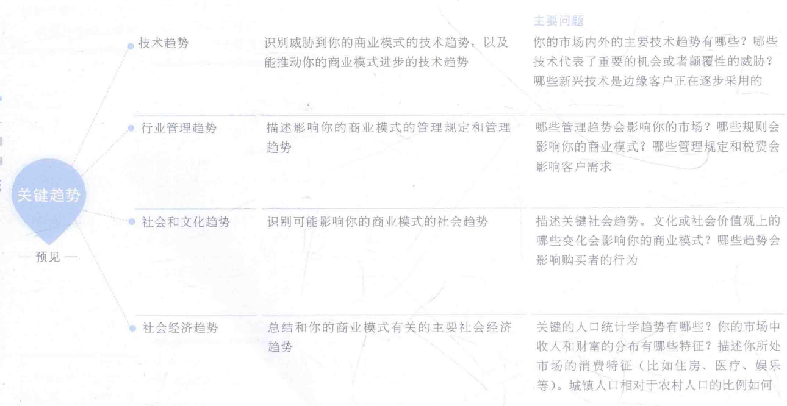 | 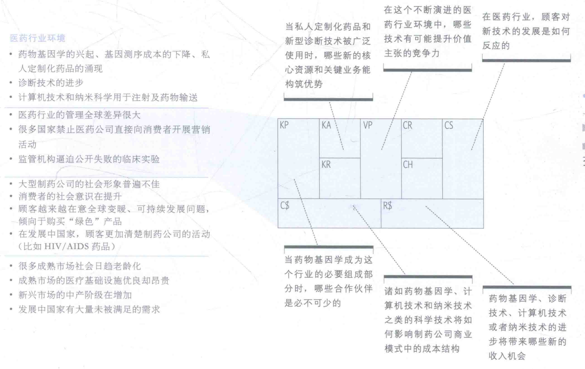 |
| 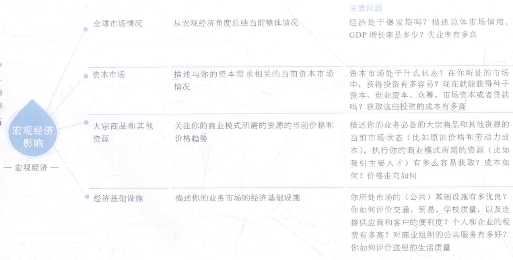 |  |

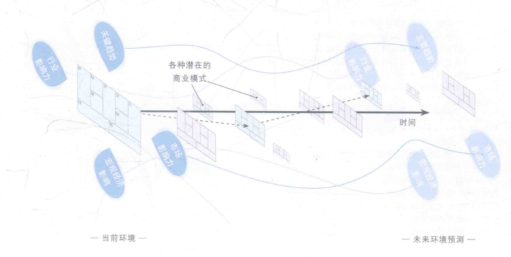

# 5. 评估商业模式
1. 定期评估商业模式:非常重要的管理活动。

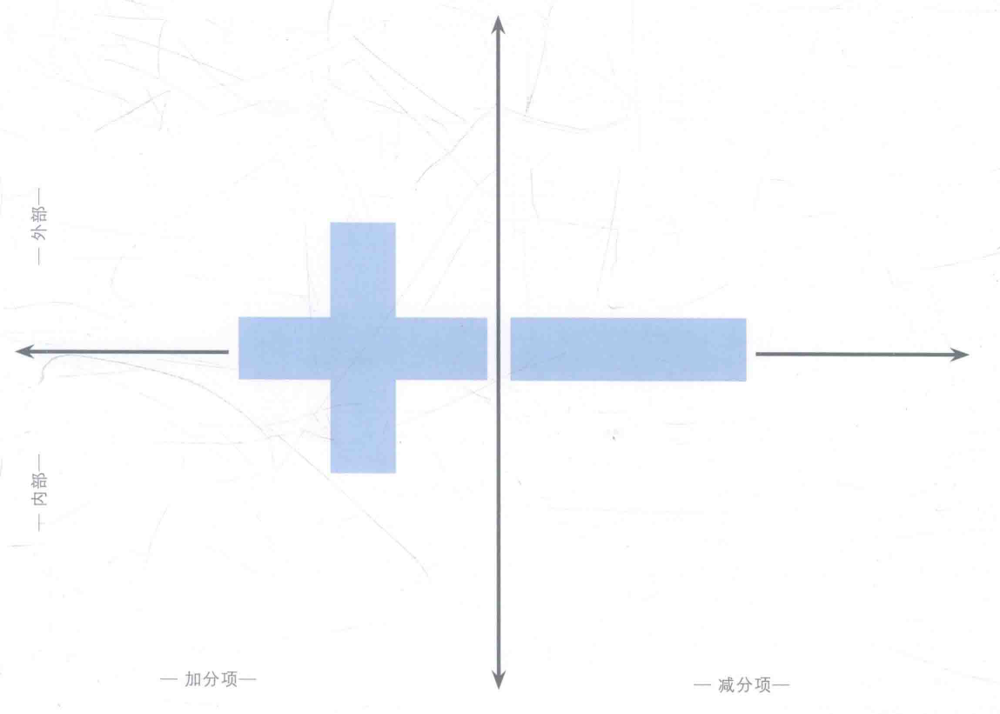

## 5.1. 变化环境下商业模式的演进
1. 商业模式的演进(创新)注定是复杂的、不确定的，甚至颠覆性的
2. 市场影响力、行业影响力、关键趋势和宏观经济影响这四个方面的分析为商业模式创新提供了设计空间
   1. 使用模型构建来展开设计(**竞品！**)
   2. 通过场景进行对未来的探索(**聚焦！**)
3. 与大作业的结合方式：**利用评估部分的内容继续优化已设计的商业模式**
   1. 寻找最适合共同创作故事的业务场景-幻想世界观构建、团队创作
   2. 把握当前年轻人对住房和家装的诉求-独立空间、情感共鸣与陪伴
   3. 探索当前自动翻译技术能力下最有魅力的场景-自助游、文化传播

## 5.2. 商业模型环境评估
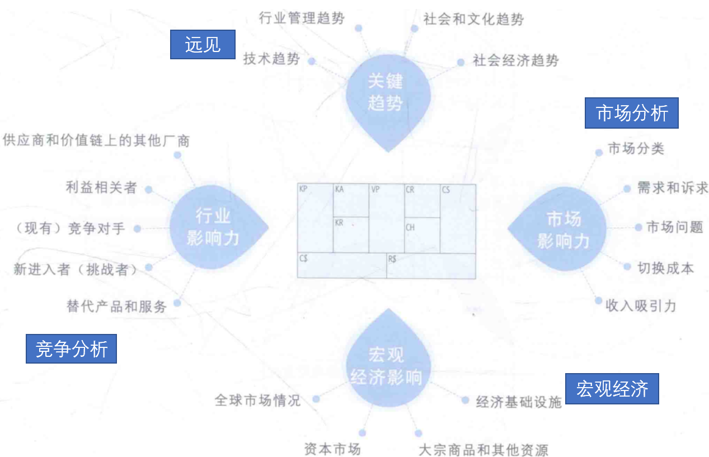

## 5.3. 市场影响力：初创期的网易考拉海购
1. 市场问题：2014年时，国内对高品质消费的需求正旺，而购买力尚未完全释放，对国外商品的期待较高(5月聚美优品上市)高品质购物体验缺位
2. 市场分类：专注于为中产阶级打造"正品低价"的体验，聚焦母婴产品
3. 需求和诉求：经济承受范围内的有品质、有保障的购物体验，对更高生活水平的追求
4. 切换成本：
   1. 14年推出时具有引领性，网易系的产品在客户体验上有优势，精致感，聚焦方向上能收获情感认同
   2. 不到一年时间建立了大量保税仓，在日韩德意等国家开设分公司，团队扩张至400人
   3. 网易有做电商的经验与意愿，但14年时已经是淘宝、京东的天下了
5. 收入影响力
   1. 高复购+较高附加值+品质重要性+"不能亏了孩子"情感认同 = 聚焦母婴产品
   2. 没有选择竞争更激烈的美妆产品，或收入不稳定或较弱的烟酒、手表、电子类产品等

## 5.4. 关键趋势：网易考拉的"死战"
1. 技术趋势
   1. 大型电商平台的技术发展已经较为成熟：诱导性的前端+微服务架构+大数据分析+推荐系统+多终端。网易一直有电商平台开发与运营的经验
   2. 品牌种草社区(ins)、直播(千播大战)带货、拼购红包与社交裂变(游戏诱导)
2. 行业管理趋势
   1. 购物社交化、娱乐化，拼购与市场下沉
   2. 14年海关56、57号文件确定电商渠道的合法性，并逐步收取跨境电商综合税：70%进口消费税+70%进口增值税+关税(限额内0%)
   3. 国内奢侈品、洋品牌开始逐渐降价、折扣、本地化生产，压缩高盈利产品品类
3. 社会和文化趋势：国内对"洋"产品和服务的认知逐渐冷静(当前高端国产婴儿奶粉价格高于主流进口婴儿奶粉)
4. 社会经济趋势：
   1. 一二线城市生活压力(住房、教育、饮食、医疗)加大，中高端消费能力的增长放缓，极简主义逐步流行
   2. 三四线城市购买能力逐渐加强，需要高品质的消费体验点缀生活，追赶潮流

## 5.5. 行业影响力：网易考拉从"死战"到"先降"
1. 主流竞争对手：阿里与京东，能力强，有专长，耕耘时间久，覆盖面广，市场规模巨大(纯跨境电商市场总盘子不到1000亿元)
2. 挑战者(相对于传统电商)：市场下沉拼多多、品牌种草小红书、专业清仓唯品会
3. 替代产品和服务：人肉代购+社交网络，国外免税店与折扣店(普通中国人出国更加容易)，没有中间商，更低价更正品
4. 供应商与价值链上的其他厂商
   1. 重资产模式，19年6月宁波的跨境保税仓开始运营，目标亚洲最大
   2. 出于营收压力不得不引入第三方店铺与"全球工厂店"，流量变现，**垂直电商的运营效率大大低于综合电商**
5. 利益相关者
   1. 虽然营收一度达到网易总营收的20%，但利润率太低，拖累股价
   2. 受政策、汇率、经济热度、消费者喜好、供应稳定性的影响较大

## 5.6. 宏观经济影响：网易考拉的"先降"
1. 全球市场情况：
   1. 2008-2020的又一个12年周期，全世界主要经济体的增速都在放缓
   2. 跨境商品交易受汇率波动影响较大：14年开始人民币升值(最高接近1比6)，18年开始贬值(近期最低1比7.1)
   3. 中国提出供给侧改革，鼓励进口平衡贸易(第一届进口博览会)
2. 资本市场
   1. 14年开始资本市场流动性逐渐充裕，与互联网思维热潮同步
   2. 17年开始去杠杆，19年丁磊认为将遭遇资本寒冬(新冠疫情的全球蔓延)
3. 大宗商品和其他资源：人力成本不断上升，14年到20年程序员起薪完成了10w+到30w左右的跳跃(华为+头条)
4. 经济基础设施
   1. "洋"食品的增多：各类中欧班列的开行，去程-高附加值机电产品，返程-特色食品
   2. 08年后高铁+4g(短视频+小程序+移动支付+移动信用授权+定位服务的广泛使用)，未来20万亿新基建：5g+特高压+轨道交通+充电桩+AI+大数据中心+工业互联网

## 5.7. 定期评估商业模式："年度体检"
1. 一项重要的管理活动，让一个组织评估它的市场地位的健康程度，并做出相应的调整，是商业模式不断进步的基石，或触发一次颠覆性的商业模式创新
2. **商业模式环境-由外到内的影响，评估商业模式-由内到外的分析**
3. 两种评估类型：
   1. 某商业模式的总体评估，以及相应的未来战略
   2. 商业模式优势、劣势、机会和威胁(Strength, Weakness, Opportunity, Threat, SWOT)的检查清单(Checklist)

## 5.8. 总体评估亚马逊
| 平台高效，受众广泛；成本敏感利润率低 | 业务复用、需求挖掘、新业务利润率高 |
| ------------------------------------ | ---------------------------------- |
| 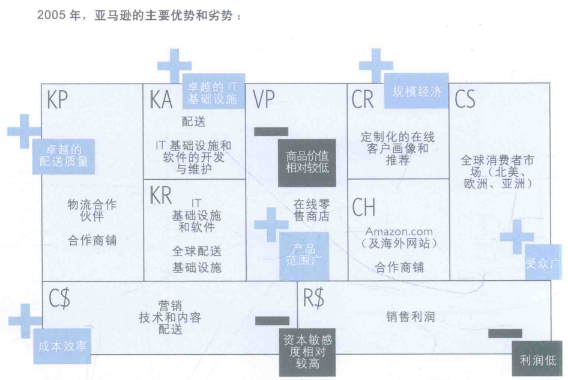                | 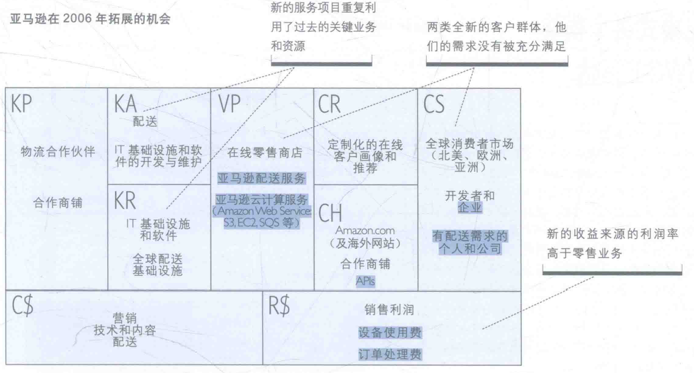              |

1. 2005年的优势与劣势
   1. 成本来自于最出色的几项业务，即配送与技术(7.45亿美元，占比46.3%)+内容(4.51亿美元，占比28.1%)
   2. 销售产品利润率低，含书籍、音乐CD与DVD
   3. 2005年亚马逊销售额85亿美元，利润率4.2%；谷歌61亿，23.9%；eBay46亿，23.7%
      - 阿里巴巴03年每天销售100万，04年每天盈利100万，05年纳税25480万元
2. 06年拓展的机会
   1. 亚马逊配送：仓库+分拣+投递+网站
   2. 亚马逊云

- 2006年，亚马逊针对自己的薄弱环境，开展了亚马逊配送服务和IT基础设施服务。

## 5.9. 对商业模式每一个模块的SWOT评估

1. 传统SWOT分析与商业模式画布结合
   1. 画布的存在帮助聚焦SWOT分析，避免模糊，实现聚焦
   2. 按照价值主张、成本/收入、基础设施(KR+KA+KP)、客户界面(CS+CH+CR)四类展开评估

### 5.9.1. **SW**OT：价值主张

1. 网络效应：各项价值主张之间相互联系，相互促进
2. 产品与服务的强耦合：
   1. 以产品为主的，服务能否有效支持产品传递和售后
   2. 以服务为主的，产品和环境能否满足服务的需要
3. 纯产品到纯服务的分级与举例

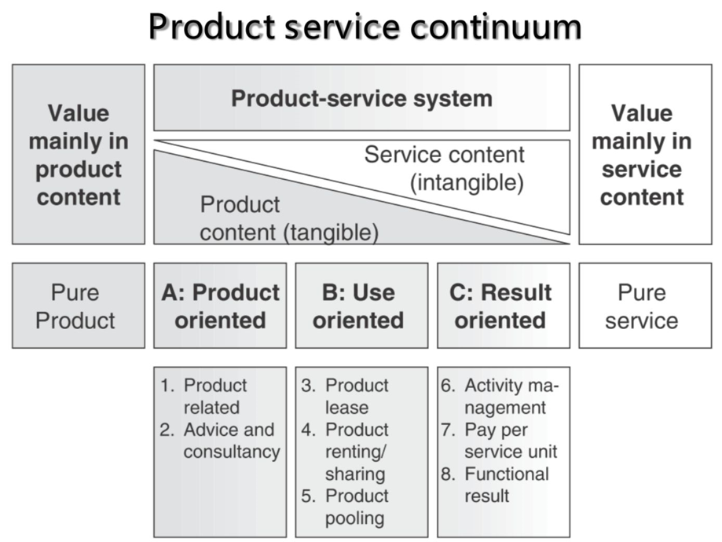

### 5.9.2. **SW**OT：成本/收入
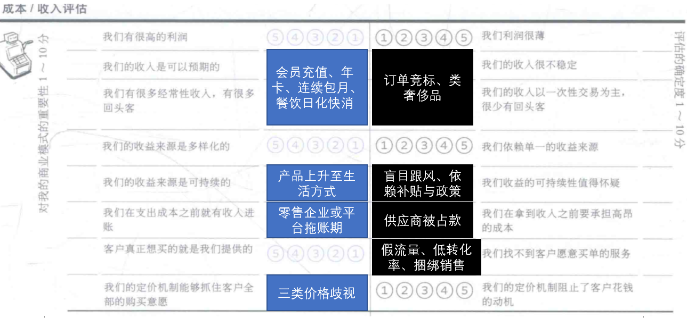

### 5.9.3. **SW**OT：基础设施

### 5.9.4. **SW**OT：客户界面
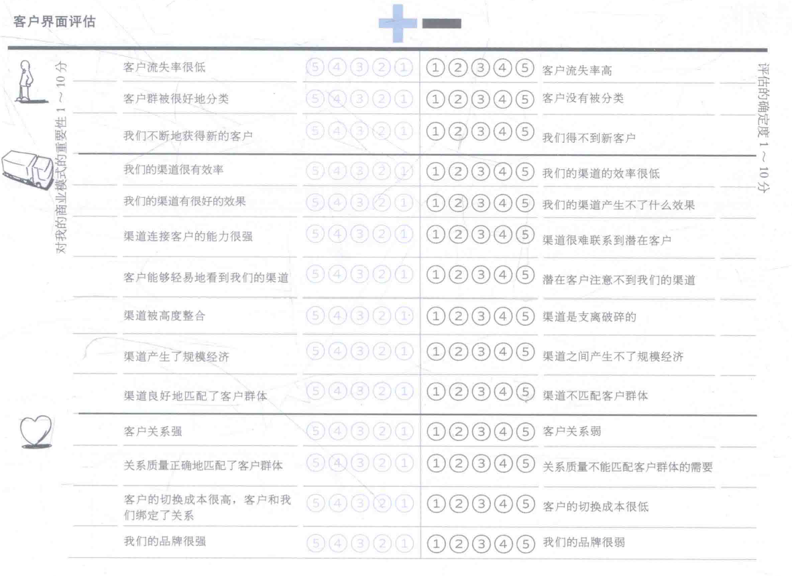

1. 客户细分：客户洞察、客户忠诚度、获客与获客成本
2. 渠道通路：网易严选在渠道的了解与评估部分取得了正面的效果(品牌构建与形象宣传)，但在传递与售后的部分取得了较为负面的效果(ems-顺丰，产品品控与SPU、SKU的矛盾)
3. 客户关系
   1. 品牌
   2. 网易严选与拼多多的情感诉求-高性价比与便宜好玩
   3. 强渠道或服务难以替代

## 5.10. 评估威胁
1. 评估每一个模块的威胁

|                       |                       |                       |
| --------------------- | --------------------- | --------------------- |
|  | 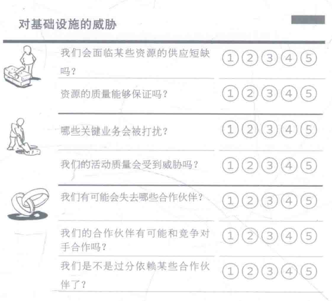 | 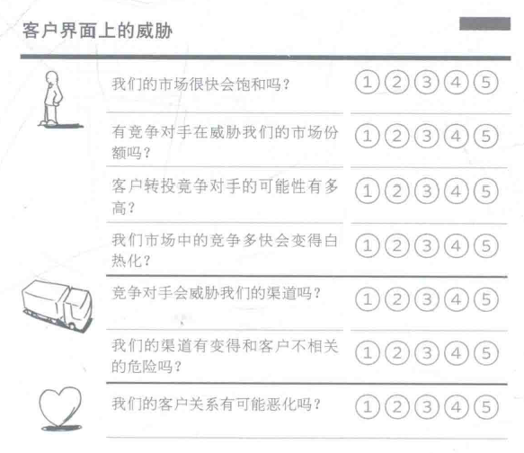 |

### 5.10.1. SWO**T**：评估威胁

1. 对价值主张的威胁(可替代性)
   1. 产品是否可替代？
   2. 是否会被更有竞争力的价格或更好的价值取代？
2. 对成本/收入的威胁(利润的威胁、是否单一、缩水、无法预测、无法支撑)
   1. 受威胁的利润？是否是技术原因导致？(PDD对淘宝、JD的威胁)
   2. 是否过度依赖某一项或多项收益来源？(九城代理魔兽世界)
   3. 未来可能消失(或缩水)的收益来源？(归属宝洁的吉列减值)
   4. 是否有无法预测的成本？(对宏观经济形势的依赖，供应链的稳定性，负面事件的影响与公关)
   5. 哪些成本的增加会快过它们所支撑的收入？(瑞幸的无人售卖战略)
3. 对基础设施的威胁(供应不足、干扰、合作关系波动)
   1. KR：某些资源的供应短缺？资源的质量是否有保证？(网易云音乐的版权问题)
   2. KA：哪些关键业务会被打扰(A站关停) ？我们的活动质量能否保证(产品、渠道)？
   3. KP：可能失去的合作伙伴？是否会跟竞争对手合作？是否过分依赖某些合作伙伴？(阿里失手O2O：自废武功+问题频出+养蛊反噬+点评被美团收购)
4. 客户界面上的威胁(市场竞争、渠道威胁、客户关系恶化)
   1. CS：市场是否很快饱和？市场份额被友商威胁？客户转投的可能性？竞争白热化的速度？(千播大战)
   2. CH：竞争对手是否威胁渠道？(恶意举报)是否存在渠道与客户不相关的危险？
   3. CR：我们的客户关系有可能恶化吗(产品质量与特性无法支持品牌构建)？

### 5.10.2. SW**O**T：评估机会(总结)
1. 价值主张中的机会(整合、服务化与拓展)：VP：产品与服务能否整合，产品能否服务化？价值主张的补充和外延？满足客户的额外需求或其它可做的工作？(共享单车、安卓与B站漫画、海尔能洗红薯的洗衣机)
2. 成本/收入中的机会(可重复、交叉销售、开源节流
   1. R$：重复性收入代替一次性收入、寻找额外买单元素与交叉销售的机会、新的收益来源、能否提价(会员自动续费、套餐与B站影视、瑞幸与共享单车的涨价)，交叉销售，通过客户关系管理发现现有顾客的多种需求，并通过满足其需求而销售多种相关服务或产品的一种新兴营销方式
   2. C$：成本削减
3. 基础设施中的机会(强化核心、减轻负担、转让闲置)
   1. KR：核心资源的降本、外包、强化、转让(降本增效、技术壁垒、技术转让)
   2. KA：标准化、IT技术带来的整体效率提升(海尔设计团队的微服务化，实体产业的互联网化)
   3. KP：外包与核心业务聚焦、交叉销售与更好的客户连接、价值主张补充(联名款)
4. 客户界面的机会(增长的市场、客户细分、渠道优化与去中间商，客户关系加强与取舍)
   1. CS：找到增长的市场并从中获利、服务新客户群体或更细致的已有客户分类(社交类产品)
   2. CH：渠道的效率、效益、整合，补充性的渠道伙伴，去中间商、渠道客户匹配(品牌)
   3. CR：加强与客户的关系并提升客户跟进的效果(华为19年近20%的盈利增长)、定制化或可自动维护、提升切换成本(全家桶)、是否抛弃没有利润的客户以及原因(发掘潜力或果断抛弃)

## 5.11. 国内各大电商平台的优势与发展动向
1. 成熟电商平台包含：网站+物流仓储+供应链+金融服务
2. 阿里：商业网络第一，新价值主张
   1. 优势：个人信用与金融平台，技术实力，集团内部高度整合，总部杭州
   2. 最新动向：阿里本地生活服务
3. 京东：基于物流拓宽新的价值主张与客户细分组合
   1. 优势：一手打造的物流网络，总部北京
   2. 最新动向：京东物流外部收入占40%，营收与利润大涨(净收入2019增长24.9%)，"买光湖北货"
4. 苏宁：强化线下渠道与资源优势，提升客户关系覆盖度
   1. 优势：线下仓储+供应链(半日达)，实体产业集群，良好的地方政企关系，总部南京
   2. 最新动向：收购万达商城、家乐福，整合线下便利店与Outlets(线下获客成本开始小于线上)
5. 拼多多：基于社交拓宽新的价值主张与客户细分组合
   1. 优势：用户心理把握，社交引流：货找人，拼购模式引领者，轻资产(物流？)，总部上海
   2. 最新动向：开团电子类产品("开车成功就真香")， Disney + Costco："多有趣，多实惠"
6. 唯品会：回归服饰特卖，拓展线下渠道，拓宽客户关系
   1. 优势：专注品牌(少量大牌+大量小品牌)特卖，09-16年吃到了服装产业库存红利，盈利能力强(小品牌佣金30%，连续29个季度盈利)，CEO温州人，总部广州
   2. 最新动向：布局线下特卖与渠道建设，回归垂直电商(服饰类)，剥离自有物流并与顺丰合作
7. 网易严选：维护客户关系(情怀)
   1. 特点：ODM引领者，没有中间商赚差价(PDD：？)，降低消费决策成本，总部广州
   2. 难点：重资产与体量小的悖论，淘宝、京东、小米的围剿，定价困难，没有品牌认同，品控风险，成长慢
   3. 最新动向：请罗老师代言旗下转椅；网易剥离电商，聚焦游戏、音乐、教育，得到资本市场认同；考拉20亿美元卖了，严选没人要

## 5.12. 评估机会
1. 评估每一个模块内部的机会

|                       |                       |                       |
| --------------------- | --------------------- | --------------------- |
| 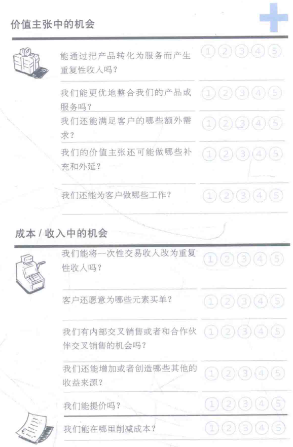 |  | 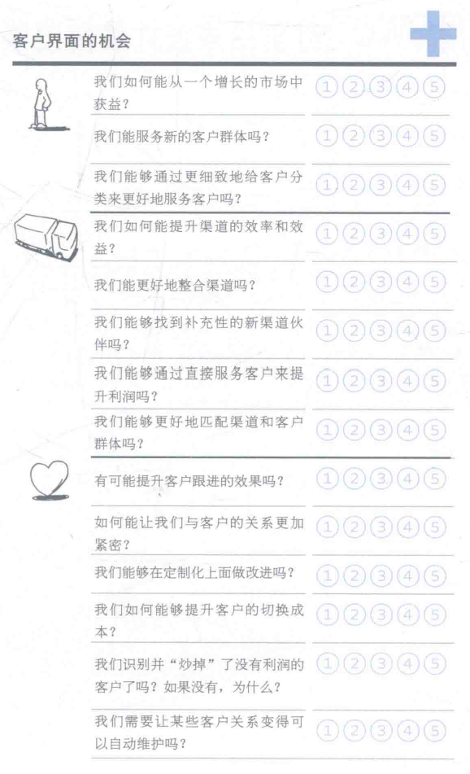 |
 
## 5.13. 利用SWOT分析结果来设计新商业模式
1. 对商业模式进行结构化的SWOT分析
   1. 说明了你当前处于的位置(优势和劣势)
   2. 建议了未来的方向(机会和威胁)

# 6. 从商业模式的视角看蓝海策略

## 6.1. 什么是蓝海策略
1. 蓝海战略是一个强大的方法，可以探究价值主张、商业模式，以及开拓新的客户群体。
2. 蓝海战略通过根本性的差异化来创造全新的行业，而不是通过模仿现有商业模式在当前行业中竞争(价值创新):
   1. 通过创造新的利益和服务来为客户增加价值，同时通过削减低价值的功能或服务来降低成本。
   2. 价值创新：不是在传统的绩效指标下超越对手，而是**创造新的、未充分竞争的市场空间**
   3. 画布的可视化效果为蓝海战略带来"全局化"的视角
   4. 通常还与开拓未被开发的客户群体相结合

## 6.2. 挑战行业的战略逻辑和现行的商业模式的四个关键问题
> 蓝海战略的"四项行动架构"(增加价值，减少成本)
1. 行业中哪些看起来理所当然的要素应该被**删除**?
2. 哪些要素应该被大幅**削减**到行业标准之下?
3. 哪些要素应该大幅**提升**到行业标准之上?
4. 哪些行业中从未提供的要素是应该被**创造**出来的?

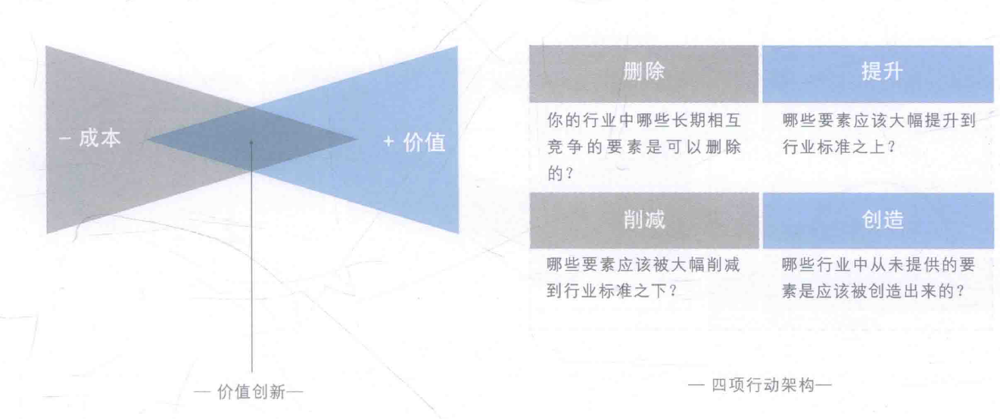

## 6.3. 整合蓝海战略框架和商业模式画布
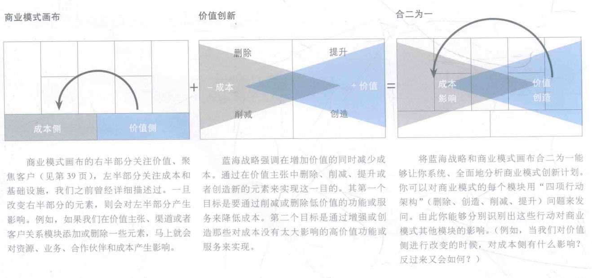

1. 商业模式右半部关注价值、聚焦客户，左半部分关注成本和基础设施。右侧的改变回对左半部分产生影响
2. 蓝海战略强调在增加价值的同时减少成本，通过删除和消减低价值产品或服务来降低成本，通过提升和创造对成本影响弱的高价值功能或服务来实现
3. 二者的整合使得使用"四项行动架构"分析时能够更好地识别这些行动对商业模式其它模块的影响

### 6.3.1. 太阳马戏团
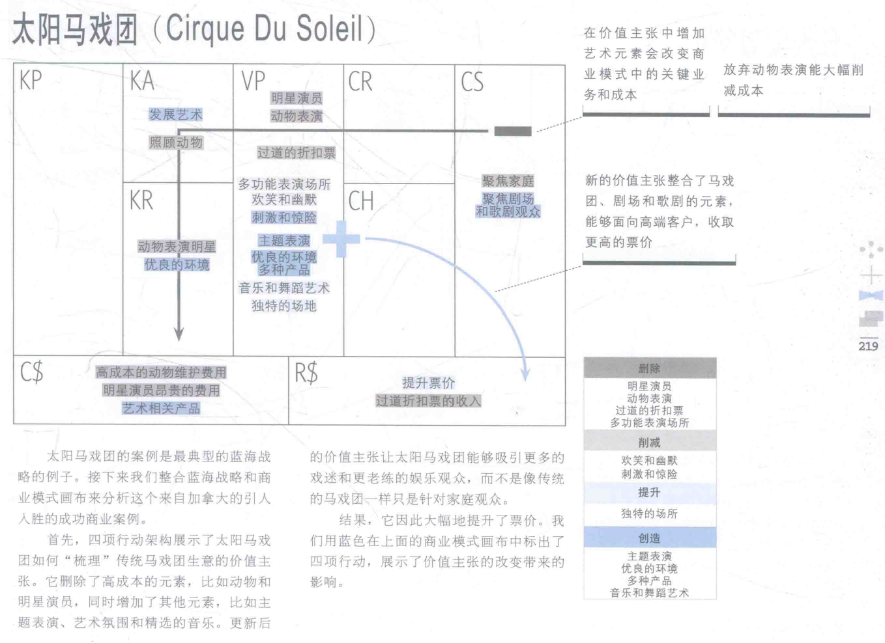

- 被中国复兴资本收购90%，4月2号裁员95%
- 演员成本高(一次演出需要50-100名艺术家)
- 大量的资本运作
- 疫情导致演出中断
- 没有考虑数字化转型

### 6.3.2. 任天堂的Wii
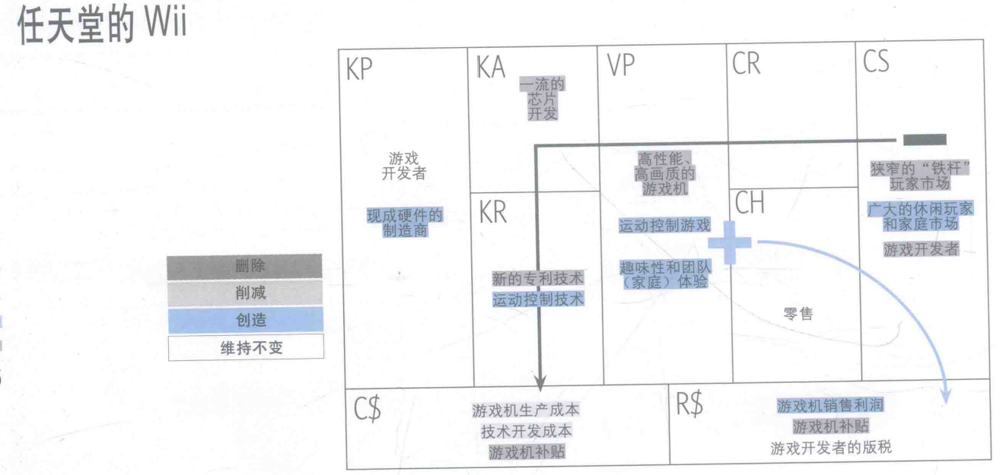

1. 遵照这一思路的Wii U和3DS的失败差点断送了任天堂
   1. Switch重新发掘了游戏场景(含Lite)
   2. 但Wii U引入了Switch的原型和体感设置，3DS引入了eShop游戏商店
   3. 积累和从失败中调整都很重要
   4. 与商业模式相比技术突破更有决定性
   5. 游戏移动化的趋势不可避免，与轨道交通强关联

## 6.4. 通过四项行为架构探究你的画布
1. 从三个视角出发
   1. 客户群体视角
   2. 价值主张视角
   3. 成本的视角

1. 探索成本影响
   1. 哪些活动、资源和合作伙伴关系的成本最高？
   2. 如果消减或删除这些成本项，会发生什么？
   3. 在删减或消除代价高昂的KR、KA或KP后，如何利用低成本的元素来代替它们创造价值
   4. 拼多多：复用社交网络实现小规模的货找人。
2. 探索价值主张:
   1. 哪些低价值的功能或者服务可以被删除或消减？
   2. 可以通过新增或加强哪些功能或服务来产生有价值的客户新体验？
   3. 价值主张的改变对成本有何影响？
   4. 价值主张的改变将如何改变商业模式客户侧的内容？
   5. 阿里:从淘宝到天猫-高品质带来的溢价、供应商加盟费与金融服务费。
3. 探索对用户的影响:
   1. 你可以聚焦哪些新的客户群体，哪些客户群体可以消减或删除？
   2. 新的客户群体真正希望你帮他们完成哪些工作？
   3. 这些客户倾向于何种联络方式，他们期望与你建立何种关系？
   4. 服务新的客户群体对成本有何影响？
   5. 西瓜视频：下沉市场的长视频、社交化收视体验。

## 6.5. 辩证地看待蓝海战略:风险与必要性
1. 蓝海战略的必要性：逃离"王慧文四杀"
   1. 当一个专注于特定领域的公司一家独大时，会为了继续扩大规模而使用非常规手段消灭竞争，利用垄断优势剥削上下游，恶化口碑
   2. **在某个领域取得绝对优势后，无法通过开拓新的赛道满足企业继续成长的压力，导致采用非常规手段争抢和压榨领域内达到上限的利润和资源，最终自我毁灭(内卷化)**
   3. 之后会出现戴维斯双杀：**利润率翻倍但股价不涨(没有发展预期)，每股收益与市盈率下降**
   4. 进而在中国出现**优秀人才大规模离开，用户体验下降导致口碑大规模恶化**
   5. 美团的"被迫"扩张：打车与共享单车(18年巨亏1000亿的主要原因)、实物电商"闪购"、充电宝、信用分
   6. Robin：what’s your problem? 菊厂的企业哲学：一切以用(fa)户(zhan)为中心
   7. 在某个领域取得绝对优势后，无法通过开拓新的赛道满足企业继续成长的压力，导致采用非常规手段争抢和压榨领域内达到上限的利润和资源，最终自我毁灭(内卷化)
2. **(错误的)蓝海战略的风险：空心化、外部潮流与形势变更**
   1. 在一个有限的时间段内，产品与服务过于聚焦某个明星品类，过于迷信利润率：经营之神杰克韦尔奇与通用的空心化
   2. 人类兴趣三年一小变五年一大变
   3. (供应链)经济全球化带来的蝴蝶效应

## 6.6. 蓝海精神:持续打造和运营产品体系
1. 追求与日常生活结合的独特业务场景
   1. VP一定要能够解决日常生活中的问题，高频刚需
   2. 对新技术、新趋势、新问题保持敏感
2. 构建关键业务的技术与商业壁垒，允许设计与产品试错
   1. 在KR与KP的不可或缺性与成本之间权衡
   2. 从产品聚焦到生态补完
   3. 保持探索精神与定期评估
3. 构建强有力的渠道与忠诚的客户关系(对产品的情感认同):保证组织与客户之间的有效沟通与服务传递，持续的经营品牌，将产品思维上升到情感认同

## 美团佣金争议
1. 疫情期间线下行业过于依赖线上入口，排他性的高额佣金问题涌现
2. 佣金涨价：5%、8%、14%、20%、23%(这时就基本上已经不剩多少的盈利空间)
3. 从2015到2018年，美团的净利润分别为-105.19亿、-57.9亿、-189.15亿和-1154.77亿，2019年实现正向盈利22.39亿元。2019年全年收入同比增长49.5%达975亿元，全年总交易金额同比增长32.3%至6821亿元。
4. 应对：妥协、新(持续改善)业务、公共形象塑造

# 7. 管理多种商业模式
1. 成功应对如何在实施和管理新商业模式的同时维持现有的商业模式这个挑战的组织被称为:二元组织。

## 7.1. 双变量准则
1. 组织的艰巨任务：如何在实施和管理新商业模式的同时维持现有的商业模式
   1. 将新商业模式剥离成一个独立的实体，或者成立独立的业务单元，或维持现状
   2. 拆分商业模式：基础服务、客户关系、新业务
2. 衡量是否拆分的双变量
   1. 两种模式冲突的严重程度
   2. 战略上的相似性
   3. **Swatch的合：符合公司的产品分层与定位；**
   4. **Nespresso的拆：与速溶咖啡在价值主张、客户关系、渠道通路、市场细分上完全不同**
3. 成功不仅依赖于选择正确的管理模式-整合或者单独实施，而且取决于如何执行相应的决策

## 7.2. 例子
|                       |                       |                       |
| --------------------- | --------------------- | --------------------- |
| 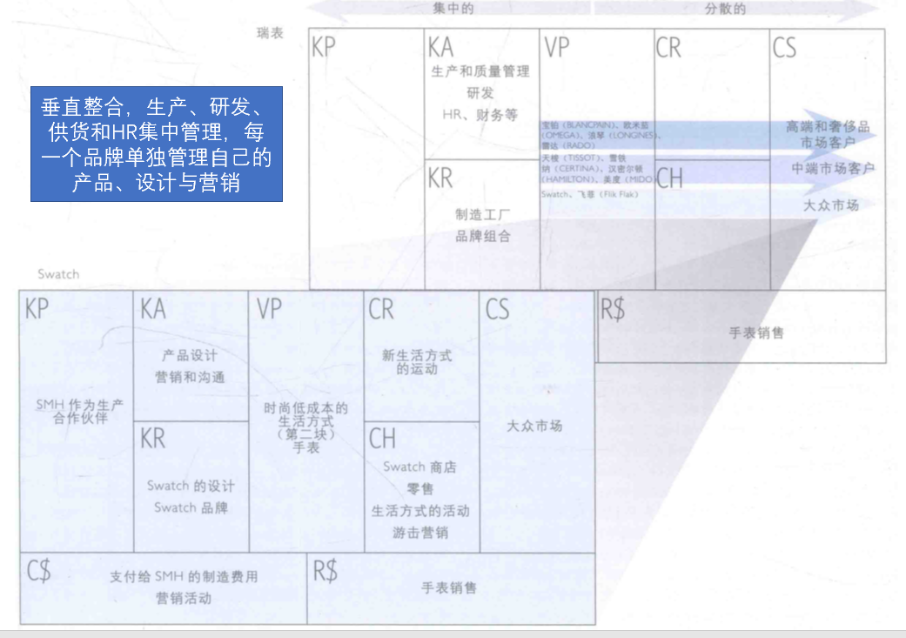 | 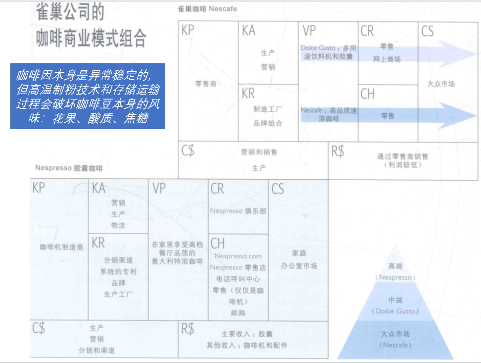 | 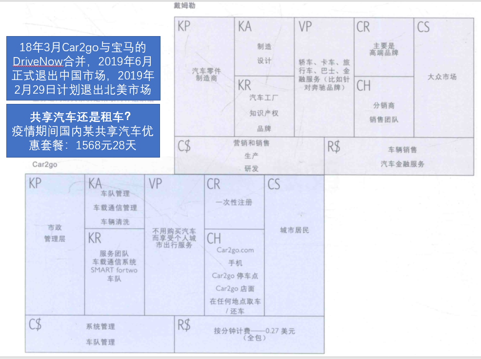 |

## 7.3. 其他补充
1. 第三个变量则是风险:新的商业模式有多大风险会对现有的模式产生负面影响。

## 7.4. 企业管理
1. 公司可能在某个时段考虑整合运营
2. 公司也可能在另一个时段考虑将不同的商业模式分开管理

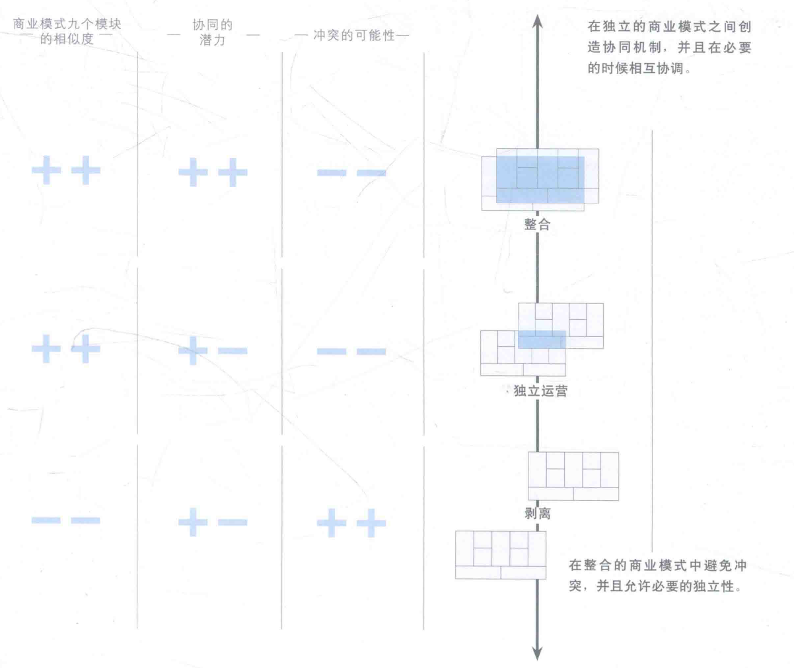

## 7.5. 例子

### 7.5.1. SMH的SWATCH品牌的独立运营模式
|  |  |
| --------------------- | --------------------- |

### 7.5.2. Nespresso 胶囊咖啡的成功

- 更多:书226页

### 7.5.3. 戴姆勒公司Car2go的商业模式
1. 补充了母公司的商业模式，戴姆勒的核心商业模式是制造、销售从豪华轿车到卡车和巴士的各种汽车，并提供汽车金融服务。
2. Cat2go:即需即用

# 8. 信息
> 内容修正、作业亮点与热门事件

1. 美团、大众点评、百度外卖、饿了么的相互试探与收购事件点
   1. 2015.9.22日美团接触百度谈合并，达成初步意向，成为点评被美团收购的最后一头骆驼(此时点评正在与百度谈合并，并随后拖延了美百的合并)
   2. 2016.9.5日网传新美大将与百度外卖+糯米网合并，被辟谣
   3. 2017.8.24日饿了么8亿美元收购百度外卖(糯米网与百度搜索业务合并)
   4. 2018.4.2阿里联合蚂蚁金服95亿美元收购饿了么(70-90-95，2018.9.20日美团上市)
2. 为瑞幸打造产品体验
   1. 大部分设想考虑了瑞幸咖啡功能性的特点，没有考虑到瑞幸店面的缺点：快速扩张的小店，店内空间有限
   2. 为带婴儿的顾客提供免费奶粉冲泡服务：育婴生活场景
   3. 类似于大桶奶茶的大桶咖啡：会议场景与tea break(瑞幸有启动公司咖啡外包业务)
   4. 按工作时间与强度分级的定制咖啡：熬夜加班与咖啡因加倍、(下班最后一杯deCafe)
3. 滴滴发力社区团购
   1. 橙心优选-程维表示投入不设上限，全力拿下市场第一名
   2. 社区-团长(小店主)-宣传并下单一次日配送订单商品至团长-门店自提
   3. 因疫情影响的新零售蓝海(与叮咚买菜这类线上平台的优势?)已有产品十荟团、兴盛优选、好草滩、同程生活，背后是阿里、腾讯、美团、拼多多等巨头(四家各有什么优势?)