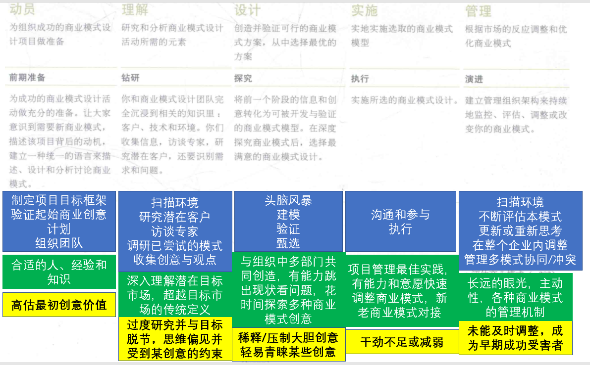
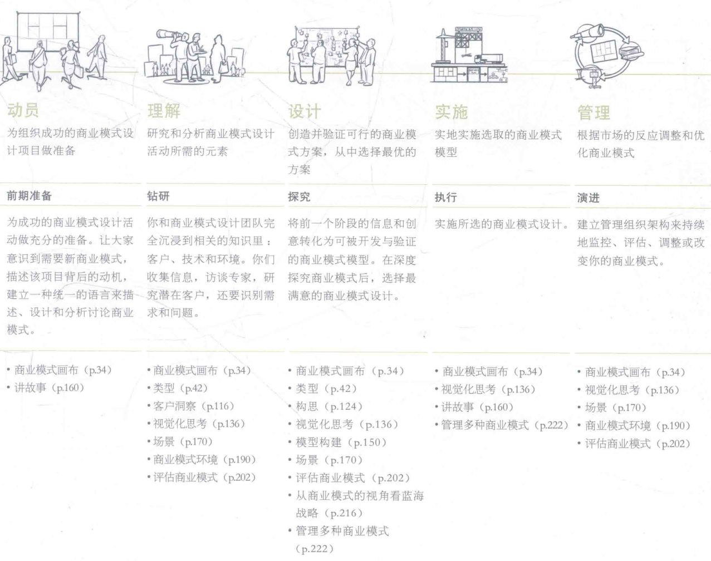

Book5-流程
---

# 1. 商业模式设计流程
1. 基础的商业模式设计流程
   1. 动员
   2. 理解
   3. 设计
   4. 实施
   5. 管理
2. 商业模式创新的目的
   1. 满足未被相应的现实市场需求
   2. 将新的技术、产品或服务推向市场
   3. 用更好的商业模式来改进、颠覆现有市场或者推动其转型
   4. 创造一个全新的市场
3. 商业模式创新的动机
   1. 当前商业模式的危机
   2. 为了适应黄姐的变化，调整、改进或者捍卫当前的商业模式
   3. 将新的技术、产品或服务推向市场
   4. 为未来做准备、开发和验证最终可能取代当前商业模式的全新商业模式

# 2. 商业模式创新的基本出发点

## 2.1. 商业模式设计和创新
1. 满足市场:未被相应的市场需求
   1. 拼多多
   2. 汇通达
2. 投放市场:将新技术、产品或服务推向市场，或者开发现有的知识资产
   1. 云游戏
3. 改进市场:改进或者颠覆当前的市场
   1. 哈啰单车
4. 创造市场:创造一种全新的业务
   1. 头条
   2. 抖音
5. 挑战
   1. 找到正确的模式
   2. 在全面启动前验证该模式
   3. 有诱导市场接受新的模式
   4. 根据市场的反馈不断调整该模式
   5. 管理不确定因素

## 2.2. 成熟组织特有的因素
1. 被动反应:由当前商业模式危机引发
   1. Switch
2. 调整适应:调整、改进或捍卫现有的商业模式
   1. 爱奇艺的"随刻创作"
   2. B站的"必剪"
3. 扩张:开发一项新技术、产品或服务
   1. 头条的海豚与瓜瓜龙
4. 主动开拓:为未来做准备
   1. 华为AR地图-河图
5. 挑战
   1. 对新的模式产生欲望
   2. 新老模式之间的拉通
   3. 管理既得利益
   4. 聚焦长远利益

# 3. 设计态度
1. 创新的参与者必须愿意投入大量的时间和经历去探索很多的可能，而不是过早地采用某一种解决方案，时间的投入会得到回报的，你会因此获得更强大的新商业模式，确保未来的增长。

# 4. 设计模式流程的五个阶段
1. 理解和设计阶段一般会并行前进，理解早期就可以启动商业模式建模；设计阶段的建模也可能催生出新的创意。
2. 最后的阶段管理就是持续地管理你的商业模式

## 4.1. 阶段详解
|  |  |
| -------------------- | -------------------- |

## 4.2. 动员
> 为组织成功的商业模式设计项目做准备

1. 项目合法性
2. 管理既得利益
3. 跨职能团队
4. 引导决策者

### 4.2.1. 活动
1. 制定项目目标框架:涵盖基本原理、项目范围和主要目标，最初计划应该包含动员、理解和设计三个极端
2. 验证最初的商业框架
3. 计划
4. 组织团队

### 4.2.2. 成功的关键因素
1. 合适的人、经验和知识:这个世界上并不存在完美团队的通用规则，有必要聚合各种管理背景和行业经验的人才，汇聚新鲜的创意、正确的人际网络。

### 4.2.3. 主要风险
1. 高估最初创意的价值:考虑使用"红脸白脸"研讨会，所有参与者先头脑风暴20分钟，然后找各种理由来证明为什么行不通(白脸)，然后花20分钟头脑风暴来证明这个创意为什么会很有前途(红脸)

### 4.2.4. 在成熟企业中运作的注意事项
1. 项目合法性:比较有效的是，最开始就让一位高层管理者加入到团队。
2. 管理既得利益:小心识别和管理好组织内部的各种既得利益，有的设计活动会威胁到一些人的利益。
3. 跨职能团队:理想的商业模式设计团队是由组织中各种类型的人组成的，包括不同的业务单元、业务职能、资历和专业技能等。
4. 引导决策者:计划好用相当多的时间来引导和教育决策者，让他们理解这些商业模式、重要性，以及设计和创新的流程。

## 4.3. 理解
> 研究和分析商业模式设计活动所需的元素

1. 绘制并评估当前商业模式
2. 跳出现状看问题
3. 不要局限于当前的客户群体
4. 展示进展

### 4.3.1. 活动
1. 扫描环境:包括市场调研、研究客户并与之互动、访谈相关领域的专家，以及描绘出竞争对手的商业模式(避免过度研究)
2. 研究潜在客户
3. 访谈专家
4. 调研已经被试过的模式(比如失败的例子和它们失败的原因)
5. 收集创意和观点

### 4.3.2. 成功的关键因素
1. 对潜在目标市场的深入理解
2. 超越对目标市场的传统定义的条条框框:突破性的创意有可能会受到强烈的阻力

### 4.3.3. 主要风险
1. 过度研究:研究活动和目标之间的脱节
2. 带着偏见研究，思维受到某个商业创意的约束

### 4.3.4. 在成熟企业中运作的注意事项
1. 绘制/评估当前商业模式:成熟组织中的创新需要从当前商业模式开始。绘制和评估要分别通过两次研讨会完成，从多角度观察现在新商业模式的创意和观点。
2. 跳出现状看问题:
3. 不要局限于当前的客户群体
4. 展示进展:及时向管理层展示项目的进展，避免失去支持。

## 4.4. 设计
> 根据市场的反馈调整和修改商业模式

1. 避免对大胆想法的遏制
2. 参与式设计
3. 思考新旧模式之间的关系
4. 避免聚焦短期利益

### 4.4.1. 活动
1. 头脑风暴
2. 建模
3. 验证:与外界专家或潜在客户一起验证潜在商业模式
4. 甄选

### 4.4.2. 成功的关键因素
1. 与组织中各个部门的人共同创造
2. 有能力就跳出现状看问题
3. 花时间探索多种商业模式创意

### 4.4.3. 主要风险
1. 稀释或压制大胆的创意
2. 轻易地青睐某些创意。

### 4.4.4. 在成熟企业中运作的注意事项
1. 避免对大胆想法的遏制:保持微妙平衡，为每一个商业模式画一个"风险/收益"图像
2. 参与式设计:让大胆的创意更可能被采纳或实施的方法就是在组织设计团队的是后续尽可能包含各类人员。
3. 新旧模式之间的关系:独立运营还是合并运营
4. 避免聚焦短期利益:避免期望在第一年就收获很多

## 4.5. 实施
1. 主动管理"路障"
2. 项目赞助人
3. 新旧商业模式之间的关系
4. 内部沟通活动

### 4.5.1. 活动
1. 沟通和参与
2. 执行

### 4.5.2. 成功的关键因数
1. 项目管理的最佳实践
2. 有能力或意愿快速地调整商业模式
3. "新""老"商业模式的对接

### 4.5.3. 主要风险
1. 干劲不足或者越来越小
2. 注意管理不确定因素:当用户数量爆炸增长时，必须低成本、高效地处理用户的反馈和投诉

### 4.5.4. 在成熟企业中运作的注意事项
1. 主动管理"路障":在动员、理解和设计阶段，组织内部人员全方位地参与，提前发现管理障碍
2. 项目赞助人:第二个成功因素是项目赞助人持续且明显的支持。
3. 新旧商业模式之间的关系:第三个关键因素是为你的商业模式创造正确的组织结构，被拆分成实体还是新业务
4. 内部沟通活动:第四个因素是组织一次引人注目、多渠道的内部沟通活动，宣布新的商业模式。

## 4.6. 管理
> 根据市场的反应调整和修改商业模式

1. 商业模式管理机制
2. 管理协同和冲突
3. 商业模式组合
4. 空杯心态

### 4.6.1. 活动
1. 扫描环境
2. 不断评估你的商业模式:跨部门研讨会决定要不要微调和彻底改造。
3. 更新或重新思考你的模式
4. 在整个企业范围内调整各种商业模式
5. 管理各种商业模式之间的协同和冲突

### 4.6.2. 成功的关键因素
1. 长远的眼光
2. 主动性
3. 各种商业模式的管理机制

### 4.6.3. 主要风险
1. 未能及时调整，成为早期成功的受害者。

### 4.6.4. 在成熟企业中运作的注意事项
1. 商业模式管理机制:成立一个小组来专门管理各种商业模式
2. 管理协同和冲突:
3. 商业模式组合:用当前挣钱的业务补贴面向未来的商业模式实验。
4. 空杯心态:保持初学者的空杯心态帮助我们避免成为自己成功的受害者。

# 5. 还有哪些建议?
1. 当一个组织想改进它的商业模式的时候，往往是认识到了差距。
2. 在成熟企业中，往往有很多的产品创意从来得不到足够的重视
3. 以终为始，客户视角