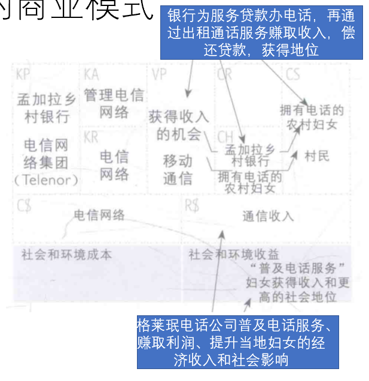
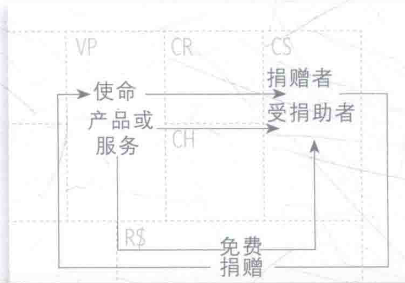
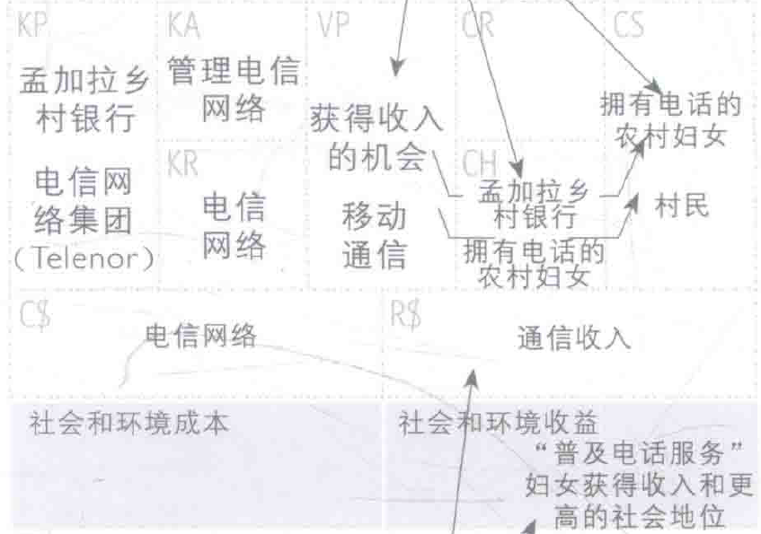
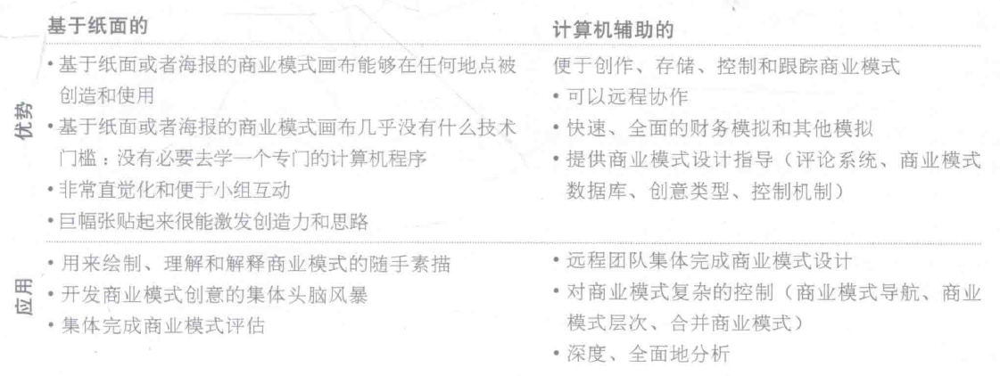
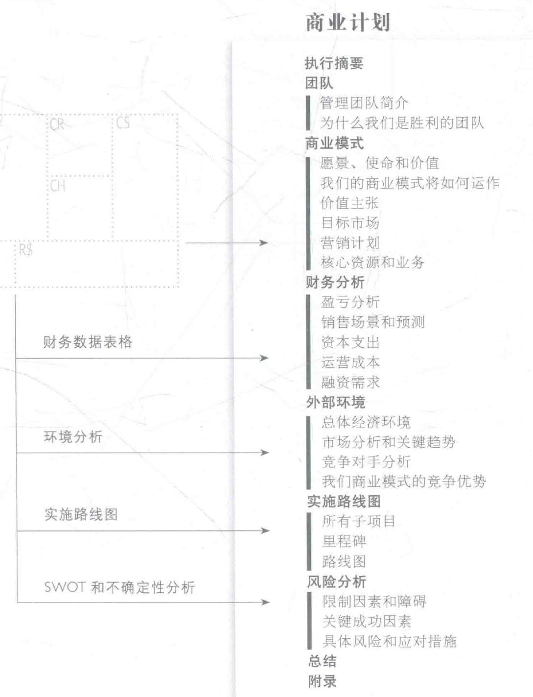
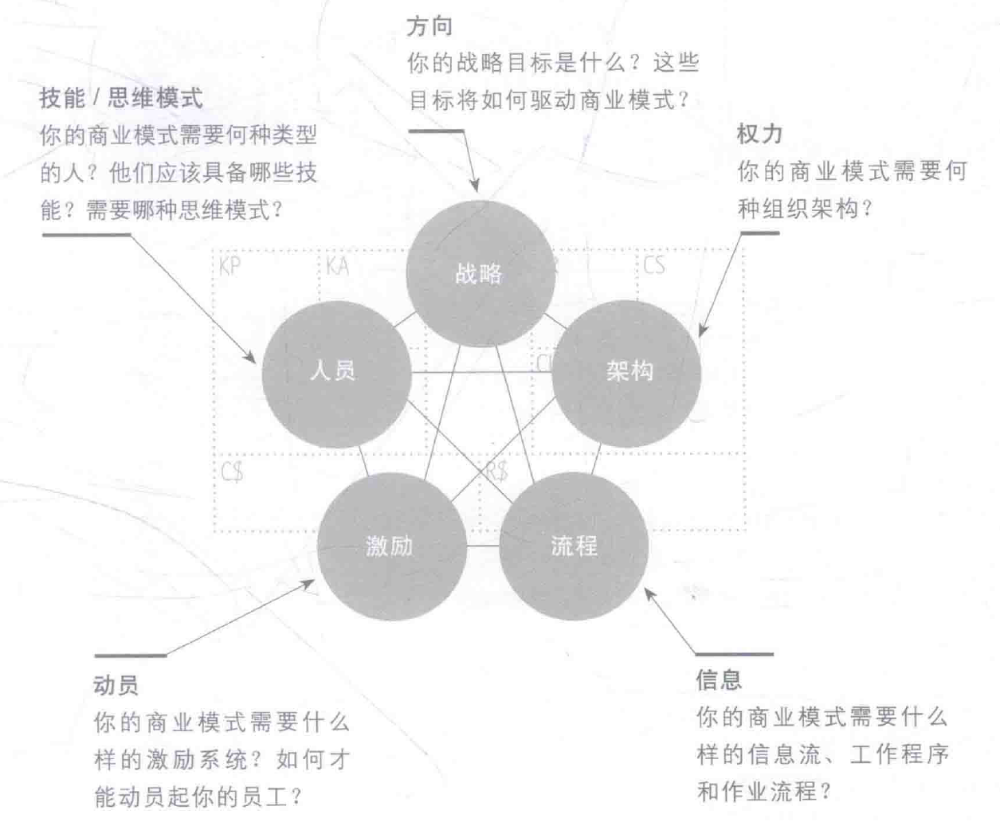
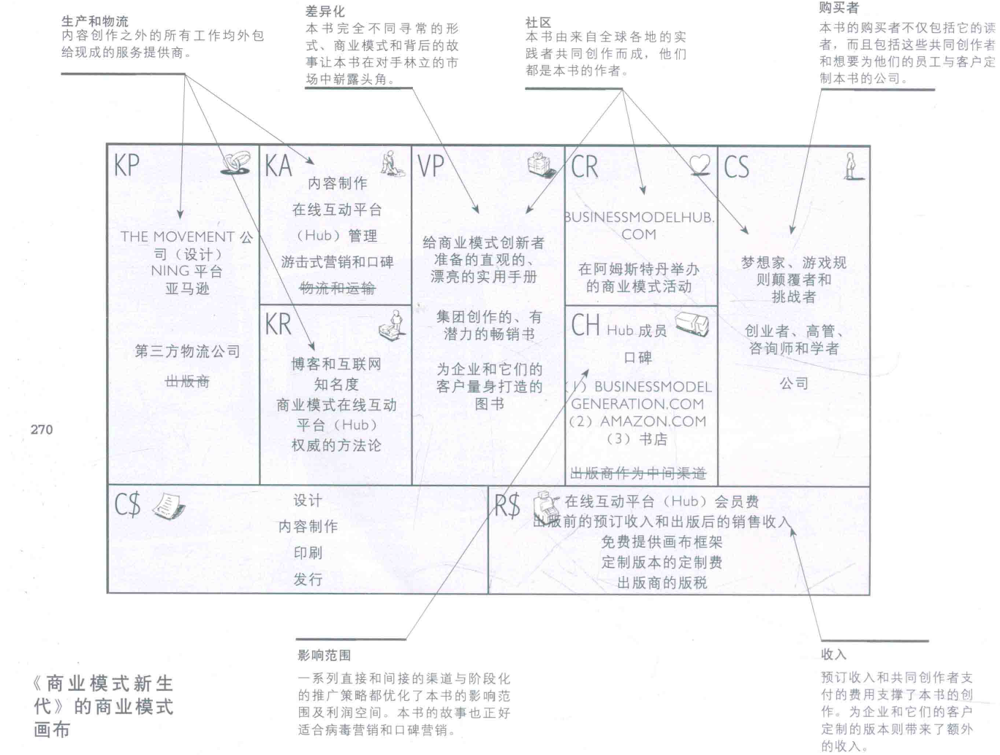

Book6-五个课题
---

# 1. 超越经济效益的商业模式
1. 每一个组织都有一个商业模式，即便它并没有"商业"属性。
2. 为**非盈利组织、慈善机构、公共服务实体和以盈利为目的**的社会投资机构服务
3. 主要讨论的是**非盈利组织**的的商业模式，这种我们更倾向于叫做"**企业模式**"
   1. 第三方资助的**企业模式**(比如公益组织、慈善组织、政府组织)，政府购买公共服务、红会捐款
   2. 有强烈的环境和社会使命的"**三重损益**"商业模式:"三重损益"，指的是计算环境、社会和财务成本，孟加拉格莱珉电话公司、中国邮政与邮储银行

## 1.1. 第三方资助的模式
1. 在这种企业模式中，一个为产品和服务买单的**第三方**，可以是一个捐助者，也可以是一个**公共服务机构**，第三方出资让这个组织来完成一项使命，可以是社会性质、**与环境相关或者是公共服务性质的使命**。
2. 第三方很少期望获得**直接**的经济回报。
3. 第三方企业模式的一项风险是**价值创造的动机**可能会错位。
4. **企业为捐赠者创造价值的动机**可能会大过为**受捐助者创造价值的动机**。

## 1.2. "三重损益"商业模式
1. 要考虑三重损益商业模式，我们可以在商业模式画布上**增加两个模块**来阐述以下两个方面的结果:
   1. 商业模式的**社会和环境成本**(比如负面的影响)
   2. 该商业模式的**社会和环境利益**(比如积极的影响)

# 2. 计算机辅助的商业模式设计
1. 使用计算机辅助工具来帮助商业模式设计。
2. CAD(Comupter-aided design, 计算机辅助设计)
3. CAD的出现可以省去很多的人工活动，CAD系统可以帮助实现商业模式的可视化、存储、控制、跟踪、注释和沟通，就像商业模式工具包一样。

# 3. 讨论商业模式和商业计划之间的关系
1. 商业计划的目的是在组织内外描述和沟通一个营利性和非营利性的项目，以及该项目将如何实施。
2. 我们建议在商业计划中使用六段式结构:团队、商业模式、财务分析、外部环境、实施路线图以及风险分析。

## 3.1. 团队
1. 在一个商业计划中，风险投资人最为看重的一个元素就是管理团队。
   1. 团队经验、知识和足够协调来完成其宣称的目标
   2. 团队成员是否有成功的过往经历
   3. 为什么你的团队是能成功打造和执行你提出的商业模式的最合适的团队

## 3.2. 商业模式
1. 展示商业模式的迷人之处
2. 通过商业模式画布来展示最直接的商业模式画像，然后描述价值主张，展示客户需求的证据，并解释你将如何抓住市场，用故事说明一切，强调你的目标的客户的诱惑力来抓住读者的眼球。

## 3.3. 财务分析
1. 根据画布中的模块来做预算，并且估算能获得多少客户，并且在本段中包括其他元素，比如盈亏分析、销售场景和运营成本。

## 3.4. 外部环境
1. 描述商业模式在外部环境中的定位
2. 重点是前面提到的四项外部影响力，关注自己的商业模式的竞争优势。

## 3.5. 实施路线图
1. 向读者展示实施你的商业模式锁需要的成功要素，以及你将如何来实施。请概括总结其中设计的所有项目，并提供总体里程碑。
2. 用一个项目路线图来列出实施日历，并包含项目进度甘特图。

## 3.6. 风险分析
1. 作为总结，请描述各种限制因素和障碍，以及关键的成本因素。
2. 通过SWOT分析得到。

# 4. 在组织中执行商业模式
1. 组织必须相互协同的五个领域:战略、架构、流程、激励和人员。

## 4.1. 战略
1. 战略驱动商业模式，包括新的客户群体、渠道通路或者关键业务

## 4.2. 架构
1. 商业模式的特征决定了哪种组织架构最适合执行它。

## 4.3. 流程
1. 每个商业模式都有要求不同的流程。
2. 一个低成本商业模式的运营应该是精细化和高度自动化的

## 4.4. 激励
1. 不同的商业模式需要不同的激励系统。
2. 比如直销团队去获取新客户:激励系统应该是高绩效导向的。

## 4.5. 人员
1. 特定的商业模式需要有特定思维模式的人。
2. 创业机制就需要给员工给足够的发挥空间。

# 5. 考察如何更好的协同商业模式和IT

- 不同的企业架构概念都从以下三个方面
  - 商业方面
  - 应用方面
  - 技术方面

# 6. 商业模式新生代的商业模式画布

# 7. 商业模式与商业计划
1. 商业计划(BP)：在组织内外描述和沟通一个**营利性或非营利性**的项目，以及该项目将如何实施
2. 本书推荐的六段式结构：**团队、商业模式、财务分析、外部环境、实施路线图、风险分析**
3. 我参与过的"双创项目"六段式结构
   1. 创业项目简介、企业及**团队运营情况**
   2. 创新性服务或产品(**创新性+成熟度**)
   3. 产品市场与竞争:**产品说明**、目标客户与**市场容量**、竞争对手与**市场趋势**、**风险与应对**、销售收入预测
   4. 产品商业模式:研发与生产策略、**销售策略**与盈利模式、项目进度计划
   5. 财务与社会经济效益:**投融资计划**、经济效益分析、社会效益预测

