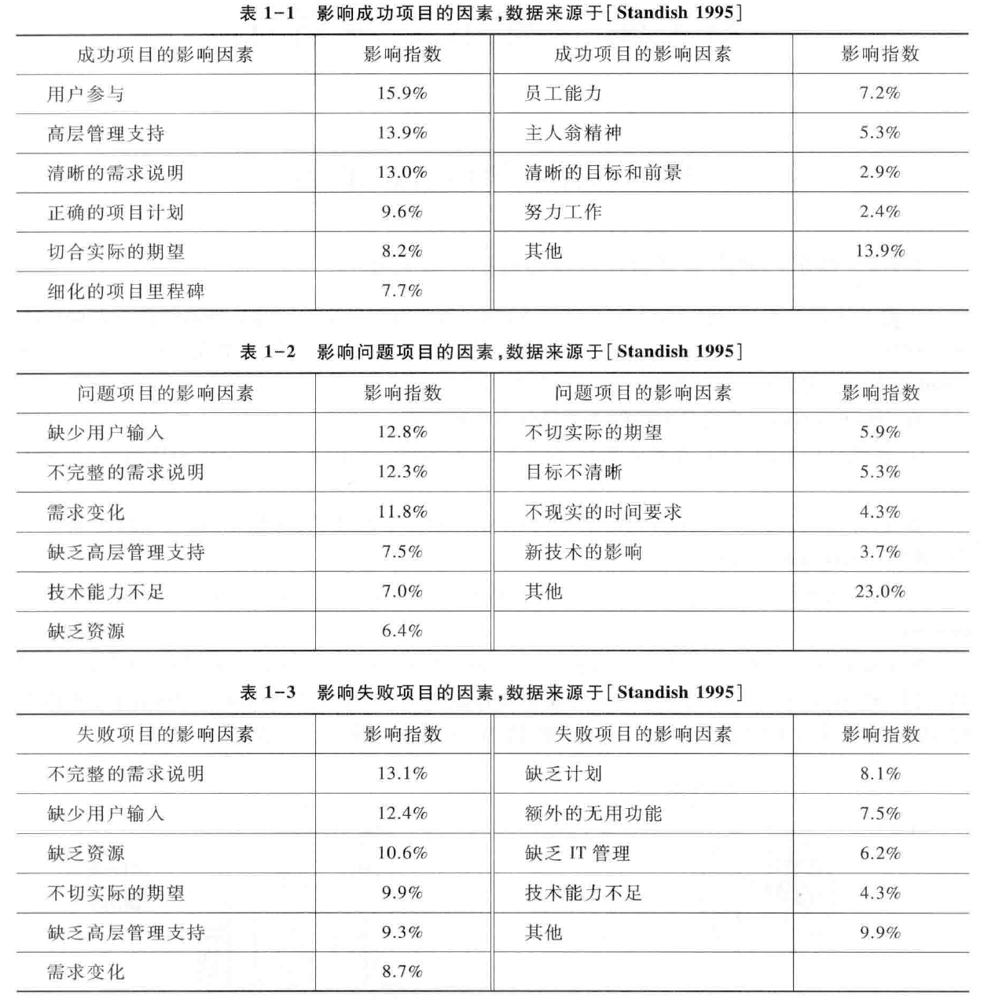
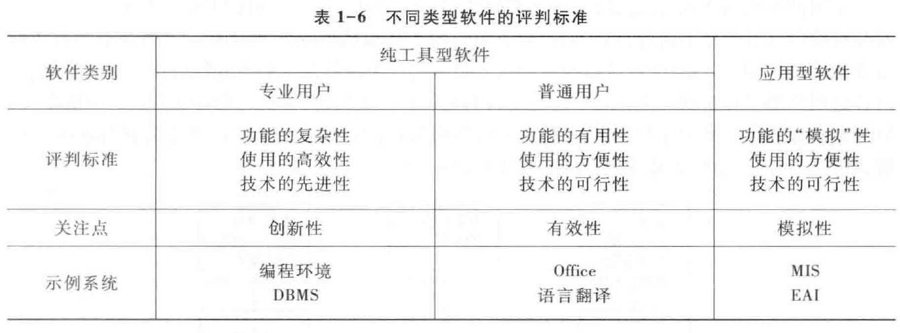
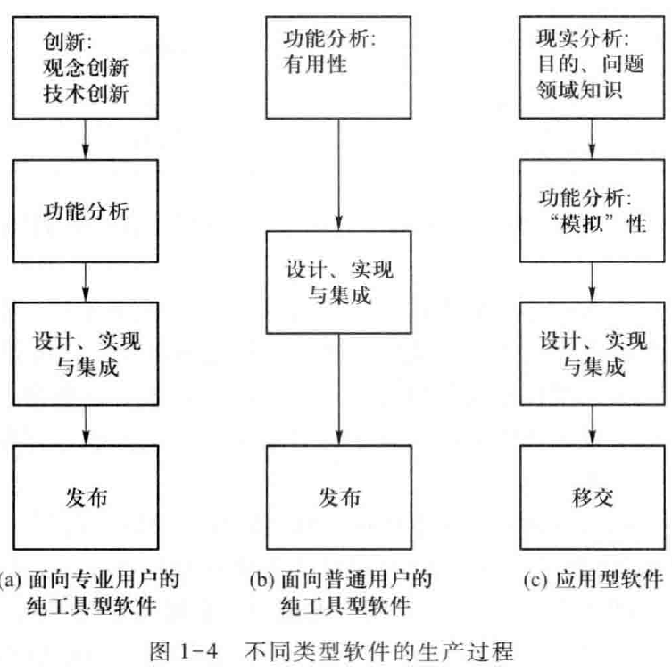
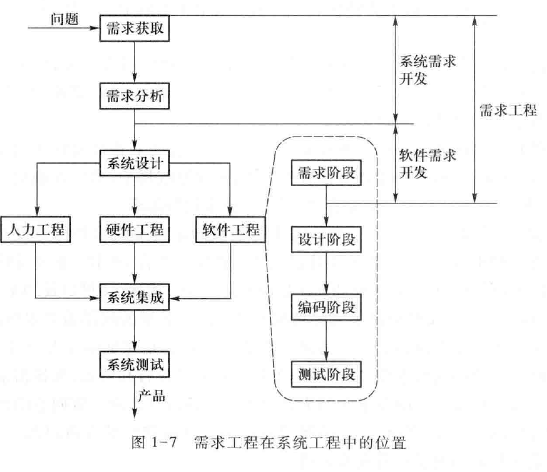

Book1-需求工程导论
---

# 1. 课程下半场:需求工程与商业模式的链接
1. 需求获取前半段(获取业务需求)：项目前景与范围+涉众分析 <=> 商业模式画布
2. 需求获取后半段(获取用户需求)：面谈+原型+观察 <=> 商业模式设计
3. 需求分析(获取系统级需求)：利用UML模型细化并精化需求 
4. 需求规格说明：完整描述并记录业务需求、用户需求、系统级需求
5. 需求验证与管理：常用手段与基线保持 <=> 商业模式评估
6. 互联网产品设计与需求工程对比

# 2. 软件生产中的需求问题

## 2.1. 需求问题是当前软件开发的主要问题
1. 需求问题对项目的成败有着比较重要的影响

## 2.2. 软件的模拟特性
1. 软件的模拟特性来源于其知识载体的特性：软件在运行中表现出来的特性、行为应该和应用的显示情况保持一致。
2. 软件的冗余功能问题也从另一个侧面很好地反应了它的模拟特性。
   1. 一个软件中接近50%的功能用户从来不使用，这些冗余功能往往是导致用户不满意和软件不被接受的原因之一。
   2. 用户会担忧触发未知或者不确定的功能。

### 2.2.1. 软件的模拟性的具体指称
1. 目的性
2. 正确性
3. 现实可理解性

### 2.2.2. 不同类型的软件

- 面向专业用户的工具型软件:具有一定的创新优势而进行巧妙的功能安排
- 面向普通用户的工具型软件:进行方案权衡，寻找一套切实有效的功能配置
- 应用型软件:发现人们利用软件的原因(目的)，找出需要软件解决的问题。

## 2.3. 需求问题具体原因分析

### 2.3.1. 非技术型和社会性因素重要不足
1. 需求建模与分析师需求处理中的核心活动，它用一些形式化或半形式化的语言进行知识描述。
   1. 只有通过需求与分析活动才能将混乱、模糊的用户需求变成清晰、明确的软件需求：建立的分析模型是需求处理中最为重要的成果。
   2. 建模与分析的理论可以帮助人们系统化的看待问题。
2. 这些因素包含组织机构文化、社会背景、商业目标、利益协商等。

### 2.3.2. 传统需求分析方法的缺陷
1. 传统的需求分析方法都是最先在编程领域取得成功的，后续在设计领域的应用也取得了成功
2. 但是理解现实这个目标是传统分析方法所无法实现的(先天缺陷)

### 2.3.3. 软件规模的日益扩大
1. 软件规模的扩大，导致涉众也在扩大，导致相互之间的利益冲突更加剧烈，因此对商业目标和利益协商的处理要求也就更加重要了。
2. 对于以企业为中心，很少有用户可以单独给出全局的解释，需要由需求分析人员结合给出的片段，拼接起来形成一个全局理解，导出需求。
 
### 2.3.4. 需求问题的高代价性
1. 在维护阶段进行需求修复的代价可能是需求阶段的修复代价的100-200%

# 3. 需求工程

## 3.1. 需求工程的定义
1. 需求工程是所有需求处理活动的总和，它收集信息、分析问题、整合观点、记录需求并验证其正确性，最终反映软件被应用后与其环境互动形成的期望效益。

## 3.2. 需求工程任务
1. 需求工程必须说明软件系统将被应用的环境及其目标
2. 需求工程必须将目标、功能和约束反映到软件系统中，映射为可行的软件行为，并对软件行为进行准确的规格说明
3. 现实世界是不断变化的世界，因此需求工程还需要妥善处理目标、功能和约束随着时间的演化情况。

## 3.3. 基本活动

- 需求工程
  - 需求开发
    - 需求获取:从项目的战略规划开始建立最初的原始需求
      - 确定系统涉众
      - 了解现有问题
      - 建立新系统目标
      - 获取为支持新系统目标需要的业务过程细节和具体的用户需求
    - 需求分析:保证需求的完整性和一致性
      - 将需求获取阶段输出的原始需求和业务过程细节出发，将目标、功能和约束映射为软件行为，建立系统模型
      - 在抽象的系统模型中进行分析，标识并修复其中的不一致缺陷，发现并弥补遗漏的需求。
    - 需求规格说明:文档化固定需求
    - 需求验证:保证需求及文档的正确性
  - 需求管理：对需求开发所建立的需求基线的管理，在修基线完成后正式开始，并在需求工程阶段结束后持续存在。

## 3.4. 需求工程与系统工程
1. 系统需求开发又称为需求工程的早期阶段，为了获取整个系统的期望目标，包含功能特征和非功能特征。
2. 系统需求开发阶段获得的需求被分配到软件工程、硬件工程和人力工程部分。

## 3.5. 需求工程的复杂性
1. 需求工程的复杂性源自于需求处理过程的复杂性
2. 复杂性包含
   1. 处理范围广泛:需求工程连接现实世界和计算机世界。
      1. 理解现实世界
      2. 理解计算机世界
      3. 连接现实世界和计算机世界
   2. 涉及诸多参与方
   3. 处理内容多样
   4. 处理活动互相交织
   5. 处理结果要求苛刻

# 4. 需求工程师
  
## 4.1. 需求工程师是涉众和开发者之间的桥梁
1. 面对涉众时，需求工程师就是后续软件开发者的代理，负责设计软件方案以满足涉众的各项需求。
2. 面对后续软件开发者时，需求工程师就是涉众的代理，准确地各项需求告知开发者。
3. 需求工程师更应该扮演好涉众代理的角色。

## 4.2. 需求工程师需要具备的技能
1. 精确的表达能力，尤其是文档化能力。
2. 非常好的沟通能力。
3. 抽象建模与分析的能力。

## 4.3. 需求工程师要重视"软技能"

### 4.3.1. 交流能力
1. 包括表述、写作、面谈、团队工作和狭义交流能力等。
2. 狭义交流能力包含
   1. 交谈和提问的技巧
   2. 倾听的技巧

### 4.3.2. 观察技能
1. 观察用户的工作环境和工作过程。
2. 引导用户谈话的过程

### 4.3.3. 抽象分析与问题解决技能
1. 抽象能力：把握问题的重点、核心和本质。
2. 整合全局能力：得到完整和一致的系统需求
3. 系统化思想

### 4.3.4. 写作技能

### 4.3.5. 关系协调和团队工作技能

## 4.4. 需求工程师需要创新
1. 软件系统并不仅仅是模拟现实，还要让现实变得更好。
2. 出色的需求工程师往往还会给出具有飞跃意义的创新

## 4.5. 需求开发是团队行为