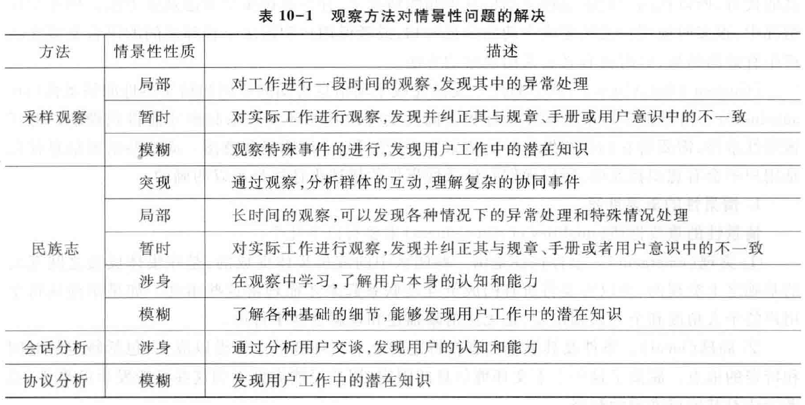
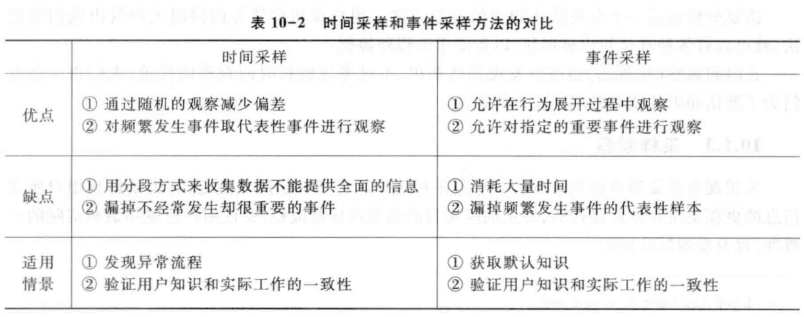

Book10-观察和文档审查
---
> 模型优先放客观信息，然后放置客户要求的部分。

# 1. 扩展内容
1. 互联网企业反垄断
   1. 谷歌与脸书遭遇美国联邦与州政府反垄断调查
   2. 市场监管总局正制定《关于平台经济领域的反垄断指南》，已经完成公开征求社会公众意见
   3. 阿里(银泰)、阅文(新丽)、丰巢(中邮智递)分别被处罚50万人民币(少？形同虚设？)
      1. 罚款上限为50万人民币
2. 王慧文"退休"与新冠疫情持续恶化
3. "打工人"-> "干饭人"
   1. Z世代年轻人的解构、独立与乐观
   2. 辩证地看待国内对资本的"优待"

# 2. 课程回顾
1. 需求获取前半段
   1. 确定项目的前景与范围
      1. 问题分析-目标分析-业务过程分析
   2. 涉众分析
      1. 涉众识别-涉众描述-涉众评估-涉众代表选择-参与策略
2. 需求获取后半段
   1. 基于用例/场景展开用户需求获取
   2. 用户获取手段
      1. 面谈-原型-观察
      2. 原型：抛弃式与演化式，控制成本，应对模糊与变更
      3. 观察：采样观察与民族志，应对复杂协同

# 3. 观察的情境适用性
1. 应用于用户无法完成主动的信息告知的情况下
   1. 采样观察(Sampling Observation)
   2. 民族志(Ethnography)
   3. 话语分析(Discourse Analysis)
   4. 协议分析(Protocol Analysis)
   5. 任务分析(Task Analysis) 

## 3.1. 事件的情景性(situatedness)
1. 某些事件只有和它们发生时的具体环境联系起来，才能得到理解 
   1. 突现(Emergent)：集体促成 ，互动中突现 
   2. 局部(Local) ：特定的上下文环境 
   3. 暂时(Contingent) ：演进过程中的一刻
   4. 涉身(Embodied) ：参与者的认知和能力受限 
   5. 开放(Open) ：业务不确定并开放，以后完善
   6. 模糊(Vague) ：基于潜在知识，尚未明确表达

## 3.2. 观察方法解决的问题
1. 理解复杂的协同事件
   1. 突现，民族志
2. 获取工作中的异常处理
   1. 局部 ，采样观察、民族志
3. 获取与用户认知不一致的实际知识 
   1. 暂时，采样观察、民族志 
4. 了解用户的认知
   1. 涉身 ，民族志 、话语分析
5. 获取默认(tacit)知识 
   1. 模糊，采样观察、民族志、协议分析

# 4. 观察方法的应用

## 4.1. 采样观察

## 4.2. 民族志
1. 典型示例是复杂的协同问题 
2. 优点
   1. 能够得到信息的深度理解 
   2. 能够让真实世界的社会性因素可见化 
   3. 打破人们已有的一些错误假设和错误观念 
3. 缺点
   1. 需要耗费很多的时间 
   2. 调研结果很难传递到开发过程 

### 4.2.1. 针对复杂协同问题的民族志
1. 关注三个方面的内容：
   1. 工作的分布式协同(Distributed Coordination)
      1. 要特别注意那些利用物件实现的协同和创建这些物件的文书工作 
   2. 工作的计划和程序(Plans and Procedures)
      1. 关注它们在组织活动中的应用方式 
      2. 发现实际工作和文档化程序之间存在的偏离 
   3. 工作的意识(Awareness of Work)
      1. 活动是如何对协同中的其他人可见或者可理解的？

### 4.2.2. 使用普通民族志的规则
1. 应该定期的记录发现 
2. 尽快的记录可能会在观察过程中发生的面谈 
3. 定期的复查和更新自己的想法 
4. 确定管理海量数据的应对策略 

# 5. 文档审查方法的应用

# 6. 本章小结
1. 在需求获取的诸多方法当中，观察的作用越来越显重要，它可以帮助解决情景性问题
2. 采样观察的应用方法较为固定，但民族志的应用非常复杂，需要很多的实践积累
3. 文档审查方法是专门用于处理各种硬数据的需求获取方法

# 7. 思考题
1. 观察用户工作总是困难的。它通常使你和用户都感动不舒服。为了确保由于你的访问而不至于使用户的行为发生改变，你应该怎么办？为了使观察看起来更自然一些，你应该怎么做？
2. "我知道你有很多材料。那些材料里到底有什么？"Betty Kant问道，她是MIS特别工作组的负责人。MIS特别工作组是你的系统团队联络Sawder家具公司的桥梁。你拖了一大堆材料，正准备离开这栋楼
3. "哦，是过去6个月的一些财政决算、生产报表，还有Sharon给我的一些业绩报表，业绩报表涵盖了过去6个月的目标和工作业绩。"你在回答时，有些纸掉到了地上，"你为什么问这个问题呢？"
4. Betty为你拾起纸并把它放到最近的桌子上，回答道："因为你根本不需要这些垃圾。你来这里要做一件事情，就是和我们这些用户谈话。从这些材料中得不到任何有益的信息。"
   1. 只有告诉Betty你从每份文档中找到的东西才能使她相信每份文档都是重要的。用一段文字解释文档为需求工程师提供了什么帮助？
   2. 在你和Betty谈话的时候，意识到实际上也需要其他的定量文档。列出你缺少的东西。
