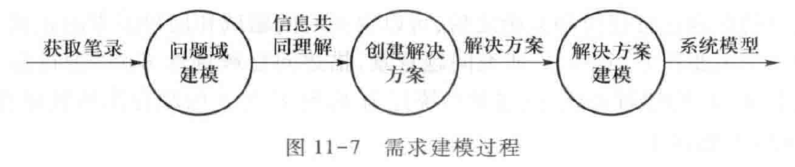
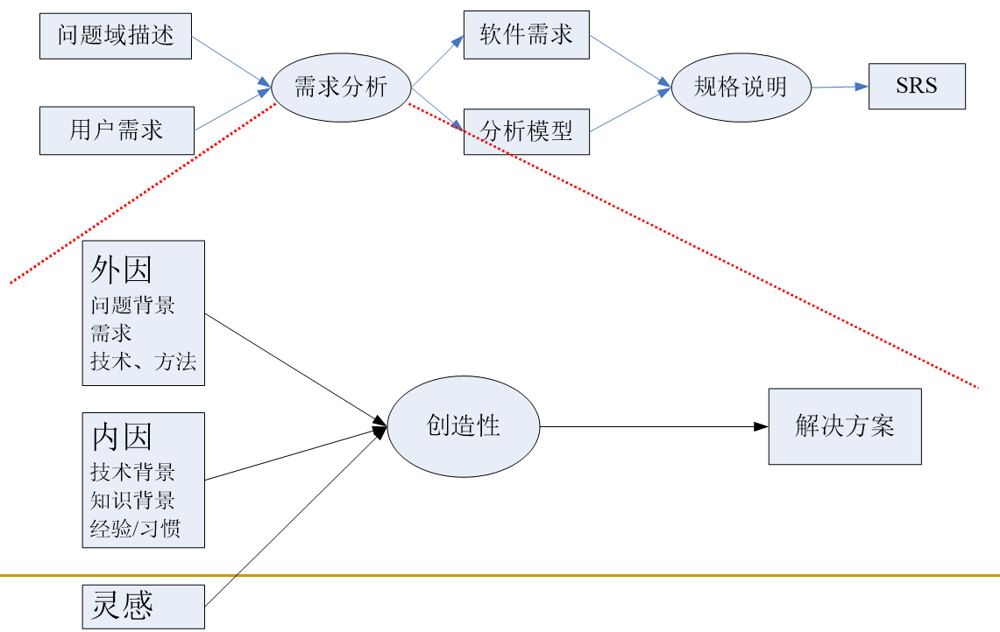
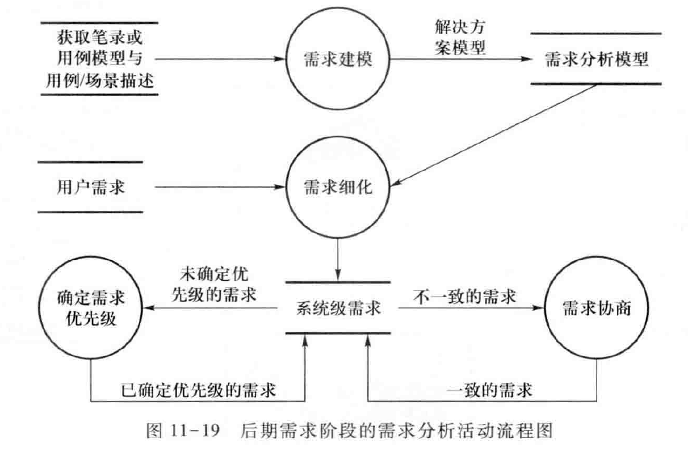
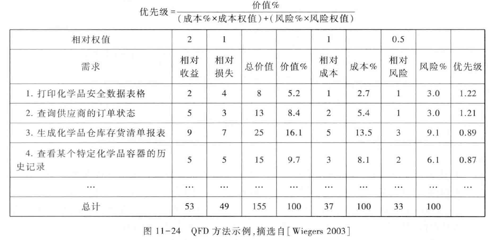

Book11-需求分析概述
---

# 1. 需求分析的根本任务

## 1.1. 建立分析模型
1. 将复杂的系统分解成为简单的部分以及它们之间的联系，确定本质特征
2. 和用户达成对信息内容的共同理解
3. 分析的活动主要包括识别、定义和结构化，它的目的是获取某个可以转换为知识的事物的信息

## 1.2. 创建解决方案
1. 将一个问题分解成独立的、更简单和易于管理的子问题来帮助寻找解决方案
2. 创建解决方案的过程是创造性的
3. 帮助开发者建立问题的定义，并确定被定义的事物之间的逻辑关系
   1. 这些逻辑关系可以形成信息的推理，进而可以被用来验证解决方案的正确性。

## 1.3. 模型 
1. "模型是对事物的抽象，帮助人们在创建一个事物之前可以有更好的理解" 
2. 集中关注问题的计算特性(数据、功能、规则等等) 
3. "它是对系统进行思考和推理的一种方式。建模的目标是建立系统的一个表示，这个表示以精确一致的方式描述系统，使得系统的使用更加容易" 
4. 建模方法
   1. 抽象
   2. 分解
   3. 投影

### 1.3.1. 抽象(Abstraction)
1. 一方面要求人们只关注重要的信息，忽略次要的内容
   1. 通过强调本质的特征，就减少了问题的复杂性
2. 另一方面也要求人们将认知保留在适当的层次，屏蔽更深层次的细节
   1. 在问题的各元素之间推断出更广泛和更普遍的关系，帮助人们寻找解决方案

### 1.3.2. 分解(Decomposition / Partitioning)
1. "分而治之"
   1. 将单个复杂和难以理解的问题分解成多个相对更容易的子问题，并掌握各子问题之间的联系
2. 分解的方案往往还能提供问题的解决思路

### 1.3.3. 投影(Projection)
1. 多视点方法

## 1.4. 建立分析模型
1. 计算世界与计算模型
   1. 使用软件的构成单位作为模型的组元
   2. 软件构建单位之间的关系作为模型组元之间的关系
2. 基于计算科学建立的，具有形式化的特征
   1. 信息的描述具有明确化、准确化和确定化的特征
3. 需求分析阶段不适宜建立形式化的计算模型
   1. 重点是问题，缺乏和软件实现相关的技术细节
   2. 用户无法理解

4. 问题世界与业务模型
   1. 使用问题域中的重要概念作为模型的组元
   2. 使用概念之间的业务联系作为组元之间的关系
5. 使用了业务描述的方式，具有非形式化特征
   1. 业务模型元素(即业务概念和业务联系)的选取和定义上具有不准确、不确定和模糊化
   2. 可以抽取出需求信息中最重要和最本质的内容
   3. 可以达成用户和开发者的共同理解
6. 非形式化特征使得它不适合于进行需求建模
   1. 不足以用于描述一个有效的软件解决方案
      1. 不准确、不确定和模糊化
7. 软件分析模型
   1. 介于计算模型和业务模型二者之间的模型形式
   2. 使用了计算模型的组元形式
   3. 在组元的表现上采用了业务模型的表现方式
8. 半形式化的
   1. 不像计算模型那么严谨
   2. 比业务模型更严格
9. 三种模型

10. 模型的描述
    1.  三个要素之间互为依赖，每个要素都为下一个要素提供了一个必需的环境
        1.  语法：使用规则——怎样使用模型的元素，并且以什么方式组织、连接或关联这些元素；
        2.  语义：特定模型元素所具有的含义；
        3.  语用：模型元素的上下文，以及影响该模型元素意义的约束和假定
11. 分析模型
   1. 语用复杂
   2. 语义丰富
   3. 语法严格同时又不太复杂
12. 曾经有很多的研究者尝试建立一种能够描述软件开发中各种情景的形式化或半形式化模型语言，但最后都失败了
13. 模型的描述
    1.  多视点方法

14. 视点(Viewpoints)：将系统中既交织共存又相对独立的不同内容拆解成不同的部分
    1.  每一个视点都是独立的模型存在，用独立的模型语言和表示法进行描述
15. 多视点：所有视点的模型描述集成起来，就是对原有复杂系统的模型描述
    1.  依据系统内不同部分之间的关系，建立不同模型内元素之间的联系，从而将多个独立的模型描述在语义上连接起来

### 1.4.1. 模型、模型语言与表示法

### 1.4.2. 需求建模
1. 通常的做法是：
   1. 先依据获取的问题域信息建立初步的模型。
   2. 然后分析用户需求，对模型进行调整，得到一个中间形式的模型形式。
   3. 最后，对调整后的模型进行逻辑推理和验证，如果符合预期的期望，那么它就是最终的解决方案模型。 

## 1.5. 建立解决方案

### 1.5.1. 建立解决方案的过程

# 2. 需求分析技术

## 2.1. 常用需求分析技术

### 2.1.1. 结构化技术
1. 数据建模
   1. 实体关系图Entity Relationship Diagram
2. 过程建模
   1. 数据流图Data Flow Diagram
   2. 上下文图Context Diagram
   3. 微规格说明Mini-Specification
   4. 数据字典Data Dictionary
3. 行为建模
   1. 状态(转换)图/矩阵State (Transition) Diagram/Matrix
4. 过程/数据关系建模
   1. 功能实体矩阵Function/Entity Matrix
5. 信息工程方法
   1. 功能分解图Function Decomposition Diagram
   2. 过程依赖图Process Dependency Diagram

### 2.1.2. 面向对象技术
1. UML
   1. 用例图Use-Case Diagram
   2. 类图Class Diagram
   3. 交互图(顺序图/通信图)Interaction(Sequence / Communication)Diagram
   4. 活动图Activity Diagram
   5. 对象约束语言Object Constraint Language
   6. 状态图State Chart Diagram

### 2.1.3. 技术的综合运用
1. 如何为各个视角选择需求分析技术？
   1. 每一种需求分析技术都有自己的特点，具有在应用上的独特性
2. 如何实现它们之间的配合？
   1. 只有通过多种需求分析技术的有机结合与集成才能充分的描述复杂应用

## 2.2. 需求分析技术的发展过程

## 2.3. Wieringa框架

## 2.4. Zachman 框架

### 2.4.1. Zachman矩阵的行
1. 目标/范围(规划者视图)
   1. 关心软件系统的成本和效益，
   2. 对最终系统的规模、形式、位置空间以及基本目标的粗略描述
   3. 规划者视图规定了项目的前景和范围。
2. 企业模型(所有者视图)：
   1. 关心软件系统会如何参与和帮助实际工作
   2. 对业务实体、业务过程以及它们与系统之间交互的描述
   3. 利用业务概念限定了系统的解决方案——分析模型。
3. 系统模型(设计师视图)：
   1. 关注软件系统应该的需要以及设计方法的选择限制
   2. 对软件系统的基本功能和设计空间的描述——体系结构。
4. 技术模型(构建者视图)：
   1. 关注程序
   2. 对软件系统当中控制逻辑、算法、I/O控制以及其他各种具体技术细节的描述——描述详细设计的设计模型
5. 组件模型(集成者视图)：
   1. 关注组装
   2. 对软件系统的组件、接口以及编码程序等内容的描述
6. 实际运行的系统：
   1. 描述系统投入使用后的实际状况和在运行中的实际表现。

## 2.5. Zachman矩阵的列
1. 数据：对企业有重要意义的事物以及企业对这些事物的理解
2. 功能：企业在业务中执行的任务以及企业对任务的理解。
3. 位置：组织活动和软件系统的地理分布，以及它们与组织的其他方面的关联。
4. 人：在软件系统被引入后会涉及的人员和组织
5. 时间：系统内的事件-事件关联之间的时间因素，表现为业务的规划调度、系统的事件响应和控制结构。
6. 动机：该列针对的是企业建立目标系统的动机，揭示了企业的目标、目的、业务规划、知识架构、思想路线和决策基础。

# 3. 需求分析方法
1. 传统分析 
   1. 没有方法 (1950’s)
      1. 依赖个体才智,依据个人习惯
      2. 缺乏结构、不可重复、不可测量,冗长、混乱、偏颇、无结构等等
2. 结构化分析 
   1. 传统结构化分析 (late 1960’s),现代结构化分析 (late 1970’s)
      1. 以数据流动为中心，以DFD为核心技术，辅助ERD,STD…
   2. 信息工程 (late 1980’s)  
      1. 以数据知识结构为基础，ERD为核心技术，辅助DFD，STD, FDD, PD…
3. 面向对象分析 (1990‘s)
   1. 以对象为中心，以UML(类图)为核心技术
   2. 以全面思想革新为理想，以承继结构化技术为现实

## 3.1. 结构化分析

## 3.2. 面向对象分析

# 4. 前期需求阶段的建模与分析

1. 面向目标的分析(Goal Oriented Analysis)
2. 面向问题域的分析(Problem Domain Oriented Analysis)
3. 领域分析(Domain Analysis)
4. 企业建模(Enterprise Modeling) 

## 4.1. 面向问题域的分析
1. 问题框架
   1. 特性
   2. 解决
2. 框架分解与组合
3. 基本思路
   1. 研究所有可能的问题域，从中发现一些重复出现的简单问题类型
   2. 分析每一种问题框架的特性，确定问题的理解和解决方法
   3. 将问题框架的建立和分类系统化，以简单的问题框架为基本单位，进行复杂问题的分解

## 4.2. 示例分析
1. 没有意识到不同的人群对模型同时理解认识的困难。
2. 项目中大量使用对象模型，但的确存在不少的问题，主要表现在以下几个方面：
   1. 忽略了对象要同时拥有状态和行为；
   2. 对象的职责太多；
   3. 对象的关系划分不明确；
3. 其他如用例模型，行为模型，状态机模型都普遍使用。用例模型中使用不当的主要是子系统之间的关系，有时感觉各个子系统的边界不是很好确立。行为模型，状态机模型存在的问题主要是需求人员面对一需求时，不知道用顺序图，通信图，活动图还是状态图。

# 5. 需求分析的活动

## 5.1. 需求细化
1. 明确用户需求的隐含因素 
2. 将从问题域和业务的角度表述的用户需求等价的转化为从软件和技术的角度表述的系统需求
3. 非功能需求也需要从高层次的表述方式转化为一系列更加详细和具体的需求表述 
4. 需求细化也会发现新的细节需求
5. 需求已经得了充分的理解，并且开发者已经可以着手为其进行方案设计时停止细化过程 
6. 细化后的需求应该被一一的标识和记录下来 
7. 需求的记录
   1. 标识符(ID)，每一条需求都应该能够通过ID唯一的标识自己。
   2. 源头(Source)，要能够回溯到需求的源头，例如特定的涉众。
   3. 理由(Rational)，需求被提出的目的。
   4. 优先级(Priority)，详细情况见下一节。
   5. 成本(Cost)，预估的实现成本。
   6. 风险(Risk)，实现该需求的过程中可能带来的风险。
   7. 可变性(Volatility)，将来发生变化的可能性。

## 5.2. 确定需求优先级
1. 累计投票 
2. 区域划分 
   1. 重要性。需求的不可或缺程度。
   2. 紧急性。需求的时间紧迫程度。
   3. 惩罚性。忽略需求会导致的惩罚程度。
   4. 成本。实现需求的代价。
   5. 风险。需求实现中可能产生的风险程度。 

1. 不重要但紧急：微信的存储语音是不是要用。
2. Top-N
   1. N的取值是不受明确限制的，真正受限制的是Top-N个需求的实现代价总和

1. 基于时间延迟成本的优先级判断
   1. 延迟成本相同，短任务优先
   2. 工作量相同，高延迟成本优先
   3. 加权最短任务优先(重要+紧急程度)
   4. 所有优先级都是本地和临时的

## 5.3. 需求协商
1. 明确冲突的因素，避免情绪上的冲突 
2. 明确冲突的解决空间 
3. 确定最佳解决方案 

# 6. 本章小结
1. 需求分析是需求工程中最为重要和核心的活动，它对信息的建模是理解问题的关键，也是创建正确解决方案的关键
2. 需求分析涉及很多的技术和方法，需求分析活动的有效执行需要分析人员能够掌握并判定这些方法的选择与使用
3. 需求分析过程当中会执行很多的重要子活动，它们的有效整合确保了整个需求分析工作的成功
