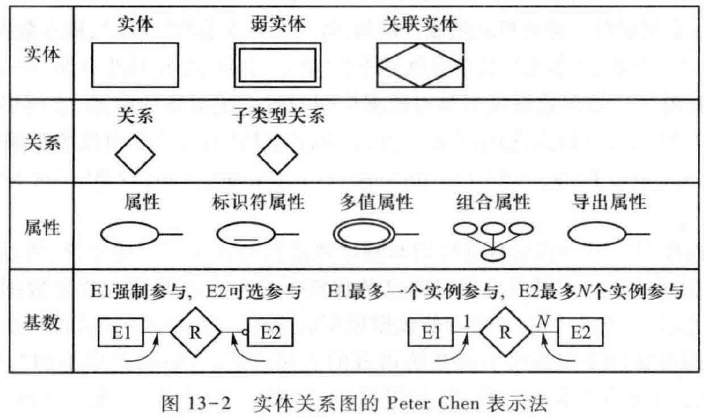
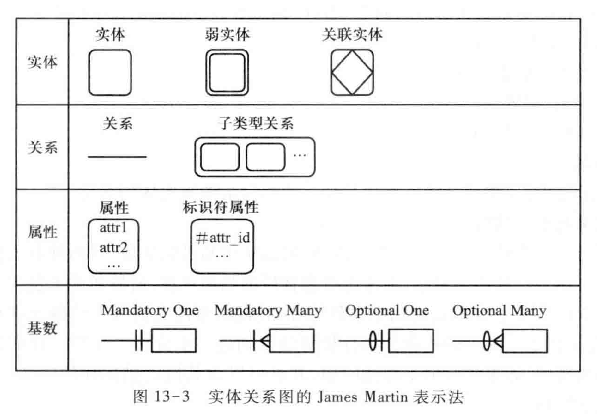
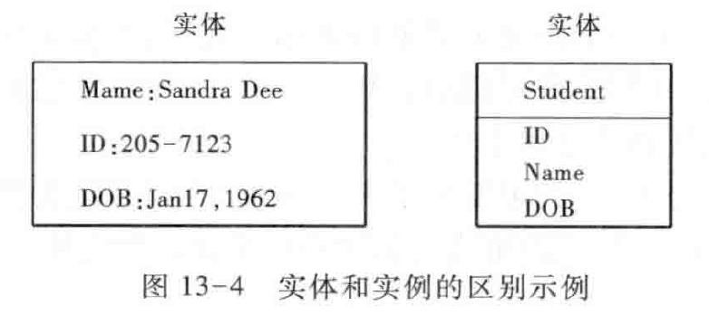
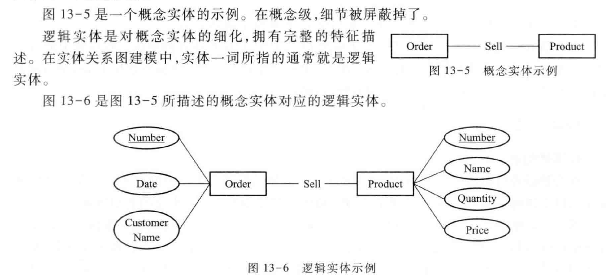
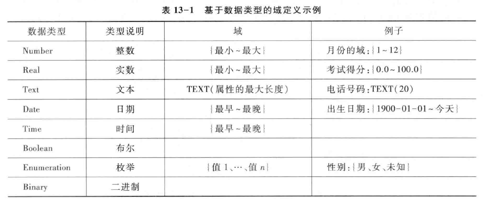
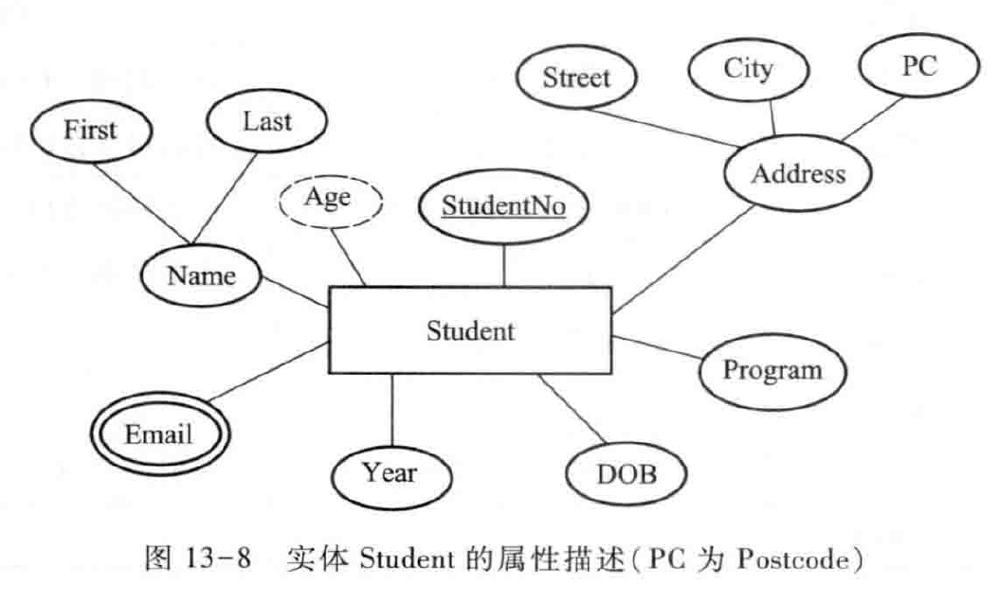
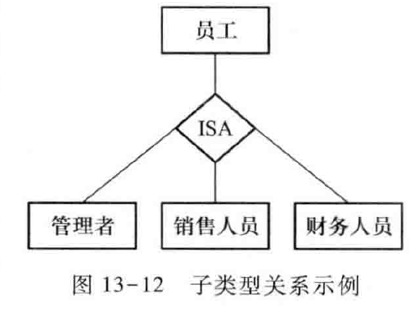
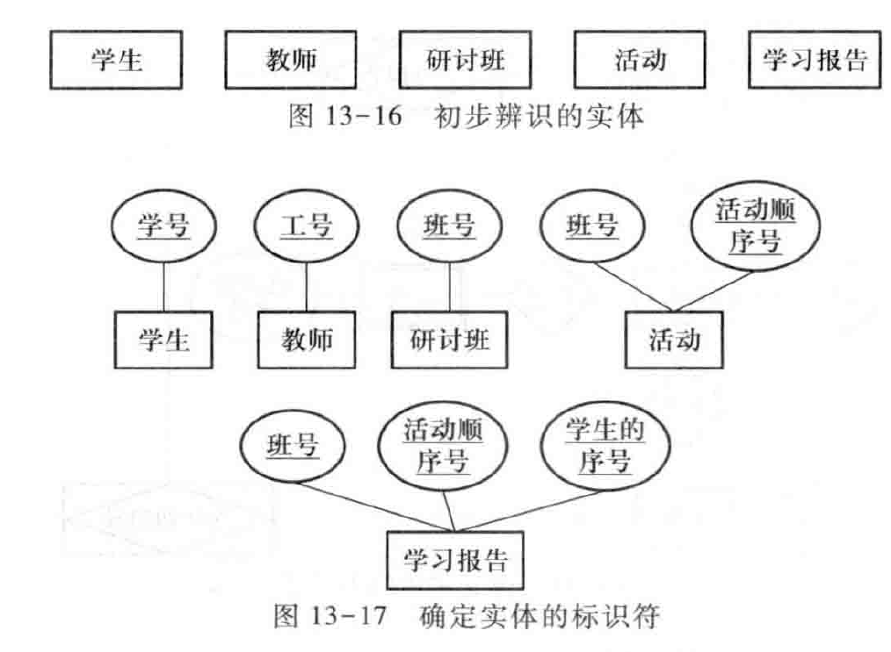
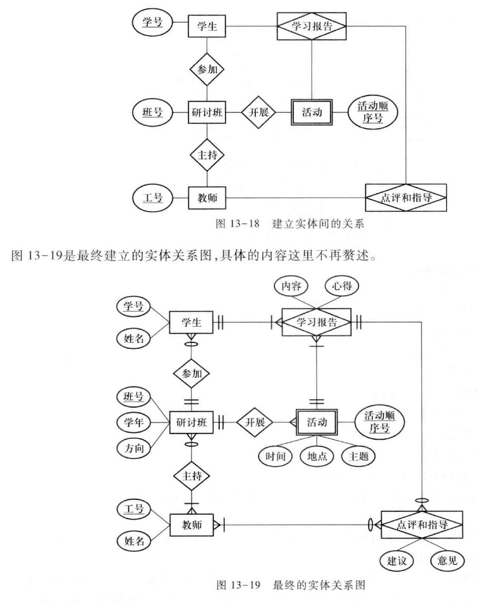
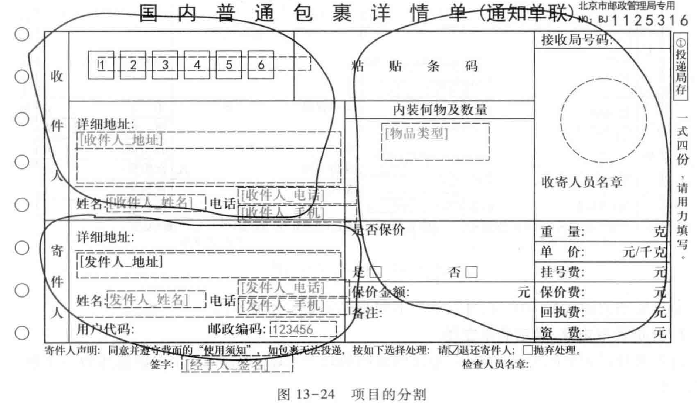

Book13-数据建模
---

# 1. 概述
1. 数据建模描述了数据的定义、结构和关系等特性的技术。
2. 数据模型表现
   1. 概念数据模型：用问题域语言解释数据模型，学生(学号、姓名、出生日期)
   2. 物理数据模型：物理数据模型是对数据模型的解系统语言的解释，描述共享事务在解系统的实现形式，是形式化的定义，Student{(Number,Long,Not Null, primary key),(Name, Varchar 50, Not Null),(Birthday,Date, Null)}。
   3. 逻辑数据模型：学生=(学号,标识符)+(姓名,4位汉字)+(出生日期,日期)
3. 最常用的是实体关系图

# 2. 实体模型

|  |  |
| --------------------- | --------------------- |

## 2.1. 实体

1. 逻辑实体是对概念实体的细化，拥有完整的特征描述。
2. 实体关系建模中的实体一般指逻辑实体。
3. 进程实体：比如销售行为进程实体。

## 2.2. 属性
|  |  |
| --------------------- | --------------------- |

1. 上图中email是多值属性。
2. 存储属性与导出属性。

## 2.3. 关系

1. 关系的度数：参与关系的实体数量

2. 关系的基数(约束)：描述示例可能参与关系的数量
   1. 最大基数：键约束
      1. One 1
      2. Many >1
   2. 最小基数：参与约束
      1. Optional 0
      2. Mandatory 1

3. 子类型关系：多个实体大部分相似、少部分不同。

4. 被关系影响的实体
   1. 弱实体：存在和标识需要依赖于其他实体的实体，比如考试(弱实体)对于课程(父实体)。
   2. 关联实体：建立关系时附带的实体

# 3. 实体关系图的创建

## 3.1. 依据充分描述信息的实体关系图创建
1. 能获得充分信息的情况
   1. 系统小而简单
   2. 系统功能被划分为简单部分，对某一部分
2. 步骤
   1. 从描述信息中辨识实体
   2. 确定实体的标识符
   3. 建立实体之间的关系
   4. 添加详细的描述信息
3. 实例：课本330-332

## 3.2. 依据硬数据表单的实体关系图创建
|  |  |
| ---------------------- | ---------------------- |

1. 创建步骤
   1. 分析表单内容，确定表单主题
   2. 建立主题之间的关系
   3. 围绕表单组织表单的项目
   4. 补充实体关系的详细信息
2. 示例：课本P333-335

## 3.3. 复杂情况下的实体关系图创建
1. 发现系统的概念域
2. 建立对概念域的描述
3. 展开概念域
4. 合并概念域的局部数据模型

# 4. 实体关系图与过程模型的联系
1. 实现实体关系图和过程模型同步的技术：功能/实体矩阵。

2. 建立功能/实体矩阵的过程也是一种极好的检查，可以帮助验证过程模型和数据模块的正确性，发现其中的错误、遗漏、冗余和不一致性。
