Book13-需求规格说明
---

# 1. 课程相关内容
1. 阿里
   1. 反垄断调查立案
   2. 四部委约谈蚂蚁金服
      1. 阵痛下的成长：以新规范新姿态拥抱未来
      2. "提升交易透明度到严禁不正当竞争，从合法合规经营个人征信业务到强调保护个人数据隐私，从确保资本充足、关联交易合规到完善公司治理……"
      3. "金融管理部门将一如既往鼓励、支持金融科技企业在服务实体经济和遵从审慎监管的前提下守正创新，推动金融科技成为助推国内国际双循环的重要力量。"
   3. 互联网平台，创新？垄断？公益？
2. 罗永浩老师"立Flag"跨年

# 2. 课程回顾
1. 面向对象的基本概念
   1. 复杂是简单部分的组合，最小简单部分独立完成一系列任务，内部组合紧密度大于外部，接口
   2. 计算实体：对象-明确角色的独立可确认的实体-标识,状态,行为 
   3. 组合接口：一个对象暴露的接口
   4. 类：共享相同属性和行为的对象的集合：概念聚类
   5. 层次关系：聚合(组合)、继承、关联
   6. 多态：一个对象在相似情景下表现出多个不同形态，或者多个对象在同一情景中表现出相同形态的现象：重载与泛型
2. 面向对象建模
   1. 结构模型-领域建模
      1. 类别分析、名词分析、动词分析、建立关联、添加类的重要属性
      2. 作用：发现数据方面的需求缺陷与不足，表现为数据的定义、加工与使用
   2. 行为模型-交互图：顺序图
      1. 基于用例的系统顺序图，详细顺序图
      2. 作用：发现系统交互行为的缺失，即交互消息的数据和组合片段的监护条件的缺失
   3. 行为模型-状态图
      1. 有效的事件使系统从一个稳定的状态转换到下一个唯一的明确状态
      2. 作用：通过状态无法转换发现缺失的行为，不明确的监护条件，缺失或不够明确的状态
   4. 契约：对象约束语言OCL：不变量，前后置条件，监护条件
   5. CRC建模

# 3. 需求规格说明概述

## 3.1. 获取 VS 分析 VS 规格说明
1. 需求获取：目标是得到用户需求——收集需求信息
2. 需求分析：目标是更深刻的理解用户需求——界定能够让用户满意的解决方案准则
3. 需求规格说明：目标是定义用户需求——准确描述需求及其解决方案

## 3.2. 需求规格说明活动

# 4. 需求规格说明文档

## 4.1. 作用
1. 更好的传递软件系统的需求信息和解决方案给所有的开发者
2. 拓展人们的知识记忆能力
3. 作为合同协议的重要部分
4. 作为项目开发活动的一个重要依据
5. 发现和减少可能的需求错误，减少项目的返工，降低项目的工作量
6. 作为有效的智力资产：新人培训、客服、类似或增强项目

## 4.2. 忽视的原因
1. 交流途径
2. 时间压力
3. 迭代式开发
4. 敏捷

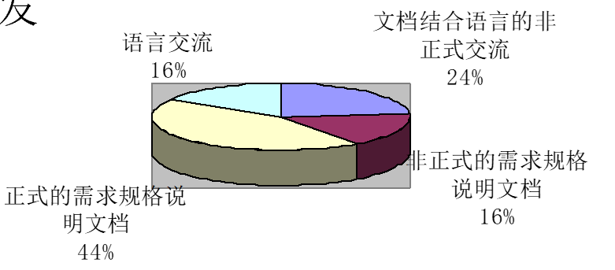

## 4.3. 类型
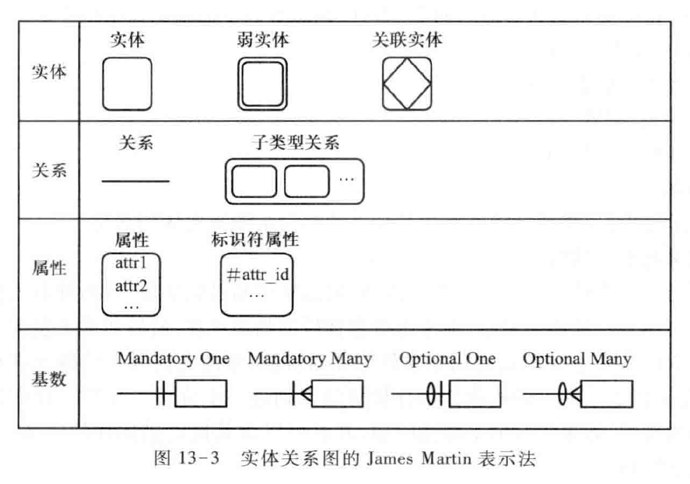
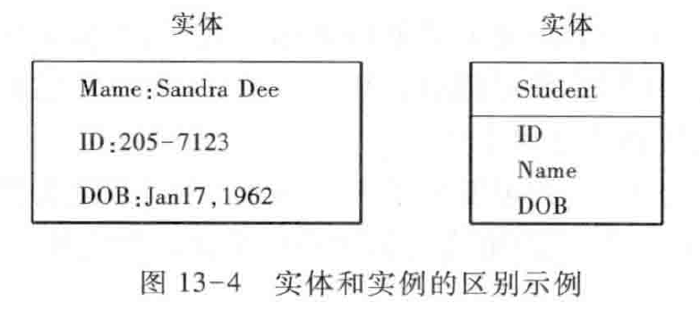

## 4.4. 内容
1. 前景和范围内
   1. 问题域信息
   2. 解决方案：系统特性
   3. 需求：从用户需求细化得到

## 4.5. 作者
1. 项目管理者：组织安排、提供条件
2. 需求工程师：负责人、主导人
3. 文档写作人员：有时会采用，节省需求工程师的时间
4. 涉众(用户)：验证人

## 4.6. 读者
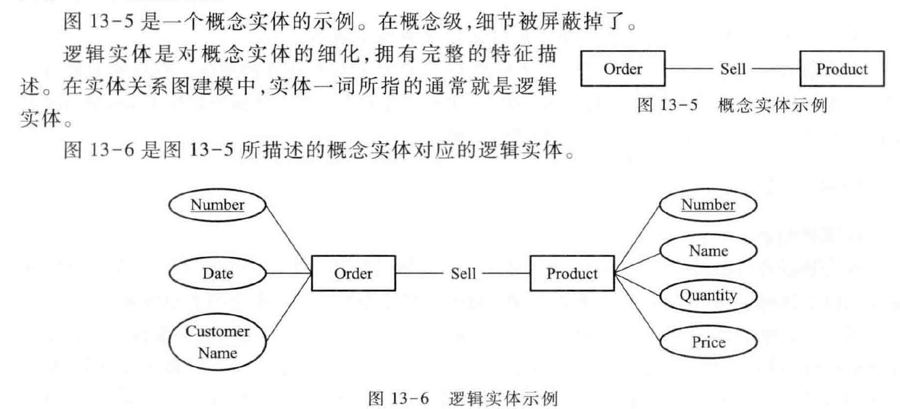
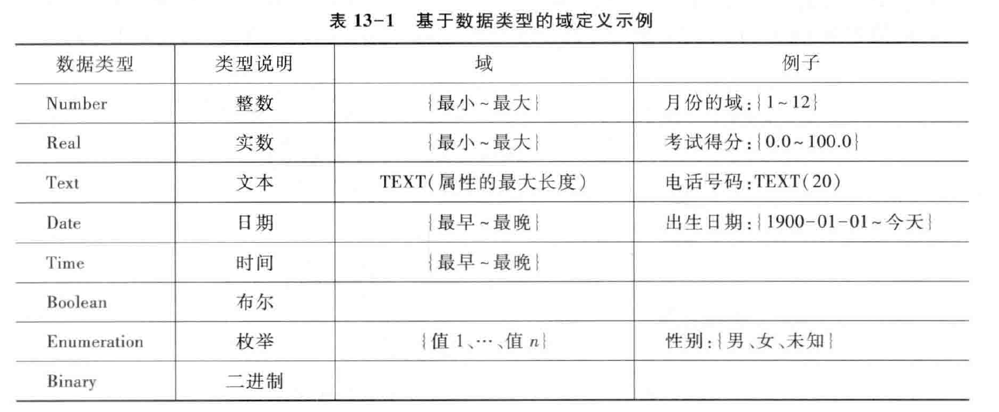
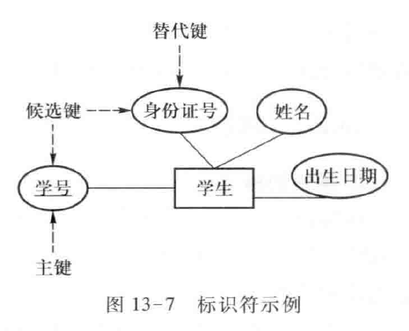

## 4.7. 手段
1. 非形式化
   1. 自然语言
   2. 限制性文本
2. 半形式化
   1. 结构化文本：伪码/结构化英语
   2. 模型语言：图、表…
3. 形式化
   1. 形式化语言
      1. 数学语言：BNF，Z…

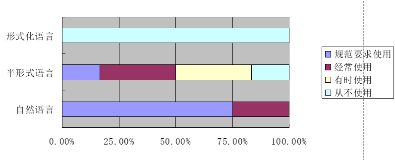

# 5. 模板的选择与裁剪
1. 优秀的文档
   1. 结构组织
      1. 复用：模版
         1. 选择与裁剪
   2. 文字写作
      1. 字词、句法
         1. 写作技巧

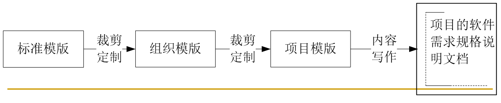

## 5.1. 需求规格说明的实践调查

## 5.2. 模板
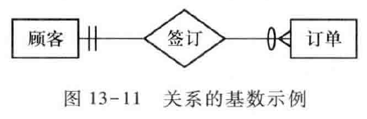
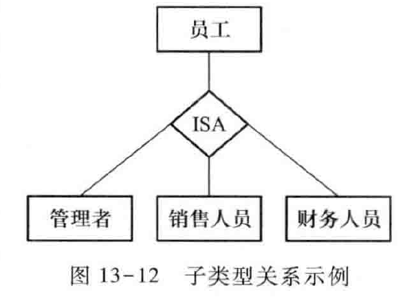
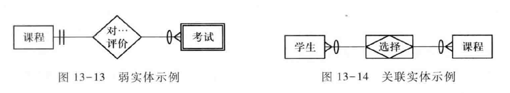
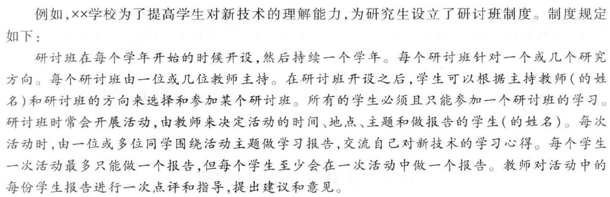

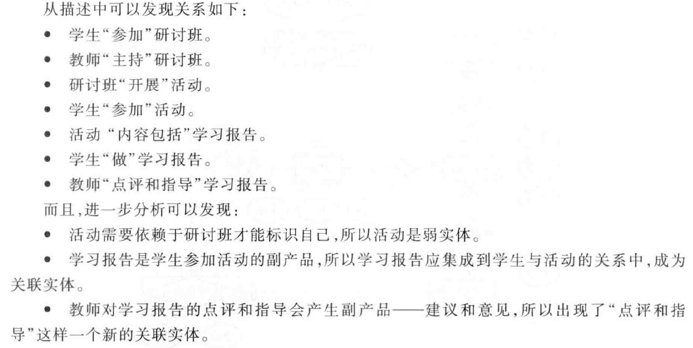
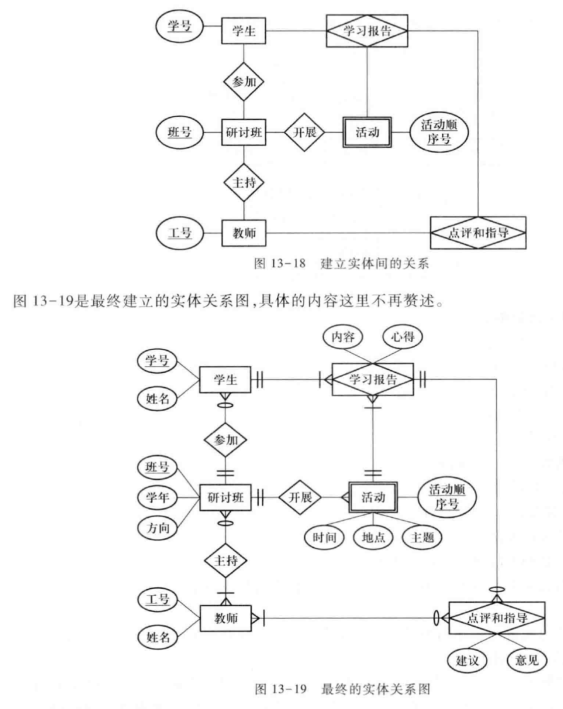

## 5.3. 例子
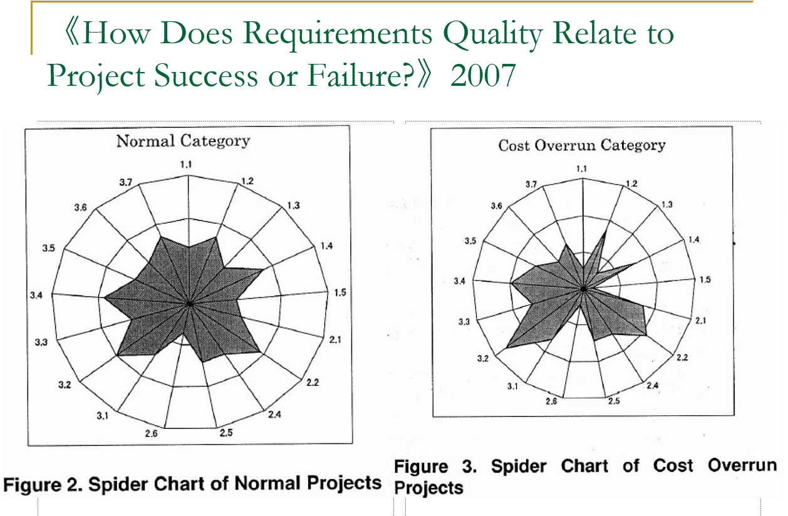
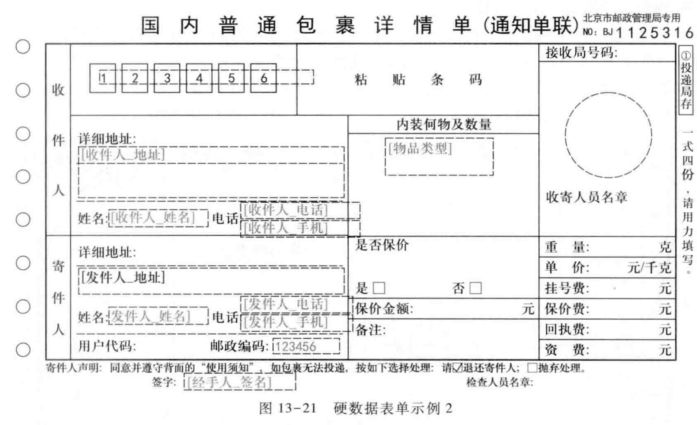

# 6. 文档写作技巧

## 6.1. 原则
1. 写作是一门艺术
   1. 没有什么固定的规律
   2. 有一些效用有限的经验原则
      1. 文档的组织方式；
      2. 常见情景的处理；
      3. 常用的写作技巧；
      4. 容易出错的地方等。
2. 文档化的目标是交流
   1. 简洁、易读  VS  严格、准确
   2. 不要机械的照搬某些标准和规则

## 6.2. 结构组织
1. 所有内容位置得当
   1. 借鉴和使用标准的文档模版
2. 引用或强化，但不重复
   1. 引用而不是复制
   2. 强化与重复
   3. 引言与冗余元文本

## 6.3. 表达方式
1. 形式依赖于内容
   1. 根据需要表达的内容，选择合适的表达方式
2. 使用系统的表达方式
   1. 人们倾向于系统的表达方式
      1. 使用相同的语句格式来描述所有的细节需求。
      2. 使用列表或者表格来组织独立、并列的信息。
      3. 使用编号来表达繁杂信息之间的关系，包括顺序关系、嵌套关系和层次关系。

## 6.4. 细节描述
1. 定义术语表或数据字典
   1. 术语不一致
   2. "方言"问题
   3. 错误术语和冗余术语
2. 避免干扰文本
   1. "这一段的意思是…"
   2. "上一句话是指…"
   3. "众所周知…到底是因为什么呢？"
3. 避免歧义词汇：表15－1

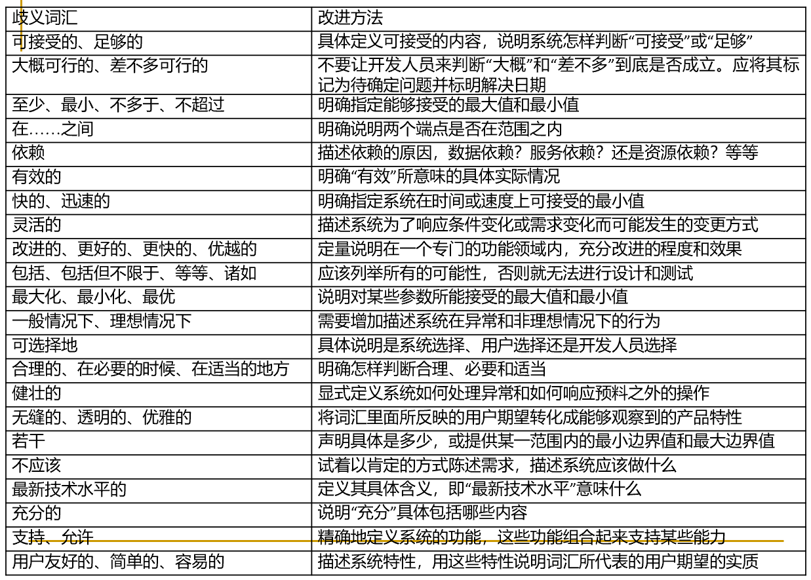

# 7. 优秀需求规格说明文档的特性

## 7.1. 完备性
1. 标准
   1. 描述了用户的所有有意义的需求，包括功能、性能、约束、质量属性和对外接口。
   2. 定义了软件对所有情况的所有实际输入(无论有效输入还是无效输入)的响应。
   3. 为文档中的所有插图、图、表和术语、度量单位的定义提供了完整的引用和标记。
2. 前景和范围
3. TBD问题

## 7.2. 一致性
1. 标准
   1. 细节的需求不能同高层次的需求相冲突，例如系统需求不能和业务需求、用户需求互相矛盾
   2. 同一层次的不同需求之间也不能互相冲突
2. 评审
3. 自动化检查

## 7.3. 根据重要性和稳定性分级
建立需求的优先级

## 7.4. 可修改
1. 标准
   1. 它的结构和风格使得人们可以对其中任一需求进行容易地、完整地、一致地修改，同时还不会影响文档现有的结构和风格
2. 文档的可修改性要求：
   1. 有着条理分明并且易于使用的组织方式，包括目录、索引和显式的交叉引用。
   2. 没有重复冗余。
   3. 独立表达每个需求，而不是和其他需求混在一起。

## 7.5. 可跟踪
1. 前向跟踪(Pre-traceability):能找到需求的来源，例如和更早期文档的显式关联。
2. 后向跟踪(Post-traceability):能找到需求所对应的设计单元、实现源代码和测试用例等，它要求每个需求都要有唯一的标识或者可供引用的名称

# 8. 本章小结
1. 需求规格说明定义解决方案和需求，承载需求分析的成果
2. 需求规格说明是一项复杂的活动，正确的文档写作要求准确的界定文档的特性
3. 掌握文档模版的裁剪技巧和文档的写作技巧，可以帮助提高需求规格说明文档写作的能力
4. 优秀的需求规格说明文档需要达到一定的要求

# 9. 实例分析
1. 由于时间压力以及采取迭代开发的方式，造成了该项目没有编写需求规格说明书。但是可以采用更为灵活的方式编写，例如wiki。我曾在某一预研性质的项目中使用wiki来完成各类文档。结果证明它非常好用。
2. 个人认为wiki非常适合用在迭代开发以及预研性质的项目中编写文档。
3. 我们公司项目的需求规格说明书，主要存在以下几点问题：
   1. 模版不是很统一，具有很多个人的特点
   2. 没有明确的业务需求、用户需求、系统需求，这三个层次，在需求规格说明书中或多或少地涵盖前三项内容，但显得不够饱满和清晰。
   3. 鉴于项目的状况，一般较少考虑硬件需求，倒是一般来说，项目上线选用的都是最新的硬件设备，成本较高。
   4. 内容的书写，自然语言居多，出现歧义、省略、模糊的机会较多，质量不高
   5. 从项目的后期来看，性能需求、约束、质量需求没有明确地分门别类地明确列出，导致后期项目中的各个业务流程还是基本可行，但是整体系统还是出现不满足需求的地方。
4. 需求分析报告中夹杂了很多专业名词和行业名词，例如横冲、平衡等等，部分客户看不懂，部分程序员看不懂，只有自己心里明白，但这样就会造成客户和程序员理解上的问题，应该加些注释尽量写得比较白话。另外报告中写得比较凌乱，没有把相关问题归类整合，编写目录，并得到客户的签字确认，导致程序员零散地一条条对着开发，很多地方衔接不是很好，另外客户很多想法尤其一些重要部分在软件交付的时候会有所改变，没有签字确认只能自认倒霉。
5. 什么时候建立术语表？
6. 在需求获取和需求分析当中采用哪些手段可以保证最终需求集的完备性、一致性和正确性？

