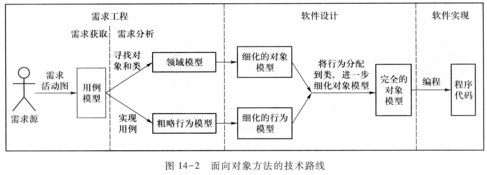
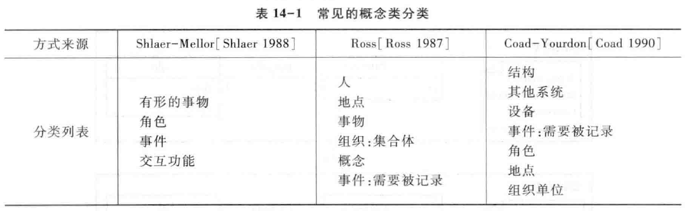

Book14-需求验证
---

# 1. 课程回顾
1. 需求规格说明
   1. 定义用户需求：准确描述需求与其解决方案
   2. 作用：信息传递，拓展记忆，合同协议，指导开发，减少错误，智力资产
   3. 内容：问题-目标-系统特性-用户需求-系统级需求
   4. 优秀的规格说明=模版(剪裁与定制)+写作(引用、强化、术语表、避免干扰文本)

# 2. 验证与确认
1. 需求验证：以正确的方式建立需求
   1. 需求集是正确的、完备的和一致的；
   2. 技术上是可解决的；
   3. 它们在现实世界中的满足是可行的和可验证的。
2. 需求确认：建立的需求是正确的
   1. 每一条需求都是符合用户原意的

# 3. 需求验证

## 3.1. 概念
1. 验证普遍存在
   1. 获得的用户需求是否正确和充分的支持业务需求？
   2. 建立的分析模型是否正确的反映了问题域特性和需求？细化的系统需求是否充分和正确的支持用户需求？
   3. 需求规格说明文档是否组织良好、书写正确？需求规格说明文档内的需求是否充分和正确的反映了涉众的意图？需求规格说明文档是否可以作为后续开发工作(设计、实现、测试等等)的基础？
2. 需求验证是专指在需求规格说明完成之后，对需求规格说明文档进行的验证活动

## 3.2. 活动

# 4. 需求验证方法

## 4.1. 评审
1. 由作者之外的其他人来检查产品问题的方法
2. 是主要的静态分析手段
3. 原则上，每一条需求都应该进行评审

### 4.1.1. 参与人员

- 领域专家是提供客观支持的。

### 4.1.2. 过程

### 4.1.3. 检查方法

### 4.1.4. 类型

## 4.2. 原型与模拟
1. 涉及到复杂的动态行为时
2. 成本较高

## 4.3. 开发测试用例
1. 如果无法为某条需求定义完备的测试用例，那么它可能就存在着模糊、信息遗漏、不正确等缺陷
2. 例外
   1. 排斥性需求(Exclusive Requirements)
      1. 这种需求要求特定的行为绝对不会发生，例如需求可能会要求系统故障不能导致数据库的崩溃
   2. 全局性非功能性需求(Global Non-Functional Requirements)
      1. 例如可靠性、可用性等，对这些需求的测试往往都是大数据集的处理

### 4.3.1. 开发系统测试用例
1. 以需求为线索，开发测试用例套件；
2. 使用测试技术确定输入/输出数据，开发测试用例。

### 4.3.2. 测试用例套件
1. 基于用例描述，可以为销售处理确定测试用例套件

### 4.3.3. 建立测试用例
1. 主要是基于规格的技术，设计测试场景的输入与输出数据

## 4.4. 用户手册编制
1. 验证功能需求：对软件系统功能和实现的描述
2. 验证项目范围：对系统没有实现的功能的描述
3. 验证异常流程需求：问题和故障的解决
4. 验证环境与约束需求：系统的安装和启动

## 4.5. 利用跟踪关系
1. 业务需求->用户需求->系统需求
   1. 如果业务需求和用户需求没有得到后项需求(用户需求和系统需求)的充分支持，那么软件需求规格说明文档就存在不完备的缺陷。
2. 系统需求->用户需求->业务需求
   1. 如果不能依据跟踪关系找到一条系统需求的前项用户需求和前项业务需求，那么该需求就属于非必要的需求。

## 4.6. 自动化分析

# 5. 问题修正
1. 需求澄清(Requirements Clarification)
   1. 理解偏差：重新进行分析工作
   2. 分析遗漏：重新分析和文档化这部分信息
   3. 表达不当：重新以合适的方式表达
2. 缺失需求
   1. 重新执行需求获取等一系列工作
3. 需求冲突
   1. 协商解决
4. 不切实际的期望
   1. 项目调整与需求协商

# 6. 需求验证的实践调查
1. 需求验证是重要的
2. 需求验证是容易被忽视的
3. 需求验证的方法是多样的
   1. 评审和原型最为广泛
   2. 客户对线索(Threads)和场景(Scenarios)表现出了最大的兴趣
   3. 技术人员、领域专家、客户以及用户是最合适的评审者

# 7. 示例分析
1. 需求虽然写好了也定稿了，但是并没有得到最终确认就开始了软件开发工作。这种现象主要是由于业务小组和技术小组沟通不全面造成的，在双方就某一问题产生分歧的情况下，没有一个能出来拍板的人决定(有权利决定的领导不参与开发和需求编写)。所以整个项目的开发是在业务小组和技术小组的争论中走过的。经常出现业务小组提出的方案技术小组难以落实，等到后期变通修改造成功能损失的情况。因为需求得不到最终确认，一直在修改中，造成技术小组不停的修改已经编写完毕的模块，有些改动甚至涉及到公共基类的修改和各模块之间的关联，造成很大的浪费。
2. 系统开发过程中，没有好的办法检测需求落实的情况。税务系统中专业性很强，经常出现业务人员不懂计算机的情况，有些业务人员甚至不会上网。技术小组编写的代码是否已经实现了全部功能，很多业务人员在测试过程中发现不了问题，造成最后验收的时候功能是否实现由技术小组说了算。

# 8. 本章小结
1. 验证与确认是软件工程当中一项重要的活动。需求验证是需求工程中发生的对需求规格说明文档进行的验证与确认活动
2. 需求验证有多种有效的方法，实践中最为重要和广泛应用是的评审方法和原型方法
3. 需求验证不仅要发现问题，而且要监督问题的解决
