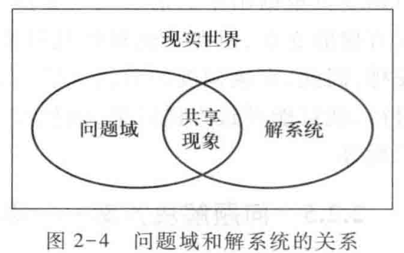

Book2-需求基础
---

# 1. 需求的定义IEEE
1. 用户为了解决问题或达到某些目标所需要的条件或能力。
2. 系统或系统部件为了满足合同、标准、规范或者其他正式文档所规定的要求而需要具备的条件或能力。
3. 对1或2中的一个条件或一种能力的一种文档化表述。

# 2. 满足需求就是解决问题
1. 需求开发的最原始出发点就是用户需求，或者需求的源头——问题。

## 2.1. 问题与需求
1. 问题的产生地：当**现实的状况与人们期望的状况产生差距**时，就产生了问题。
2. 要解决问题，就要**改变这些事件、事物的状态，或者改变其状态变化的演化顺序**，使其达到期望的状态和理想的演进顺序，使其达到期望的状态或演进顺序。
3. 开发软件系统的目的就是希望用它作为解决方案来解决问题，使得现实改善到期望的状况。
4. 例子:企业当前利润率为2%，希望开发和应用一个软件系统能够利润率提高到5%。
   1. 问题：利润率低，低3个百分点
   2. 期望的状况：利润率为5%
   3. 需求：将利润率提高3个百分点或者将利润率提高至5%

## 2.2. 问题解决的两个方面：问题域与解系统
软件，一种信息制品，为何能解决问题域中的问题，为人服务？

### 2.2.1. 问题域
1. 问题域:解决问题所必须涉及的事件和事物(实体和状态)。
2. 问题域是需求的背景
3. 和需求的区别:
   1. 问题域是自治的，有自己的运行规律，这些规律不会因解系统的引入而发生改变
   2. 需求是一种对未来的期望，是可以打折、部分满足甚至不予满足的。
   3. 问题域特性是既定现实，可以改善但不能忽视，更不能违背的。
4. 在美股交易交易前十的股票中有三家是新能源汽车，则新能源汽车中软件系统的问题域有哪些？
   1. 车联网、自动驾驶、5G的重要应用领域
   2. 续航能力：电量控制的问题解决，续航能够超过260公里，电池并没有本质变化，分析能力有效提高，实现电池之间的协同协作。

### 2.2.2. 问题域特性
1. 问题域自治的规律性称为问题域特性：利用商业模式画布进行更好的描述 
2. 需额外关注的问题域特性
   1. 间接特性（semi-automatic） 
   2. 约束和假设：社会性因素
3. 问题域特性的重要性
   1. 要想解决问题，它就需要了解问题域特性，将解决方案和问题域特性结合起来
   2. 要防止解系统的引入在问题域当中引发未预见的连锁反应（例：间接特性不直接与解系统交互而引发）

### 2.2.3. 解系统
1. 软件系统通过影响问题域帮助人们解决问题，所以称之为解系统
2. 解系统是问题的解决手段，并不是问题的产生地，所以解系统并不是问题域的一部分。解系统和问题域之间有可以相互影响的接口，以实现交互活动。

### 2.2.4. 解系统特性
1. 软件系统通过影响问题域，能够帮助人们解决问题，称为解系统
2. 手段而不是目的
3. 用户不应该关注软件系统，而是关注问题
4. 开发者关注软件系统，但要学会以问题为中心思考


### 2.2.5. 不同角色不同的关注点
1. 用户关注问题域
2. **开发人员关注解系统**，应该以问题域为中心思考
3. 需求工程师扮演桥梁作用
   1. 用户不需要了解和关注解系统
   2. 软件开发者不需要关注问题域

### 2.2.6. 问题域、要求与需求
1. 需求是用户对问题域中的实体状态或事件的期望描述
2. 需求并不针对解系统，所以其描述应该尽可能使用问题域的语言，而不应该包含“数据仓库技术”等计算机词汇。
   1. 不恰当的需求:如果用户在销售列表信息界面中选中一个商品，点击查看按钮，系统将显示商品的详细信息界面。
   2. 修改后的恰当的需求:在用户请求查看具体商品时，系统应该显示该商品的详细信息，包括条码、名称、价格和厂家。


### 2.2.7. 解系统与需求规格说明
1. 解系统的核心是软件解决方案和解决方案在通过计算机上的实现
2. 数据：现实世界的模型
3. 功能：对模型的操作，将结果反馈会现实世界，（辅助）解决问题
   1. 过程式分析：以功能分解为核心
   2. 面向对象分析：以封装的数据与对数据的操作为核心
4. 需求工作衔接中，需求是用户与需求工程师协作基础，解决方案是需求工程师与软件开发者的协作基础
5. 需求开发的最终目的就是提供一个高质量的需求规格说明。需求规格说明是解系统为满足用户需求而提供的解决方案，规定解系统的行为特征。
6. 需求规格说明的典型描述方式
   1. 系统能够...
   2. 如果用户提出...请求，那么系统应该...


## 2.3. 问题解决的基础:模拟与共享现象
1. 软件系统能够与问题域进行交互和相互影响的原因在于，**软件系统中的某些部分对问题域中的某些部分的具有模拟特性**
2. 问题域与解系统能够形成互动的基础是解系统部分**模拟**了问题域，这种模拟性叫做共享现象。
   1. 模拟是指其中一方仿制另一方的信息。
   2. 二者之间的模拟性具有交互性:
      1. 解系统会在自身中保持一份与问题域现象一致的信息，并随着问题域现象的变化而变化
      2. 问题域会期待在解系统中看到一致的信息，并据此展开自己的行为。
   3. 软件系统当中含有问题域某些部分的模型（或模拟），常见的模型包括数据模型、对象模型、处理模型等。 
   4. 问题域中的某些信息能够和模型中的信息建立映射关系 
3. 解系统与问题域模拟的交互性是由人在意识中强制建立的。如果用户并未将现实发生的情况实时地输入到软件系统中，或者用户在工作时完全忽视软件系统提供的输出，那么软件系统就会失去影响和改变现实的能力。
4. 问题域中有一些没有被解系统模拟，不可能页没必要在解系统中完全重现。
5. 共享现象就是解系统所模拟的问题域部分，该部分在两个系统中同时存在，是通过映射建立的共同知识
   1.  利用数据表模拟库存与金额、坐标模拟位置、账户登录模拟开锁或授权，像素模拟图形、流数据模拟音频视频、ai模型模拟智力
   2.  游戏中的PVE与PVP互动、支付软件中的转账与支付、各种匹配、调度与推荐算法（游戏对手、商品、打车、短视频、信息流、相亲）



## 2.4. 问题解决方法:直接与间接
1. 共享现象(模拟后的知识)是解系统的一部分，所以解系统可以对其施加操作，适当改变这些知识。
2. 成本是非常重要的因素
   1. 成本可以接受:直接方式解决
   2. 成本不可以接受：间接方式折衷

### 2.4.1. 直接方法
1. 模拟并操纵共享现象是软件系统满足需求最直接的方法，比如系统记录了人的联系方式，那么软件系统可以完成通知任务。

### 2.4.2. 间接现象
1. 软件系统操纵共享现象影响问题域的一部分，然后利用问题域内在的规律性自动影响另一部分是软件系统满足需求简介方法，如果软件系统知道是谁，但是没有联系方式，那么可以通过告知管理员由管理员简介去通知的方式来间接完成。
2. 提醒需求工程师考虑问题域内的特征性，避免设计解决方案引入导致引发预期之外的连锁访问。比如驾驶员与车辆的一对一绑定。

## 2.5. 问题解决方案——需求规格说明
1. 解系统解决问题的方案是改变共享知识，影响问题域的运行，进而满足用户的需求。
2. 需求规格说明包含两部分:
   1. 对共享现象(模型)的描述(数据)
   2. 对系统对共享现象所施加的操作的描述(功能)

## 2.6. 需求开发的形式化定义，问题解决的困难性
1. 如果拥有描述明确的问题域特性E和定义良好的系统行为S，就可以很容易地发现将系统应用到问题域后会产生的效果。这种效果如果符合预期的需求R，那么系统就是满足人们需要的系统。记为$E, S|\rightarrow R$
2. 问题解决的困难：
   1. 不存在描述明确的E
   2. 不存在确定的针对S的评估标准R
   3. 根据问题域特性和系统行为预测系统应用效果是简单的，但是根据问题域特性和期望的系统应用效果构建系统行为的过程是困难的。
3. 需求工程的主要工作：
   1. 进行需求开发，确定用户的期望效果R
   2. 研究问题背景，描述问题域特性E
   3. 构建解系统，描述解系统行为S，使得$E, S|\rightarrow R$

## 2.7. 需求工程的重要性
1. 1981年，Barry Boehm [Boehm1981]发现项目费用的6％和时间的9-12％被消耗在需求阶段。
2. 在20年之后，随着需求工程的发展，[Hofmann2001]发现项目对需求工程的投入也加大了许多：项目工作的15.7％和时间的38.6％被用于进行需求工程
3. NASA (U.S. National Aeronutics and Space Administration )提供的数据显示 [Young2002]：当在需求工程当中投入项目总成本的8-14％时，可以极大的降低项目的超支率
4. Frederick Brooks[Brooks1987]：“开发软件系统最为困难的部分就是准确说明开发什么。最为困难的概念性工作便是编写出详细技术需求，这包括所有面向用户、面向机器和其它软件系统的接口。同时这也是一旦做错，将最终会给系统带来极大损害的部分，并且以后再对它进行修改也极为困难。”


## 2.8. 需求工程的基本活动与实质


## 2.9. 需求工程活动的困难性
1. **问题域、目标、任务、交互**的相互转化（广义的设计）是**创造性的活动**
   1. 每个案例都有其独特性，不可复用，接近于艺术
   2. 需要对问题所在的领域有着深刻的认识
   3. **需要掌握一套设计思维与辅助工具，并多多练习**
2. 编程与设计方面的能力不能直接用于需求分析 
   1. 设计和编程都有构建高质量（健壮性、可维护性、适应性等等）软件的共同目标，而且使用相同的概念和组织机制保证了从设计到编程的平滑过渡，所以，结构化与OO思维在设计领域也取得了成功 
   2. 但是需求分析除了拥有构建高质量软件的目标之外，还有一个更加重要的目标是理解现实（“出圈”） 中的非技术性和社会性因素
3. **文档撰写、功能验证、基线管理**需要丰富的开发与管理经验：资（nian）深（mai）程序员与新（nian）手（qing）程序员最大的区别

## 2.10. 需求工程师：现实世界方面与技术方面的桥梁
> 好的需求工程师更应该扮演好涉众代理的角色，站在涉众的立场想问题，替涉众跟踪和监控软件开发过程，保护涉众的利益


## 2.11. 需求工程师需要具备的技能
1. 软技能 
   1. 交流
   2. 观察 
   3. 抽象分析和问题解决（抽象、整合、系统化） 
   4. 写作
   5. 关系协调与团队工作


## 2.12. 商业模式部分与需求工程部分的异同
1. 商业模式部分连接需求工程部分的内容
   1. 整套商业模式画布充当需求工程中从问题域抽取问题的方法与工具
   2. 商业模式设计与评估可视作IT企业自驱动创新的产品构思（以“人”为主）
2. 需求工程部分独有的内容
   1. 问题 – 目标 – 任务 – 交互的（基于各种模型的）逐层转化
   2. 以目标客户的需要（以“业务”为主）为驱动的需求工程与分析


# 3. 需求和问题都有层次性
1. 需求是问题解决的期望。
2. 问题和期望粒度不同的现象被称为需求的不同抽象层次

## 3.1. 需求层次划分


1. 软件解决方案：问题->目标->用户需求->系统级需求
2. 软件解决方案：背景->系统特性->问题域知识->分析模型
3. 目标是商业目标
4. 任务是用户任务
5. 系统行为是用户与系统的交互

## 3.2. 业务需求
1. 针对整个业务的需求，是抽象层次最高的需求(Objective)，是系统建立的战略出发点，表现为高层次的目标，描述了组织为什么要开发系统。
   1. 需求工程师需要描述系统高层次的解决方案，定义系统应该具备的特性。
   2. 高层次解决方案及系统特性指出了系统建立的方向，参与各方必须就它们达成一致，以建立一个共同的前景(Version)，保证涉众朝着同一个方向努力。
   3. 系统特性说明了系统为用户提供的各项功能，限定了系统的范围(Scope)，定义良好的系统特性可以帮助用户和开发者确定系统的边界。
   4. BR向SF的转化过程可以利用商业模式画布。
2. 示例(R、BR为业务需求，SF为高层次解决方案)
   1. BR1(核心资源):在系统使用6个月后,商品积压、缺货和报废的现象减少50%。
   2. BR2(关键业务):在系统使用3个月后,销售人员工作效率提高50%。
   3. BR3(成本结构):在系统使用6个月后，店铺运营成本降低15%。
      1. 范围:人力成本和库存成本。
      2. 度量:检查平均每个店铺的员工数量和平均每10000元销售额的库存成本。
   4. BR4(收入来源):在系统使用6个月后,销售额度提高20%(最好情况:40%;最可能情况:20%;最坏情况:10%。)
   5. 每个业务需求目标/指针可由针对画布模型的评估而确定
3. 业务需求必须是**可验证**的，其验证指标是通过研究问题域的背景资料得出的，其验证标准可以是：
   1. 一个数值指标,如BR1-BR4;
   2. 一个直接的有无、是否等判定，例如，下述BR5、BR6验收时就是有与没有的判定。
   3. BR5:跟踪记录储户的存取款情况。
   4. BR6:跟踪记录VIP顾客信息。
4. 其中SF1、SF3、SF7针对BR1与BR3，SF2针对BR1和BR4，SF4、SF5、SF8、SF9针对BR4、SF10针对BR2和BR3.

```   
SF1:分析店铺商品库存,发现可能的商品积压、缺货和报废现象。
SF2:根据市场变化调整销售的商品。
SF3:制定促销手段,处理积压商品。
SF4:与生产厂家联合进行商品促销。
SF5:制定促销手段进行销售竞争。
SF6:掌握员工变动和授权情况。
SF7:处理商品人库与出库。
SF8:发展会员,提高顾客回头率。
SF9:允许积分兑换商品和赠送吸引会员的礼品,提高会员满意度。
SF10:帮助收银员处理销售与退货任务。
```
5. 业务需求级别的抽象用例

```
用例x：商品管理
级别：概要（抽象）
目标：减少商品积压、缺货和报废的现象
场景
   1、分析店铺商品库存，发现可能的商品积压、缺货和报废现象
   2、制定促销手段，处理积压商品
```

## 3.3. 用户需求
1. 针对具体任务的期望，即执行实际工作的用户对系统所能完成的具体任务的期望，描述了系统能够帮助用户做些什么。
2. 用户需求来源渠道
   1. 直接渠道：用户。
   2. 间接渠道：销售人员和售后支持人员。

```
例如,在超市管理系统中,收银员用户的需求如UR1~UR5所示。
UR1:收银员可以使用系统逐--记录销售的商品。
UR2:收银员可以使用系统计算商品账单并处理付款情况,账单计算需要使用促销策略。
UR3:收银员可以使用系统为顾客打印收据。
UR4:收银员可以使用系统退回顾客已经购买的商品。
```

3. 用户需求是对任务的期望，基本表达方式“xx用户可以使用系统完成xx任务”
   1. 用户任务应该是有价值的活动(客户洞察)，并具有较强的的目标性(细化的讲故事与场景)。
   2. 对所有的用户需求，都应该有充分的问题域知识作为支持。
4. 不合适的用户需求:收银员使用扫描仪扫描商品条码。
5. 用户的任务可以有不同粒度的抽象表述，大的任务可以包含(分解)小的任务，我们建议使用无法进行任务分解的粒度，同样我们可以使用嵌套层次结构，比如UR1-UR3命名为UR5.1-UR5.3表明是细化。
6. 用户需求的特点
   1. 模糊、不清晰：允许适度使用形容词和副词
   2. 多特性混杂：将功能需求和非功能需求混杂在一起
   3. 多逻辑混杂：用户需求是对用户任务的描述，任务本身往往由前后相继的多个逻辑处理过程。
7. 用户需求往往需要补充完整的问题域知识，比如对于UR1需要补充问题域知识
   1. Data:需要记录的商品信息,包括ID、名称、描述、价格、特价、数量和总价。
   2. Format:ID为xxx格式的条码。
   3. Rule:总价=特价x数量。
8. 需求开发阶段可视作从用户需要解决的问题到用户与系统的一系列交互的转化，此过程中用户的输入与获得的反馈不断精化，但系统本身仍被视作一个整体，留待后续设计阶段确定模块划分与结构
9. 用户需求示例:连锁商店销售系统

```
用例1.1：销售处理
级别：用户需求
目标：快速、正确地完成商品销售
场景
   收银员可以逐一输入销售商品，系统记录并显示商品列表（UR1）
   系统结合促销策略，计算商品账单，收银员处理付款情况（UR2）
   系统记录销售信息，收银员使用系统打印收据（UR3）
扩展场景
   系统记录会员用户积分，收银员使用积分抵扣货款
```

## 3.4. 系统级需求
1. 用户对系统行为的期望，一系列的系统行为联系在一起可以帮助用户完成任务，满足业务需求，适合软件开发者，是很精确的。
2. 系统需求可以直接映射为系统行为（对应需求规格说明），定义了系统中需要实现的功能，描述了开发人员需要实现什么 
3. 需求分析:系统级需求就只能通过技术加工获得。
   1. 源对象:用户需求以及相关的问题域知识
   2. 处理方式是利用分析方法、技术建立需求分析模型，并给予需求分析模型将用户需求及问题域知识转化为系统级需求。
4. R9：在收银员请求计算已输入商品的总结时，系统应根据规则$总价 = \sum (价格 * 数量 * 折扣)$计算总价并显示。
5. 将用户需求转化为系统需求的过程是一个复杂的过程
   1. 首先需要分析问题领域及其特性，从中发现问题域和计算机系统的共享知识，建立系统的知识模型；
   2. 然后将用户需求部署到系统模型当中，即定义系列的系统行为，让它们联合起来实现用户需求，每一个系统行为即为一个系统需求。
   3. 该过程就是需求工程当中最为重要的需求分析活动，又称建模与分析活动。


## 3.5. UR与SR
1. 用户需求和系统级需求在实践中经常是混淆的
   1. 用户习惯于用户需求；
   2. 开发者需要系统级需求，但得到的往往是用户需求
      1. 未能得到足够信息以准确地完成设计与实现工作
      2. 需要开发者以各自方式进行假设…
2. 正确处理用户需求和系统级需求
   1. 明确其不同点
      1. 用户需求—任务；系统级需求—交互
   2. 明确建立和维护用户需求与系统级需求的关系
   3. 系统级需求的建立需要需求分析人员的创造性（建模）


## 3.6. 需求开发要遵从层次性


> 根据业务需求，协调涉众的立场，限定问题的范围，指导用户需求的获取过程。

# 4. 需求的分类与表述
1. 系统工程，包括软件工程、硬件工程和人力资源管理。

## 4.1. 需求的分类
1. 需求分类是为了将需求划分为需要区别对待的不同类型


## 4.2. 项目需求
1. 项目需求针对的对象是作为项目核心的计划，包括项目的成本、资源、时间和进度等。

```
R10:项目的成本要控制在60万元人民币以下。
R11:项目要在6个月内完成。
```

## 4.3. 过程需求
1. 过程需求针对对象是软件开发过程，包括开发人员、工具和方法等。

```
R12:在开发中,开发者要提交软件需求规格说明文档、设计描述文档和测试报告。
R13:项目要使用持续集成方法进行开发。
```

## 4.4. 系统级需求

### 4.4.1. 软件需求

### 4.4.2. 硬件需求
1. 与硬件相关的需求
2. R14:系统要购买专用服务器,其规格不低于.....

### 4.4.3. 其他需求
1. 与人力资源相关的需求以及软件、硬件、人力之间协同的需求被称为其他需求。
2. R15:系统投人使用时,需要对用户进行为期一周的集中培训。