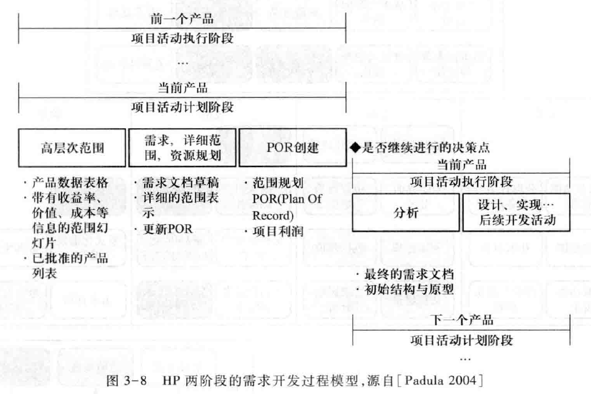
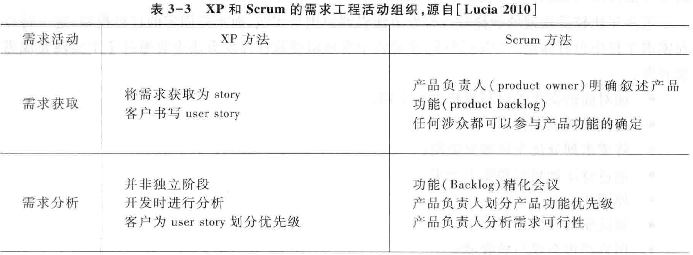

Book3-需求工程过程
---

# 1. 课程回顾
1. 需求及其问题都具有层次性
   1. 业务需求(系统特性)、用户需求、系统级需求
   2. 目标、任务、系统交互
2. 具体的软件需求类别包括
   1. 功能需求、性能需求、质量属性、对外接口和约束等
   2. 价值基础、如何量化、体系结构设计的重要因素、隔离业务环境与人机交互、环境/标准法规/商业规则/社会
3. 优秀需求的特性
   1. 完备性：
      1. 功能属性：触发者、前置条件、行为、后置条件、前置条件不满足与相应处理
      2. 数据需求(功能需求的数据部分)：语义、成分、初始/默认值、取值范围、度量单位、数据量、更新频率、合法操作、与其它数据关系(关联、聚集、泛化)
      3. 接口：名称、定义、方向声明、服务请求
      4. 质量属性(含性能)：系统与部件的质量标准、满足质量标准的情况与条件、衡量质量标准所使用的单位、质量度量的阈值
      5. 与用户端专家确认
   2. 正确性：用户意见的真实反映(为什么、侧重业务、关注涉众、演化中理解、使用量化手段理解)
   3. 可行性：在系统和运行环境的已知条件和约束下实现需求(不切实际的期望，原型，用足够的可行性与成本信息帮助用户取舍)
   4. 必要性
      1. 奥卡姆剃刀
      2. 不必要需求的原因：用户谈判的筹码、害怕信息的遗漏、需求人员添加的"用户肯定喜欢"功能
   5. 无歧义：每种需求都只能有唯一的明确解释；最好定义一个通用的词汇表
   6. 可验证：
      1. 能够通过分析、检查、模拟或测试的需求(是否满足)
      2. 不可验证的需求往往是因为描述模糊或过于抽象

# 2. 需求工程过程
1. 过程是一组相关活动的集成，通过这些活动的执行，可以完成一项任务或者达到一个目标。
2. 需求工程过程是系统开发当中需求开发活动的集成，它的模版是产生一个能够在用户环境下解决用户业务问题的系统方案
3. 需求工程过程可能会表现出极大的差异，但是除了少数情况之外

> 从需求的层次性看需求开发

# 3. 需求工程过程的活动

## 3.1. 需求获取
1. 需求获取是从人、资料或者环境当中获取需求的过程
2. 需求工程师必须要利用各种方法和技术来"发现"需求 
3. 需求获取和需求分析是交织在一起的：需求获取前半段确立项目前景与范围时使用的目标模型也可视作一类典型的基于建模的需求分析

## 3.2. 需求获取子活动 
1. 收集背景资料：深入了解需要构建知识框架
2. 定义项目前景和范围：生成业务需求，前景应对冲突，范围排除不必要的变化请求，全部内容有助于坚定投资人信心(项目明确化)
3. 选择信息的来源：从用户、硬数据、产品/专家/文档中选取最有代表性的部分
4. 选择获取方法，执行获取：面谈(调查表)、观察、原型(需要深入)
5. 记录获取结果(未精加工的原始信息) 
   1. 前景和范围文档记录业务需求
   2. 获取笔录记录用户需求和问题域特性

## 3.3. 需求分析
1. 建模来整合各种信息，以使得人们更好的理解问题：信息的细化、为创造性活动提供支撑，完成内容的转化
2. 为问题定义出一个需求集合，这个集合能够为问题界定一个有效的解决方案
3. 检查需求当中存在的错误、遗漏、不一致等各种缺陷，并加以修正：利用模型本身的语法和赋予的语义

## 3.4. 需求分析子活动
1. 背景分析
2. 业务分析(问题分析、目标分析、涉众分析)，确定系统边界 (业务需求)
3. 利用场景/用例模型描述用户需求
4. 需求建模(文本-UML图-Z模型) 
5. 需求细化(依据模型得到系统级需求)
6. 确定优先级(定期评估和调整) 
7. 需求协商
8. 最终得到一个需求基线集：指定开发任务(用户要求功能的子集)，具有优秀需求的特性(消除不一致和冲突)

## 3.5. 需求规格说明
1. 获取的需求需要被编写成文档，主要目的是为了在系统涉众之间交流需求信息
2. 业务需求被写入项目前景和范围文档
3. 用户需求被写入用户需求文档(或者用例文档)
4. 系统需求被写入需求规格说明 

## 3.6. 需求规格说明 子活动
1. 定制文档模版 
2. 编写文档

## 3.7. 需求验证
1. 确保需求规格说明文档能正确、准确的反映用户的意图
2. 确保文档的高质量
   1. 文档内每条需求都正确、准确的反映了用户的意图；
   2. 文档记录的需求集在整体上具有完整性和一致性；
   3. 文档的组织方式和需求的书写方式具有可读性和可修改性 

## 3.8. 需求验证子活动
1. 执行验证(同级评审-原型-模拟) 
2. 问题修正(修正后需跟踪以确保落实) 

## 3.9. 需求管理
保证需求作用在整个软件的产品生命周期中的持续、稳定和有效发挥

## 3.10. 需求管理子活动
1. 建立和维护需求基线集 
2. 建立需求跟踪信息(后向：制品，前向：高层需求) 
3. 进行变更控制(策略与团队，半自动化)

## 3.11. 需求工程过程为什么要适合软件工程过程?
1. "需求工程"是正性活动:< An empirical study of the complex relationships between requirements engineering processes and other processes >, 2006

2. < Requirements Engineering and Downstream Software Development: Findings from a Case Study>, 2005
   1. 需求对后续的影响
      1. 改进对细节的理解，改进对特征间依赖及复杂性的理解
      2. 节省精力浪费
      3. 看不见的好处：提升沟通
      4. 看不见的好处: 帮助决策
      5. 估算
      6. 变更管理
3. How to Manually Trace during Process [Watkins & Neal, IEEE Software1994]

# 4. 需求工程过程的并发和迭代性

## 4.1. 需求开发中的分析模型复杂度

## 4.2. 迭代的需求开发过程模型

## 4.3. 需求开发活动的并发性

# 5. 实践方法的应用
1. 个人才智=>实践方法=>知识体系
2. 需求工程师需要为组织或项目选择、定制和应用一些有效的实践方法 
   1. 教材表3-1

# 6. 需求工程过程示例

## 6.1. 螺旋RE

## 6.2. 依赖原型方法的需求开发过程

## 6.3. HP 需求过程

## 6.4. Practices-Based

## 6.5. Agile RE
1. 面对面的交流胜过写规格说明文档(User Story)
2. 迭代式需求工程；
3. 将需求划分优先级做到极限；
4. 通过持续规划管理需求变更；
5. 原型法；
6. 测试驱动开发；
7. 用户评审会议与验收测试。

## 6.6. RUP

# 7. 需求工程过程与软件工程过程

## 7.1. Waterfall
1. 软件的问题域比较成熟和易于明确化，并且需求也比较稳定
2. 不利于用户的有效参与
3. Waterfall

## 7.2. Incremental
1. 软件的问题域比较复杂，但是业务非常成熟而且需求比较稳定
2. 不利于用户的有效参与
3. Incremental

## 7.3. Spiral/Evolutional
1. 问题域极其复杂或者需求不稳定
2. 更好的应对需求的改变
3. 提高用户的有效参与度
4. 使得开发工作的协同和管理工作变得困难
5. Spiral/Evolutional

## 7.4. Agile
1. 问题域不成熟，业务活动仍然在不断发展和改变
2. 能够很好的解决各种不确定性
3. 提高了需求工程阶段的成本，而且易于发生各种原型风险
4. Agile

## 7.5. 概述
1. 需求工程过程更应该是软件工程过程的一部分，而不是独立出来作为单独部分
2. < Requirements Engineering and Software Project Success- An Industrial Survey in Australia and the US >
   1. 发现相比于需求方法本身的好坏，需求方法与软件开发方法的适配性更会影响项目的成败。这也就是说，需求开发方法与软件开发方法是否适配，比结果需求的好坏更能影响项目的成败
   2. 相比于应用领域的熟练性，一个项目管理者有效管理需求的能力更加重要;
   3. 没有必要在项目一开始就建立完备的需求，更好的方式在项目后续的阶段中逐步完善需求;

## 7.6. Software Process Model in Practices
1. < Requirements Engineering-The State of the Practice >, 2003 – 传统软工过程更重视需求工程过程

# 8. Summary
1. 需求工程有着属于它自己的生命周期模型，存在着针对需求开发的需求工程过程 
2. 需求工程过程拥有一些常见的需求工程活动：需求获取、需求分析、需求规格说明、需求验证和需求管理 
3. 需求开发活动是互相交织、并发、迭代和递增 的
4. 需求工程过程的成功执行需要应用很多的有效实践方法
5. 在实践中，需求工程过程的差异性是非常大的
6. 因为处于前端，需求工程对后续软件开发活动的影响是非常深入的
