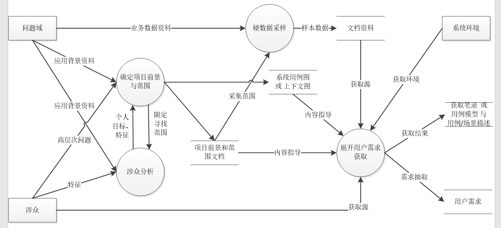
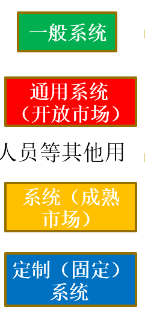
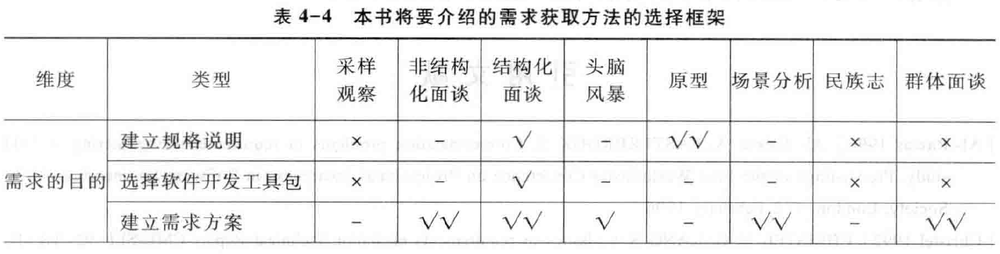

Book4-需求获取概述
---

# 1. 需求获取的非平凡行
1. **默认背景：用户/客户与开发团队分离**
2. **用户和开发人员的背景不同，立场不同**
   1. 首先是知识理解的困难：尽力去研究应用的背景，理解组织的状况，形成一个能够和用户进行有效沟通的粗略的知识框架 
   2. 默认（Tacit）知识现象：利用有效的获取方法与技巧（角色扮演、观察等）来发现并获取默认知识 
3. **普通用户缺乏概括性、综合性的表述能力**
   1. 普通用户的知识结构就相对局限于一些具体的业务细节 ：善于表达具体业务的细节问题 
   2. 专家用户的知识结构因其渊博性而具有概括性和广泛性 ：能够回答概括性和综合性的问题 
   3. 开发人员在与用户接触之前就先行确定获取的内容主题，然后设计具体的应用环境和场景条件，由用户根据细节业务的执行来描述问题、表达期望。
4. **用户存在认知困境**
   1. 潜在（Latency）知识：需要利用各种有效的需求获取方法和技巧
5. **用户越俎代庖**
   1. 用户提出的不是需求，而是解决方案：注意保持业务领域和解决方案的区分界限
   2. 用户固执的坚持某些特征和功能：分析用户的深层目的，找到隐藏在背后的需求
6. **缺乏用户参与**
   1. 用户数量太多，选择困难 
   2. 用户认识不足，不愿参与 
   3. 用户情绪抵制，消极参与 
   4. 没有明确的用户（市场驱动） 
      1. 对系统的用户以及用户的替代源等相关涉众进行分析
      2. 用户画像（Persona） 

# 2. 需求获取的活动过程

## 2.1. 需求获取的子活动
1. 研究应用背景，建立初始的知识框架；
2. 根据获取的需要，采用必要的获取方法和技巧；
   1. 先行确定获取的内容和主题，设定场景；
   2. 分析用户的高（深）层目标，理解用户的意图；
3. 进行涉众分析，针对涉众的特点开展工作。

## 2.2. 需求获取的活动过程

# 3. 需求获取活动的要点

## 3.1. 获取的内容
1. 在项目的范围之内
2. 所有为用户创建解决系统必须的信息
   1. 需求（草稿）:通常体现为用户的观点、看法、目标或者问题
   2. 问题域特性:需要注意的是不要忽略系统的环境和约束
3. 获取的内容不是一次得到的，而是逐步积累的

## 3.2. 获取的来源
1. 涉众
   1. 用户
   2. 客户
   3. **领域专家**
   4. 市场人员、销售人员等其他用户替代源
2. 相关产品
   1. 原有系统
   2. **竞争产品**
   3. 协作产品（和解系统存在接口的其他软件系统）
3. **硬数据**
   1. 登记表格、单据、报表等定量文档
   2. 备忘录、日志等定性文档
4. 重要文档
   1. 原有系统的规格说明
   2. 竞争产品的规格说明
   3. 协作产品的规格说明
   4. **客户的需求文档（委托开发的规格说明、招标书）**
5. 相关技术标准和法规
   1. 相关法律、法规及规章制度
   2. **行业规范、行业标准、领域参考模型**

## 3.3. 获取的方法
1. 传统方法：问卷调查、**面谈**、硬数据分析、文档检查、需求剥离等 
2. 集体获取方法：头脑风暴（Brainstorming）、专题讨论会（Workshop）、JAD、JRP等 
3. **原型**与模型驱动 
4. 基于上下文的方法：**观察**、民族志（Ethnography）和话语分析（Conversation Analysis） - 深入到用户之中，对其进行观察（第三者）
5. 认知方法：任务分析（Task Analysis）、协议分析（Protocol Analysis）等 – 对领域知识严谨而细致的抽取

## 3.4. 获取的过程

### 3.4.1. 注意事项
1. 在整体上制定组织方案：确定系统的边界，（最好）建立上下文图或系统用例图 
2. 维护项目的前景和范围
   1. 引导和控制获取过程
   2. 适当修改不准确的前景和范围
3. 接受需求的不稳定性：世界是随时变化的，用户随世界而变化，需接受
4. 控制探索性工作（例如模拟和原型）：有延期和超支的风险，可考虑额外立项或增量式开发

### 3.4.2. 防止需求遗漏
1. 务必让所有的涉众都表达出自己的意见。
2. 不要以抽象和模糊的需求作为结束。对抽象和模糊的需求，要进行细化，让真正的需求显露出来。
3. 使用多种方法表达需求信息。利用不同的分析技术为相同的需求进行建模，通过分析不同的关注点，考察需求是否完整。
4. 注意检查边界值（程度）和布尔逻辑（好与坏，行与不行）。

### 3.4.3. 结束获取活动的判断条件
1. 用户想不出更多的用例；
2. 用户想出的新用例都是导出用例（通过其他用例的结合可以推导出该用例）；
3. 用户只是在重复已经讨论过的问题；
4. 新提出的特性、需求等都在项目范围之外；
5. 新提出的需求优先级都很低；
6. 用户提出的新功能都属于后继版本，而非当前版本 

## 3.5. 获取的结果
1. 肯定会产生获取笔录（Elicitation Notes） 
   1. 用户需求、问题域知识和约束 
   2. 可能具有组织差、冗余、遗漏、自相矛盾等诸多问题
   3. 可以包括文字记录、录音、摄像等各种形式
2. 可能会产生两份定义明确的正式文档（与需求分析结合）
   1. 项目前景和范围文档
   2. 用例文档  

# 4. 需求获取的实践调查情况
1. 实践中的需求获取活动主要关注以下几个问题：
   1. 项目目标：项目成功的十大影响因素之一[Standish Group] 
   2. 项目范围；
   3. 用户参与；
   4. 交流问题；
   5. 获取方法的使用；
2. 项目范围
   1. 项目的边界定义不清晰，或者根本就没有定义项目的边界；
   2. 定义的项目边界错误，使得最终的需求不完备或者冗余；
   3. 没有控制已建立的项目边界，使得项目范围失控：尤其是因为时间压力而抛弃需求的问题和开发人员 “镀金”的问题非常普遍 
3. 用户参与不足
   1. 没有能够有效的选择参与项目的用户：理想的用户是最不可能的用户
   2. 认识不足
      1. 开发者：用户不懂/不感兴趣/没有时间
      2. 用户：意识不到其主体作用（直接给我产品！）
   3. 用户抵制：影响了部分群体的利益或价值观/拒绝变化/冲突
   4. 没有明确的用户:互联网企业/思维：庞大用户群（流量）+新生事物（创新）
   5. 管理上的障碍：请有权威员工参与：需求获取会占用本身的工作时间
4. 交流问题
   1. 最大的问题就是理解偏差
   2. 常用的交流方式：非正式的电话交谈、正式的电话交谈（例如客户热线或者远程电话会议）、邮件、web反馈表、文档以及一些面对面的交流（例如JAD会议、原型等）
      1. 私人联系和非正式交流更受欢迎
      2. 交流途径的数量要适中（4-7）
   3. 面对面的交流方式是最有效，也是最受欢迎的 
   4. 直接交流途径优于间接交流途径  
5. 获取方法的使用
   1. 没有在实践当中得到充分的应用：没有选择正确的获取方法
   2. 五个方面的获取方法选择依据（**用户是否有能力准确全面地表达对系统的要求**）
      1. 需求的目的（细化的SRS或整体需求方案） 
      2. 知识的类型（静态/动态，抽象/详细）
      3. 知识内化的特性要求（新知识、潜在、场景、惯性、明显） 
      4. 可观察的现象 
      5. 约束（是否需要开会、准备/采集/获得需求的时间限制、工程师/涉众的数量、涉众支持程度、前导技术要求）  
