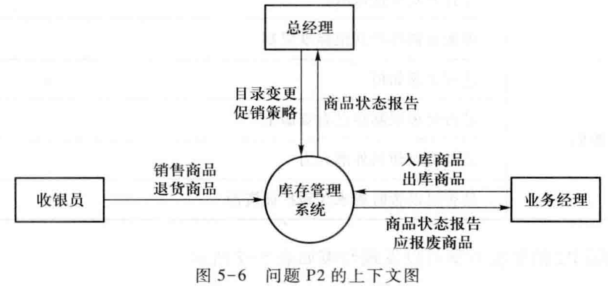
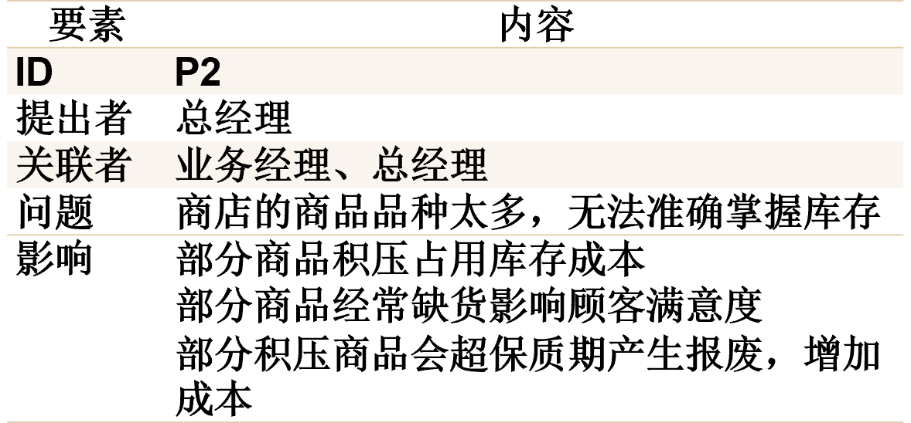
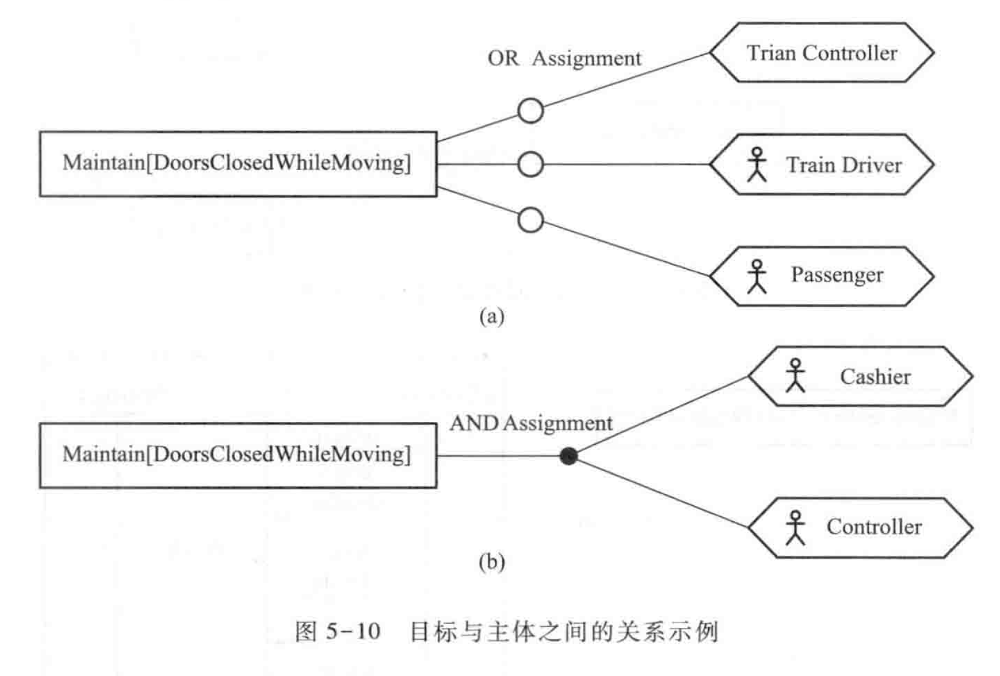
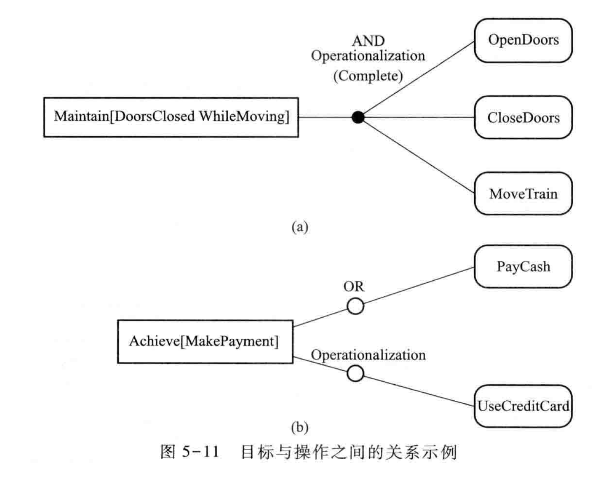
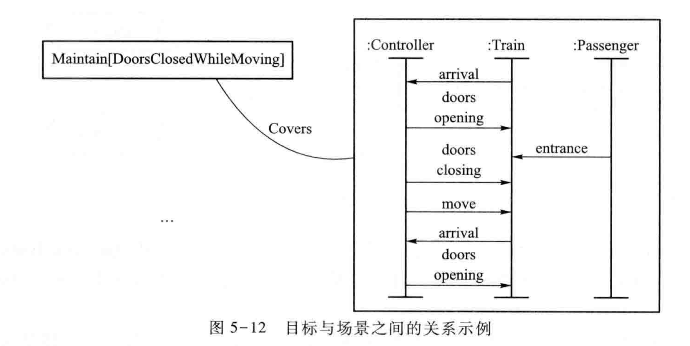
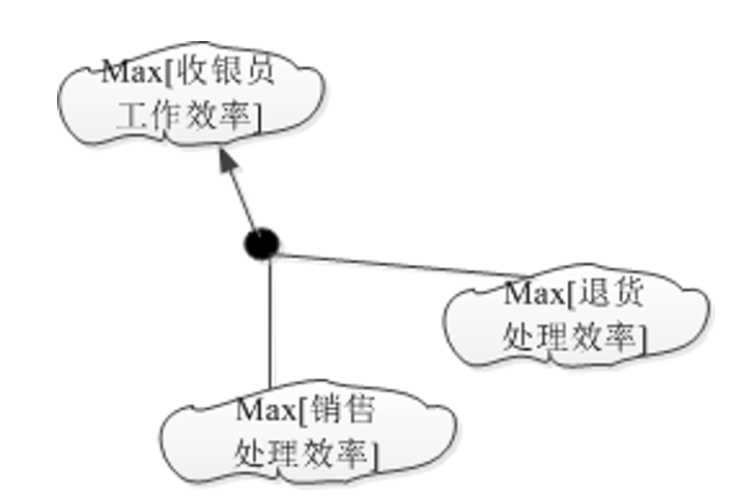
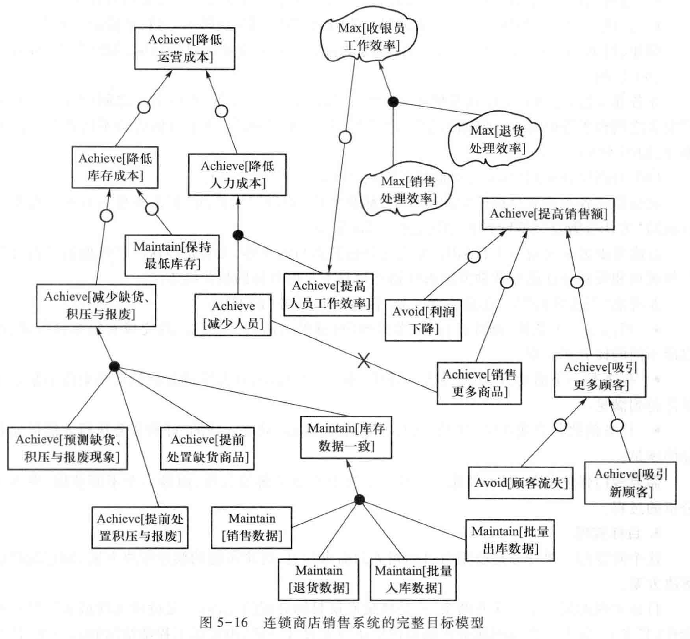

Book5-确定项目的前景和范围
---

# 1. 引入：社区团购激战正酣
1. 团长：小区门口的便利店、彩票店、餐饮店主，佣金10%，提成收入200-350/天
2. 社区团购：最后一个没有被完全电商化的市场，规模可达万亿。
3. 品控、缺货、退货问题较为明显。

# 2. 华春莹八连问
1. 诱导式与双筒问题
2. 封闭问题
3. 探究式问题与抗辩

# 3. 确定项目前景和范围的活动

## 3.1. 为什么要确定项目的前景和范围
1. 在看待现实世界时：世界是复杂的，从不同的角度观察(目的与条件)，会看到不同的内容(抽象与映射)
2. 因此
   1. 如何保证项目涉众以符合项目需要的角度描述现实世界？
   2. 描述哪些事物和事件才会尽可能的符合项目的需要？
3. 方法是
   1. 定义项目前景：所有的涉众都从共同认同的项目前景出发，理解和描述问题域及需求
   2. 定义项目范围：范围内的事物和事件是描述的目标

## 3.2. 确定项目前景和范围的位置和作用


## 3.3. 确定项目前景和范围的关键
1. 定义业务需求和能够满足需求的高层解决方案，包括:
   1. 业务目标、目的
   2. 高层业务功能
   3. 每个高层业务功能所关联的高层数据
   4. 每个功能相关的项目涉众
   5. 等等
2. **如果存在不同业务需求之间的冲突，那么在确定项目前景和范围阶段必须予以解决**：不然会导致软件很难甚至无法继续推进。

## 3.4. 业务需求冲突示例
1. 对一个配有嵌入式软件的售货机而言：
   1. 销售机开发者的业务目标：
      1. 向零售商出售或出租售货机，并由此获利。
      2. 通过售货机向顾客销售消费品。
      3. 吸引客户对商品的兴趣。
      4. 生产出多种类型的售货机。
   2. 零售商的业务目标：
      1. 将单位营业面积的收益最大化。
      2. 吸引更多的顾客来商店购买。
      3. 用售货机替代人工，带来销量和利润的增长。
   3. 可能产生的矛盾：
      1. 开发者重技术、零售商要求简单可直接投入使用、顾客希望方便和功能性
2. 泡泡玛特即将上市

# 4. 确定项目前景与范围的过程


# 5. 本章总论
1. 确定项目的前景与范围，就是确定项目的问题、目标、特性
   1. (业务需求)问题：组织的战略目标、利益分配、政策规划、业务流程等高层问题
   2. 目标：问题的反面，用户的期望
   3. 特性：选定的、针对目标的解决方案所需要具备的功能特征，通常内聚于一个目标与任务，反映系统与外界一次有价值的完整互动过程(用户)
2. 针对项目的复杂程度，可以采用的分析手段由浅到深依次为问题分析、目标分析、业务过程分析
   1. 问题与目标明确->问题分析->用例图/上下文图
   2. 目标之间存在较为复杂的关系->目标分析->目标模型与目标实现
   3. 目标、特性之间存在紧密的联系->业务过程分析->UML活动图
   4. 分析过程越复杂，分析结果的形式化程度越高，变更的成本也越大
3. 此外，还需要分析非功能需求，定义系统边界，生成前景与范围文档

# 6. 问题分析
> 过程描述


## 6.1. 获取问题
1. 通过收集背景资料或者与涉众沟通来实现
2. 收集背景资料时要收集业务描述及其统计数据关注业务困难与问题。与涉众的沟通主要通过面谈
3. 示例：×××连锁商店是一家刚刚发展起来的小型连锁商店，其前身是一家独立的小百货门面店。原商店只有销售的收银部分使用软件处理，其他业务都是手工作业，这已经不能适应它的业务发展要求。首先是随着商店规模的扩大，顾客量大幅增长，手工作业销售迟缓，顾客购物排队现象严重，导致流失客源。其次是商店的商品品种增多，无法准确掌握库存，商品积压、缺货和报废的现象上升明显。再次是商店面临的竞争比以前更大，希望在降低成本，吸引顾客，增强竞争力的同时，保持盈利水平。
   1. P1：手工作业销售迟缓，效率不高。
   2. P2：商店的商品品种太多，无法准确掌握库存。
   3. P3：成本不够低，导致竞争力不强，盈利水平不够。
   4. P4：顾客不够多，销售额不高，盈利水平不够。

## 6.2. 明确问题

### 6.2.1. 对问题达成共识
1. 描述问题：在涉众之间取得认同


### 6.2.2. 收集背景资料，判断问题的明确性 
1. 问题的明确性要求它们具备一下两点：
   1. 易于理解；
      1. P1. 图书管理员：图书总是无法上架。
      2. P2. 图书管理员：
         1. 图书的内容分类不合适，无法分类上架
         2. 图书上架的工作太繁杂，导致来不及上架。
         3. 图书的借阅不遵守章程，不能保证上架。
   2. 能指明解决的方向
      1. P3. 决策者：生产的废品过多。 

### 6.2.3. 分析不明确问题，发现问题背后的问题
1. 对于不明确的问题
   1. 直接咨询涉众是第一选择
   2. 利用收集的资料和业务数据是第二选择
   3. 必要时需要使用一些简单的问题分析技巧

### 6.2.4. 发现深层问题的示例
1. 当前问题：产生了太多的废品
2. 进一步问题：产生太多废品的原因？
   1. 用鱼骨图列出所有的可能原因
   2. 请用户确认(通常可以解决问题)
   3. 如果用户无法确认，则搜集数据进行分析
   4. 重新定义新的问题(不准确的销售订单)


## 6.3. 发现业务需求
1. 每一个明确、一致的问题都意味着涉众存在一些相应的期望目标，即业务需求。
2. 一般情况下，业务需求就是问题的反面
   1. P3. 决策者：生产的废品过多
      1. BR2：提供销售订单的准确性，在系统使用后3个月内，减少50%因此而产生的废品。
3. 注意：**业务目标要具有第二章所述的各种优秀特性，尤其是要有可验证性**

## 6.4. 定义解决方案及系统特性

### 6.4.1. 确定高层次的解决方案
1. 发现各种可行的高层次解决方案，分析不同方案的业务优势和代价，然后通过和涉众的协商，选定其中一个 
   1. 分析涉及的人员与任务，综合考虑，给出解决方案
   2. 创造性过程：依赖于个人的技术水平、经验和综合素质


### 6.4.2. 提供解决方案候选,但要由用户确定最终结果
1. 背景：对一个设备制造商的IS系统升级
2. 问题：改进同经销商之间的通信
3. 涉众：制造商、经销商
4. 开发人员提出的解决方案：
   1. 提供更好的财务报告、更好的发票和陈述的格式、在线的零件订购以及电子邮件
   2. 最终希望能实现公司和经销商间的电子资金转账
5. 客户讨论修正后的方案：
   1. 首要任务是提供电子资金转账
   2. 最好能有电子邮件及其它的通信特性

### 6.4.3. 定义系统特性
1. 明确该解决方案需要具备的功能特征，即系统特性 
2. 特性是对一系列内聚的相互联系的需求(要求)、领域特征和规格的总称[Classen2008]。通常，一个特性内聚于一个目标与任务，反映了系统与外界一次有价值的完整互动过程(一组**任务的要求**)。

### 6.4.4. 解决方案的边界
1. 分析解决方案需要和周围环境形成的交互作用，定义解决方案的边界
2. 面向对象方法：用例图
   1. 涉及哪些用户？
   2. 用户的目标有哪些？需要执行的任务有哪些？
   3. 建立用例图(角色：用户；用例：目标-任务)
3. 结构化方法：上下文图(DFD)
   1. 它需要的信息由谁提供？
   2. 它产生的信息由谁使用？
   3. 谁控制它的执行？
   4. 谁会影响它的执行？

#### 6.4.4.1. 面向对象边界描述：用例图
1. 外部角色在与解决方案的交互中完成的任务与目标


#### 6.4.4.2. 结构化边界描述：上下文图
1. 关注解决方案与环境之间的信息流输入/输出



### 6.4.5. 确定解决方案的约束


> 对“新的销售订单系统”的约束


## 6.5. 案例分析
1. ×××连锁商店是一家刚刚发展起来的小型连锁商店，其前身是一家独立的小百货门面店。原商店只有销售的收银部分使用软件处理，其他业务都是手工作业，这已经不能适应它的业务发展要求。首先是随着商店规模的扩大，顾客量大幅增长，手工作业销售迟缓，顾客购物排队现象严重，导致流失客源。其次是商店的商品品种增多，无法准确掌握库存，商品积压、缺货和报废的现象上升明显。再次是商店面临的竞争比以前更大，希望在降低成本，吸引顾客，增强竞争力的同时，保持盈利水平。

### 6.5.1. 问题
1. P1：手工作业销售迟缓，效率不高。
2. P2：商店的商品品种太多，无法准确掌握库存。
3. P3：成本不够低，导致竞争力不强，盈利水平不够。
4. P4：顾客不够多，销售额不高，盈利水平不够。

### 6.5.2. 标准化格式的问题


### 6.5.3. 业务需求
1. BR1：在系统使用6个月后，商品积压、缺货和报废的现象要减少50%
2. BR2：在系统使用3个月后，销售人员工作效率提高50%
3. BR3：在系统使用6个月后，店铺运营成本要降低15%
   1. 范围：人力成本和库存成本
   2. 度量：检查平均每个店铺的员工数量和平均每10,000元销售额的库存成本
4. BR4：在系统使用6个月后，销售额度要提高20%
   1. 最好情况：40%
   2. 最可能情况：20%
   3. 最坏情况：10%


### 6.5.4. 涉及的用户及其任务
1. BR1：在系统使用6个月后，商品积压、缺货和报废的现象要减少50%
   1. 客户经理：库存入库、出库、分析
   2. 总经理：库存分析、促销、产品调整
2. BR2：在系统使用3个月后，销售人员工作效率提高50%
   1. 销售人员：销售、退货
3. BR3：在系统使用6个月后，店铺运营成本要降低15%
   1. 范围：人力成本和库存成本
   2. 依赖于上两个目标的解决方案
4. BR4：在系统使用6个月后，销售额度要提高20%
   1. 扩大销售：总经理：促销
   2. 吸引回头客：客户经理：顾客管理(发展会员、礼品赠送)

### 6.5.5. 系统特性
1. SF1：分析店铺商品库存，发现可能的商品积压、缺货和报废现象：BR1，BR3
2. SF2：根据市场变化调整销售的商品：BR1，BR3，BR4
3. SF3：制定促销手段，处理积压商品：BR1，BR3，BR4
4. SF4：与生产厂家联合进行商品促销：BR1，BR3，BR4，CH
5. SF5：制定促销手段进行销售竞争：BR1，BR4，CH
6. SF6：掌握员工变动和授权情况：BR2
7. SF7：处理商品入库与出库：BR1
8. SF8：发展会员，提高顾客回头率：BR4，CR
9. SF9：允许积分兑换商品和赠送吸引会员的礼品，提高会员满意度：BR3，BR4，CR
10. SF10：帮助收银员处理销售与退货任务：BR2

### 6.5.6. 问题的用例图


### 6.5.7. 系统边界
1. 由多个问题合并而来


## 6.6. 商业模式画布与问题分析
1. 利用商业模式画布的九模块与模块之间的联系中抽取问题(**问题分类**)
2. 利用商业模式的内、外评估与蓝海战略确定业务需求、生成系统特性、确定系统边界与开发约束(**用于评估与量化的检查列表**)
3. 将生成的业务需求、系统特性、系统边界、开发约束与商业模式画布建立起联系，从而显式地维护各个元素之间的关联关系(**可追踪**)


> 网易严选的调整：复用渠道，强化产品，弱化自有电商。

# 7. 目标分析
1. 面向目标的方法(Goal-Oriented Requirements Engineering)
2. 为什么需要目标？
   1. 业务需求？
      1. 不够严谨
      2. 无法形成方法学支持(建模)
   2. 面向目标的方法
      1. 将“目标”严格定义:单位、组织方式->目标模型
      2. 建立方法学支持:模型的建立与应用


## 7.1. 面向目标的方法
1. 从早期就指导RE活动
   1. 有利于需求的获取
   2. 指导后期活动
2. 关注Why，深层次分析组织及其涉众的目标、候选方案和隐式因素：深入理解涉众关注
3. 得到业内的重视
   1. 很多现存的方法学也开始整合对目标的分析与处理技术。目标概念在需求工程方法中的广泛被接受现象说明：目标已经成为了需求工程常用的核心概念”[Kavakli2002]。
   2. 目标将会补充传统方法中的实体(Entities)概念和行为(Activities)概念，一起成为需求工程建模与分析的基本对象类别[Yu1998]。
   3. KAOS[Dardenne93, van Lamsweerde1995]、NFR[Mylopoulos1992, Chung2000]、I*[Yu1997]、GBRAM[Anton1996, Anton1997]

## 7.2. 目标
1. 目标：是系统被开发的目的 
   1. 它有着明确的定义方式 
   2. 名称、类型、关注、定义(正式与非正式))、优先级、主体、拥有者等


## 7.3. 目标可以有不同的抽象层次
1. 高层次目标
   1. 战略性的,全局的, 业务相关的
   2. 增加50%的传输能力
2. 低层次目标
   1. 技术性的，局部的，产品设计相关的
   2. 加速器每3秒发出一次命令

```
G1：降低5%的运营成本
Goal Achieve[OperationCostDecrease]
类型： SatisfactionGoal
非正式定义：降低5%的运营成本
关注：OperationCost
正式定义：∀ c: OperationCost
          Decrease(c)
          ⇒◊ DecreasePercent(c)>=5
G2：在商品距离报废期还有10天时，业务经理应该得到提示
Goal Achieve[CommodityOutofDateNoticed]
类型： SatisfactionGoal
非正式定义：在商品距离报废期还有10天时，业务经理应该得到提示
关注：Commodity, GeneralManager
正式定义：∀ c:Commodity, m: GeneralManager
          c.guaranteePeriod()<=10
          ⇒◊ Notify(m, c)
```

## 7.4. 目标有不同的类型
1. 功能目标(Functional Goal)
   1. 描述预期的系统行为
   2. 满足型目标(Satisfaction Goal)和信息型目标(Information Goal) 
2. 非功能目标(Non-functional Goal) 
   1. 常见的是质量目标(Quality goals)和约束目标(Constraint goals)
      1. 安全目标(Safety Goal)、性能目标(Performance Goal)、可用性目标(Usability Goal)等等 
3. 软目标(Soft Goal)和硬目标(Hard Goal)：能否利用技术手段确认是否满足
4. 实现目标(Achieve Goal，对应终止目标Cease Goal)、维护目标(Maintain Goal，对应避免目标Avoid Goal)和优化目标(Optimize Goal) 

## 7.5. 目标规格的基本模式
1. 实现(Achieve)：P ⇒ ◊ Q   //如果将来某一时刻Q为真(被满足)，则目标实现
2. 终止(Cease)： P ⇒ ◊ ¬ Q  //如果将来某一时刻Q为假(被终止)，则目标实现
3. 保持(Maintain)： P ⇒ □Q //将来任一时刻Q都为真，则目标实现
4. 避免(Avoid)： P ⇒ □¬ Q //将来任一时刻Q都为假，则目标实现
5. 优化(Optimize)：最大化Maximize (目标功能) 或 最小化Minimize (目标功能)

## 7.6. 目标模型的关系
1. 精化(Refinement)关系
2. 阻碍(Obstruction)关系
3. 支持与冲突(Support/Conflict)关系

## 7.7. 目标精化
1. 一个高层次目标G可以精化为低层次目标{G1,G2,…,Gn}：
   1. 如果一系列子目标{G1,G2,…,Gn}的完成有助于目标G的完成，那么G与{G1,G2,…,Gn}之间就是AND 精化关系。此时任意两子目标Gi与Gj之间是互补的。
      1. 如果更进一步，子目标{G1,G2,…,Gn}的完成能够直接保证G的完成{G1,G2,…,Gn}|=G，那么G与{G1,G2,…,Gn}之间就是完备(Complete)AND 精化关系。
   2. 如果任一子目标Gi都是G的替代方案，那么G与{G1,G2,…,Gn}之间就是OR 精化关系。此时，任意两子目标Gi与Gj之间是互相替代的。

## 7.8. 目标精化是目标模型的重要任务之一(Goal-oriented -> agent-oriented)
1. 目标的达成需要主体(agent)的参与
   1. 人,设备, 其他软件系统…
   2. 目标G1(超市降低5%成本) 库存管理员、商品销售系统、收银员、信用卡刷卡器、税务系统接口......
2. 越是抽象、粗粒度、范围广的目标，参与的主体越多
3. 如果一个目标的主体只有待开发的软件系统一个，那么该目标就可以等同于需求(要求)了。
4. 如果一个目标的主体只有系统环境中的一个对象(例如用户)，那么该目标就可以等同于假设(Assumption)与依赖(Dependency)了
5. 区分目标的主体与拥有者，拥有者通常是涉众，这些涉众期望目标达成但不一定参与目标达成过程

## 7.9. 示意图


> 云朵就是软目标，最好写实现xxx

## 7.10. 目标阻碍
1. 如果子目标O的达成会使得高层目标G失败O|=¬G，那么O与G的关系就是阻碍关系
2. 阻碍目标也可以继续AND精化、OR精化
3. 阻碍关系本身是一种特殊的精化——反向精化


## 7.11. 目标支持与冲突:目标模型的重要任务之二
1. 多个目标之间关系
2. Support链接表示一个目标对其他目标的支持作用
   1. 支持关系可以被处理为OR精化关系
3. Conflict链接表示一个目标的实现对其他目标的实现有阻碍作用
4. ++(Make)：一个目标的成功可以直接保证另一个目标的成功；
5. +(Help)：一个目标的成功可以让另一个目标更容易成功
6. －(Hurt)：一个目标的成功会使得另一个目标的成功更加困难；
7. ― ―(Break)：一个目标的成功会直接导致另一个目标的失败。


## 7.12. 目标与其他元素的关系
1. 主体（Agent）
2. 场景（Scenario）
3. 操作（Operation）
4. 任务（Task）
5. 资源（Resource）
6. UML元素

## 7.13. 目标与主题关系
1. Assignment链接表示为实现目标而需要参与主体。
   1. OR Assignment：多个主体中的一个来完成。
   2. AND Assignment：多个主体一起共同完成



## 7.14. 目标与操作关系
1. AND Operationalization链接和OR Operationalization链接
   1. 目标实现过程中需要执行的操作，G |= {Spec(Op1), ..., Spec(Opn)}



## 7.15. 目标与场景关系
1. Cover链接表示场景涉及所有行为都是目标所包含的操作的子集



## 7.16. 目标与数据模型
1. Concerns链接用来描述目标与应用领域对象（数据资源）之间的关系


## 7.17. 目标分析过程


## 7.18. 面向目标的分析方法
1. 面向目标方法的处理过程 
   1. 高层目标的获取：现状和背景的分析：问题与缺陷
   2. 低层目标的获取 ：需求获取与目标分析
      1. 已有目标的验证和细化 （基于目标分析）
      2. 基于场景的方法等等 （基于目标实现）
   3. 目标分析 ：精化与分解
      1. 建立系统的目标模型 
   4. 目标实现 
      1. 收集与目标相关的需求信息，讨论可能的候选解决方案，确定最终的系统详细需求和解决方案

### 7.18.1. 高层目标的获取
1. the highest level goal that can be ascribed to an enterprise is the wish to survive
2. 现状和背景的分析：问题与缺陷
   1. Achieve goal && Maintain goal
3. Identifying maintain goal
   1. The enterprise norms are maintained by regulating its relationships with other enterprises in its environment. 
      1. Maintain relationships with customers, with suppliers, employees, with investors etc.
 
### 7.18.2. 面向目标的方法
1. ×××连锁商店是一家刚刚发展起来的小型连锁商店，其前身是一家独立的小百货门面店。原商店只有销售的收银部分使用软件处理，其他业务都是手工作业，这已经不能适应它的业务发展要求。首先是随着商店规模的扩大，顾客量大幅增长，手工作业销售迟缓，顾客购物排队现象严重，导致流失客源。其次是商店的商品品种增多，无法准确掌握库存，商品积压、缺货和报废的现象上升明显。再次是商店面临的竞争比以前更大，希望在降低成本，吸引顾客，增强竞争力的同时，保持盈利水平。

#### 7.18.2.1. 分析问题确定首批目标
1. BR1：在系统使用6个月后，商品积压、缺货和报废的现象要减少50%
2. BR2：在系统使用3个月后，销售人员工作效率提高50%
3. BR3：在系统使用6个月后，店铺运营成本要降低15%
   1. 范围：人力成本和库存成本
   2. 度量：检查平均每个店铺的员工数量和平均每10,000元销售额的库存成本
4. BR4：在系统使用6个月后，销售额度要提高20%
   1. 最好情况：40%
   2. 最可能情况：20%
   3. 最坏情况：10%

#### 7.18.2.2. 高层目标模型


### 7.18.3. 目标精化：低层目标的识别与层次结构建立
1. 从对高层目标的描述中：
   1. 面谈报告
   2. 企业规章、政策
   3. 任务描述
   4. 业务过程分析（例如工作流图）
   5. 场景描述
2. 识别
   1. 精化关系

#### 7.18.3.1. 从面谈报告中发现目标


#### 7.18.3.2. 从场景描述中发现目标


#### 7.18.3.3. 发现精化关系
1. 发现AND精化关系：
   1. 同一个目标有不同场景：每个Gi代表一个典型场景，任意Gi与Gj代表不同的场景；
   2. 完成目标有连续过程：每个Gi代表G完成过程中的一个状态，Gi、Gi+1代表两个连续的状态；
   3. 完成目标需要有多个方面紧密配合：Gi与Gj紧密联系或互相支持；
   4. 目标有不同质量环境及表现：每个Gi代表不同质量要求下的G的完成。
2. 发现OR精化关系：多种可以相互替代的“候选办法”




### 7.18.4. 目标精化(续)
1. 考虑阻碍目标实现的情况（avoid目标）
2. 考虑已有目标之间的支持与冲突关系
3. 对高层目标问“how”，对低层目标问“Why”，建立层次结构



### 7.18.5. 目标精化的结束条件
1. 子目标展开到单一**事务**时终止
   1. Agents与System的一次协作活动
   2. 连续活动，要求全部成功（要么全部失败）
   3. 确认这些单一事务能够增加业务价值
2. 单一事务可以被进一步展开为场景（任**务的要求=>单个任务的描述**）

### 7.18.6. 目标精化的约束
1. 注意识别目标隐含的：
   1. 假设与依赖，例如：
      1. 商业规则，特定场景限定
      2. 市场与环境假设，业务过程假设…
   2. 质量属性
   3. 约束
      1. 资源依赖

### 7.18.7. 目标实现
1. 将最底层目标分配给主体（人+系统）


TODO 亿点点

# 8. 为隆中对构建目标模型与分析