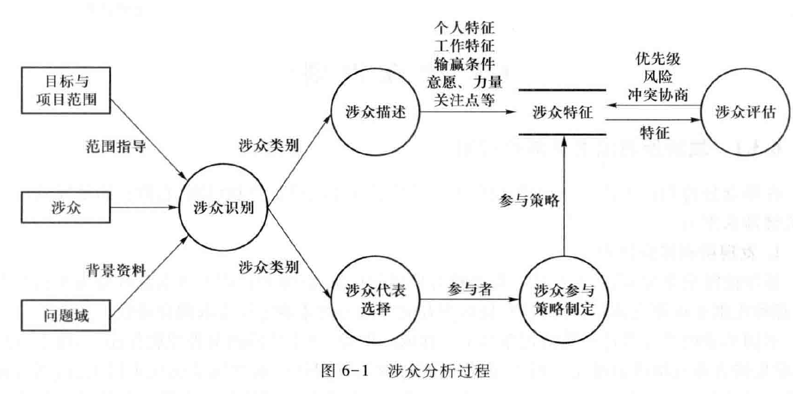
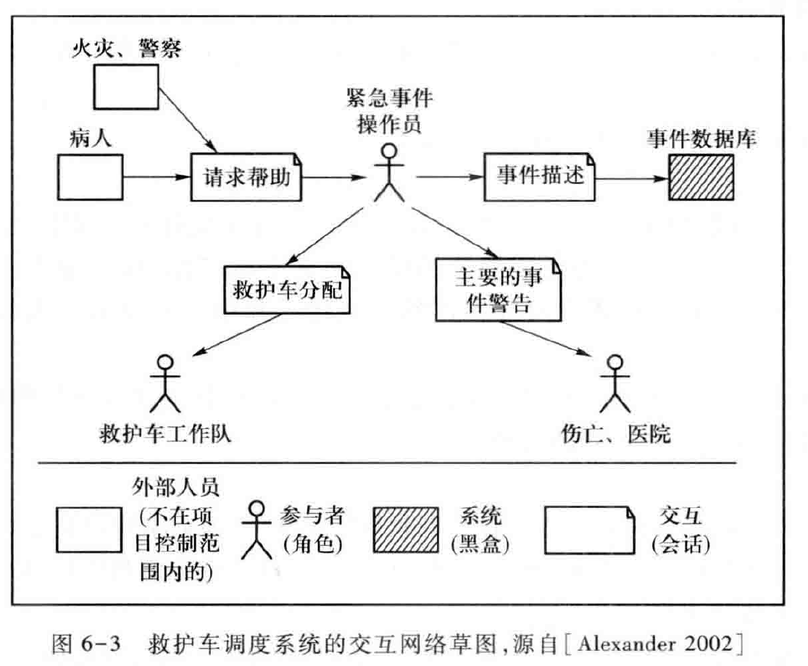
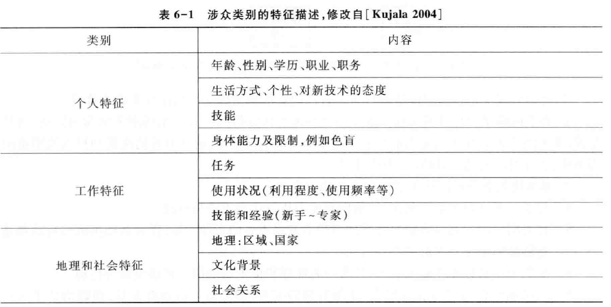
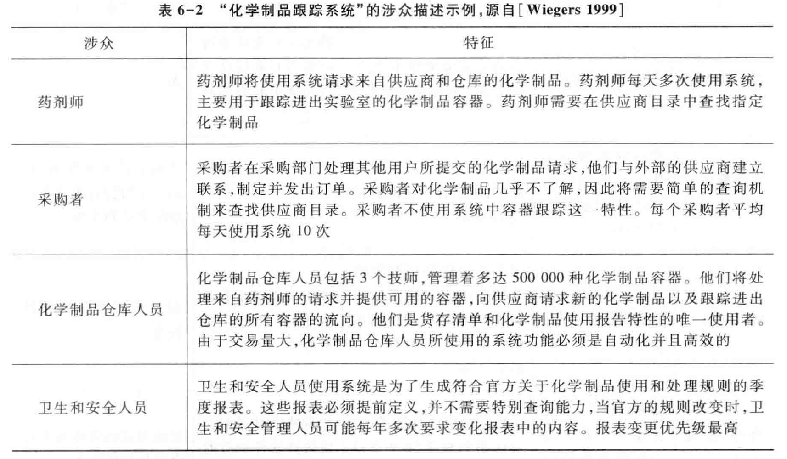
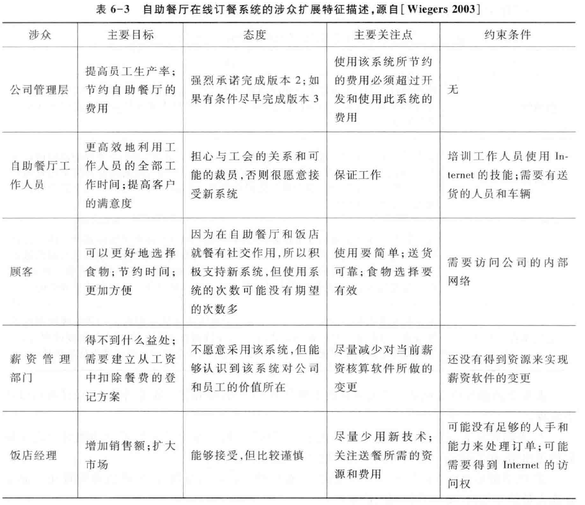
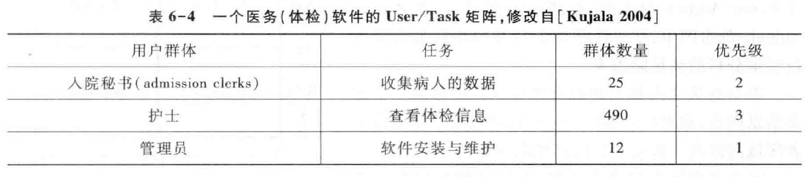
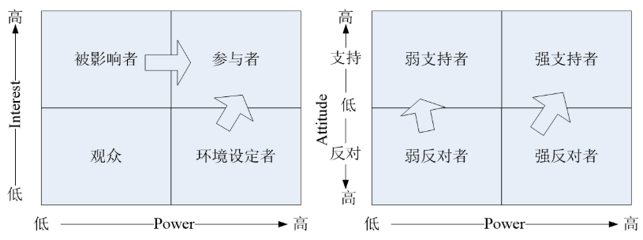

Book6-涉众分析与硬采样
---

# 1. 什么是涉众

## 1.1. 获取的源头
> 两种类型

1. 人脑外知识：科学规律
2. 人脑内知识
   1. 困难，有很多问题
      1. 如何寻找合适的人？
      2. 如何有效的与他们进行交流？

## 1.2. 涉众
1. 所有能够影响软件系统的实现(系统决策者、开发者、利益所在者)或者会被实现后的软件系统所影响的(已有产品更新、全新产品开发)**关键**个人和团体(stakeholder)。

# 2. 涉众分析概述

## 2.1. 企业信息系统的涉众：业务驱动
1. 涉众分析围绕一个组织的各个部门内的员工所负责的业务展开：所有的描述和胜败条件都和业务直接相关
2. 此类涉众分析的难度随着组织机构的复杂性和不确定性增长而增加

## 2.2. 涉众分析工作的差异性——视所开发系统的情况而定
> 信息系统的四种类型 

1. 小型系统(Small System) 
   1. 小型系统是指那些能够支持组织的部分工作，但又不会影响整个组织基础工作的信息系统
   2. 关注于某个特定问题
   3. 功能较为固定，界限较为清晰
   4. **涉众有限且明显**
2. 组织级系统(Organization-Wide System) 
   1. 其功能能够影响整个组织基础工作的系统，它的功能在质量上和小型系统有着明显的差异。
   2. 它可能会影响用户群体之外的组织内其他群体，甚至改变组织现存的权力结构
   3. 用户不再有限和明显，而且用户之外的其他群体尤其不明显
   4. 发现直接和间接群体，防止抵制
   5. **分析组织内各类人群的互动关系**
3. 战略信息系统(Strategic Information System) 
   1. 作为组织战略决策而得以开发的系统
   2. 无法根据现有的业务和技术状况来确定系统将来的应用效果
   3. 系统的影响范围也难以确定，
   4. 涉众数量更多而且更加难以确定
   5. 在业务环境内分析各种可能的机遇和风险，并据此发现可能的涉众，防止抵制
   6. **分析组织内各类人群的互动关系，各种风险/机遇对既有互动关系的影响**
4. 组织间系统(Inter-Organizational Systems)
   1. 通过系统自身的实施建立或增强组织之间的合作关系
   2. 系统的很多决定不是单个组织所能控制的
   3. 在主动参与和抵制系统的问题上有着更多的困难
   4. 涉众比组织内系统的涉众更加难以寻找和选择
   5. 考虑组织之间的合作关系和利益分配方案，在组织的大框架下进行涉众的寻找和选择
   6. **分析组织间的互动关系，分析关系到组织间互动的各类人群在组织内的互动关系**

## 2.3. 互联网产品的涉众：人性驱动，但也有围绕业务的利益冲突
1. 补充：大众型产品
   1. 例如搜索引擎、电子商务、移动互联网应用等等
   2. 分析产品定位人群(用户绘像)
   3. 产品功能在用户社会关系网中的关联作用，能否帮助解决生活中的问题
   4. **分析用户与社会关系的互动(场景)**
2. 互联网产品也需要展开基于业务的涉众分析
   1. 平台商业模式中如何补贴多个客户群体的收益流
   2. 某款产品的新功能是否会冲击同一个公司的其它产品

## 2.4. 涉众分析的过程

## 2.5. 涉众分析的过程Stakeholders, Goals, Scope: The Foundation for Requirements and Business Models
1. Suzanne Robertson：涉众分析与前景与范围的定义是交织进行的，互为依赖

# 3. 涉众识别

## 3.1. 涉众识别的基本原则
1. 涉众类别需要**细分**，发现**所有类别**：每一类涉众的所有成员都能够一致、稳定的从相同立场、相同视角来看待相同的软件系统 
2. 发现比较**关键**的涉众：需要分析他们各自的赢利条件，以在相互妥协中尽力实现一个共赢的结局 
3. 涉众群体不是固定不变的，需要**持续维护**：对涉众的理解不是一个完成之后就可以结束的活动，而是应该在完成之后继续保持适当的关注 

## 3.2. 关键涉众类别判定：涉众互动
> 如果互动及其关注点属于项目的目标与范围，那么涉众就属于关键涉众

## 3.3. 涉众识别方法
1. 简单方法：先膨胀后收缩(Expand $\Rightarrow$ Shrink)
2. 经验方法：检查列表（Checklist）
3. 经典方法：涉众网络 

## 3.4. 先膨胀后收缩
1. **膨胀**：在该阶段，需求工程师在收集到背景资料后，凭借自己的经验，尽可能多地列出涉众类别，越多越好。
2. **收缩**：在该阶段，需求工程师判断是否有两类或多类涉众的立场是一样的，将一样的多个类别进行合并。
3. **简单易用**：如果涉众群体比较复杂，可能会出现遗漏。

## 3.5. 检查列表：经典列表
1. 用户: 最终使用和操作产品的人：关注软件功能 
2. 客户: 为软件系统的开发付费的人：关注经济上的成本、收益
3. 开发者: 负责实现软件系统的人：关注技术上的成本和收益
4. 管理者：参与软件系统开发事务管理的人，
   1. 投资方管理者 、执行负责人、项目管理者 
   2. 关注系统的开发进程
5. 领域专家: 在问题域中具有丰富知识的专家：关注软件中的知识（概括性、综合性） 
6. 政府力量：法律法规、长远规划、政策意向等：起约束和指导作用
7. 市场力量：组织中的市场部门人员：关注用户的想法
8. 维护人员：系统的非功能属性，例如质量

### 3.5.1. 优点
容易操作，如果经验丰富会比较有效

### 3.5.2. 缺点
有些类别太粗，尤其是用户作为一个类别是远远不够的

## 3.6. 涉众网络
> 基本过程：
   
1. 从一些比较容易发现的涉众出发，通常包括客户、管理者和相关的投资者
2. 由初始涉众集体讨论，列出一个涉众类别列表
3. 对上一步产生的涉众类别列表进行分析 ，缩减为一个关键涉众类别列表  
4. 由上一步的各个关键涉众类别选择代表，集中讨论，列出新的涉众类别列表，如果涉众类别列表趋于稳定，就结束涉众识别过程，否则转向第2步

## 3.7. 利用目标模型分析涉众互动，识别关键涉众类别
> I*主体依赖模型ADM（Actor Dependency Model）

1. 目标依赖（goal dependency）：依赖者希望被依赖者满足一个条件，但不会规定怎样满足该条件。
2. 软目标依赖（soft goal dependency）：一种特殊类型的目标依赖，其条件是无法量化描述的。
3. 任务依赖（task dependency）：依赖者希望被依赖者执行特定任务。任务依赖比目标依赖更加具体，因为满足条件可以执行很多任务，被依赖者有自己的选择权。而任务依赖直接为被依赖者规定了任务。
4. 资源依赖（resource dependency）：依赖者希望被依赖者提供资源实体（抽象信息或者实物材料）为自己所用，但不关注提供资源需要被依赖者执行的行为和解决的问题。

## 3.8. ADM示例

## 3.9. B站的关键涉众类别
1. 一般Up主与观众：目标是流畅、有趣的中视频观看，任务是为平台带来流量和关注度，占用大量带宽和审核资源，被补贴
2. "二次元"核心Up主与观众：目标是垂直、核心的动漫内容消费，任务是为平台带来收益和核心社区，强力的粘性消费补贴平台其他用户
3. 未来演化：从"一般"获取更多收益，尽可能为"核心"保持服务
   1. 大会员（B站买电影和电视剧版权是为了什么）
   2. 新二次元手游的广告营销，拜年祭

## 3.10. ADM示例二

# 4. 涉众描述

## 4.1. 应该描述哪些内容
1. L1：根据软件系统的功能前景寻找涉众
2. L2：从涉众对象那里获取需求
3. L3: 分析涉众的输赢条件,实施共赢策略 
4. L4: 了解涉众实现、监控和评估软件系统的能力，分析涉众的力量和影响范围；了解涉众实现、监控和评估软件系统的意愿，即分析涉众的关注点和兴趣取向。
5. L5: 了解涉众的个人特征和工作特征，以便在涉众固定的情况下对软件系统的功能进行合理的调整。  

## 4.2. 涉众简单特征描述

## 4.3. 涉众深度信息描述
1. 对项目的关注点和兴趣所在，态度是反对还是赞同；
2. 对项目的期望，成为项目赢家的条件；
3. 可能受到的项目的影响，影响的具体内容及影响程度；
4. 可以对项目施加的影响，力量的施加点及其强度。 

## 4.4. 建立涉众的目标模型进行深入描述
1. 将目标模型的Goal分配到Actor

## 4.5. 涉众评估

### 4.5.1. 优先级评估
1. 涉众并不是完全平等的，有些涉众比其他涉众更为重要 
2. 优先考虑涉众的基本特征，尤其是任务特征 

3. 基于涉众扩展特征进行涉众优先级的评估 

### 4.5.2. 风险评估
1. 分析态度

2. 化解涉众风险策略 

### 4.5.3. 课堂分析
1. 在当前流行的亲子项目中（亲子班、亲子电影、亲子围棋等），谁是用户？谁是客户？用户和客户谁的优先级更高？从Interest和Attitude的角度出发，如何化解项目风险？
2. 首先明确矩阵中的角色，其次依据策略展开分析

### 4.5.4. 共赢分析
1. Stakeholder/Issue关系图
   1. 列出系统的所有涉众类别，明确描述他们的兴趣和对系统的期望；
   2. 从涉众们的兴趣和期望中发现背后涉及的共同问题（Issue）；
   3. 建立涉众类别和问题的关联，如果某个涉众类别对一个Issue存在兴趣，那么该涉众类别和这个Issue就存在关联关系；
   4. 对每一个Stakeholder-Issue关系，标明该关系上面所被寄予的期望；  
2. Stakeholder/Issue关系图
   1. 如果某个Stakeholder-Issue关系上所寄予的期望与项目的业务需求无法保持一致，那么它关联的涉众就在该Issue的问题上和项目整体目标存在冲突
      1. 涉众和项目负责人互相调整、折中
      2. 重新评估项目的可行性
   2. 如果Stakeholder/Issue关系图中某个Issue所关联的不同关系标识有互相冲突的期望，那么就意味着它所关联的涉众在该Issue上存在需求冲突
      1. 分析各冲突方成为项目赢家的条件 
      2. 适当的调整, 化解冲突 
      3. 分析项目在该Issue上的目标、约束和可选方案，并提供给冲突方进行权衡，促进他们之间协商解决 

### 4.5.5. 阅文的免费模式能否与订阅模式共赢？
1. Issue：免费带来的更多流量与写手身份转换
2. Stakeholder：
   1. 头部与底部写手、普通读者：可以接受
   2. 腰部写手：影响收入，进一步弱化保障
   3. 核心读者：担忧文章质量下降
3. 能否共赢：免费与订阅在多大程度上共存
   1. 免费创作与订阅写作区分开，但共存
   2. 同时成为免费与订阅写手，或先从免费写手做起
   3. 可能达成共赢的Issue：利用民非阅读模式为平台引流，最新PPT更新

### 4.5.6. 利用目标模型深入评估涉众
1. 将目标模型的Goal分配到Actor
2. 根据Goal的优先级安排Actor的优先级
3. 根据Goal的风险确定Actor的风险
4. 根据目标分析深入分析Actor间的互动
   1. 发现Actor之间的冲突
   2. 根据Goal的冲突情况协商解决Actor间冲突

- 大意TODO新PPT