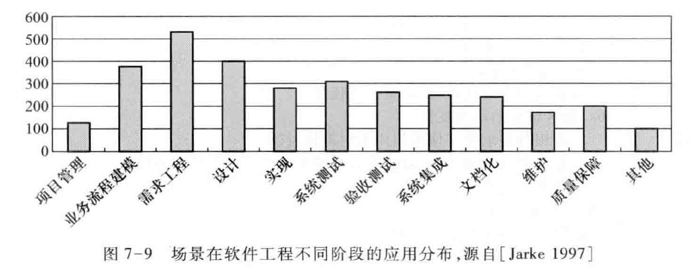
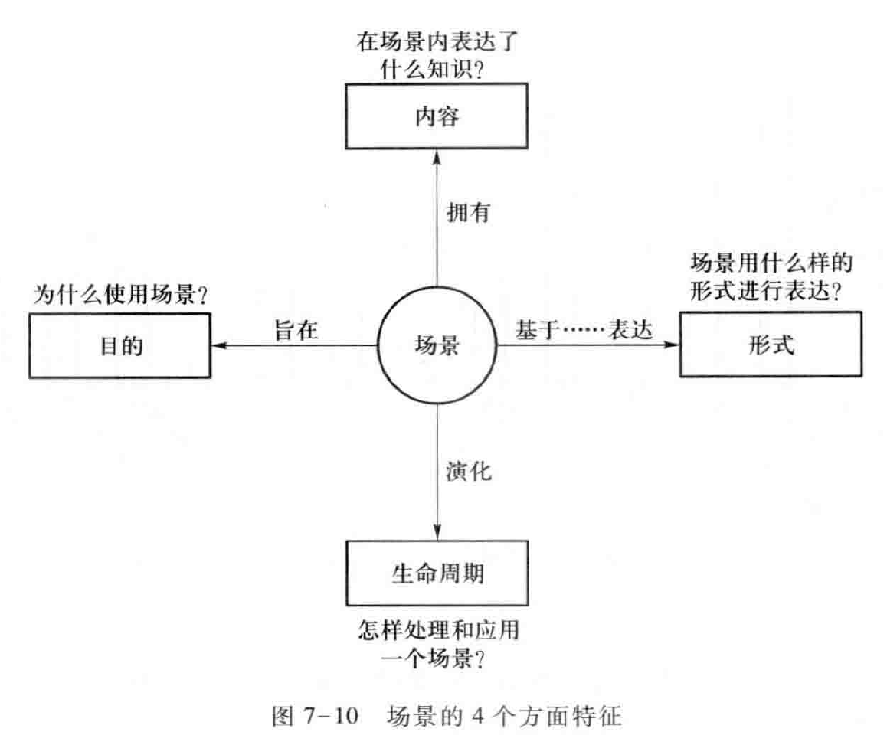
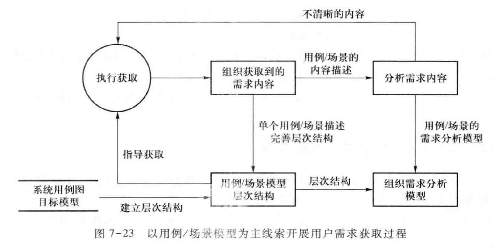
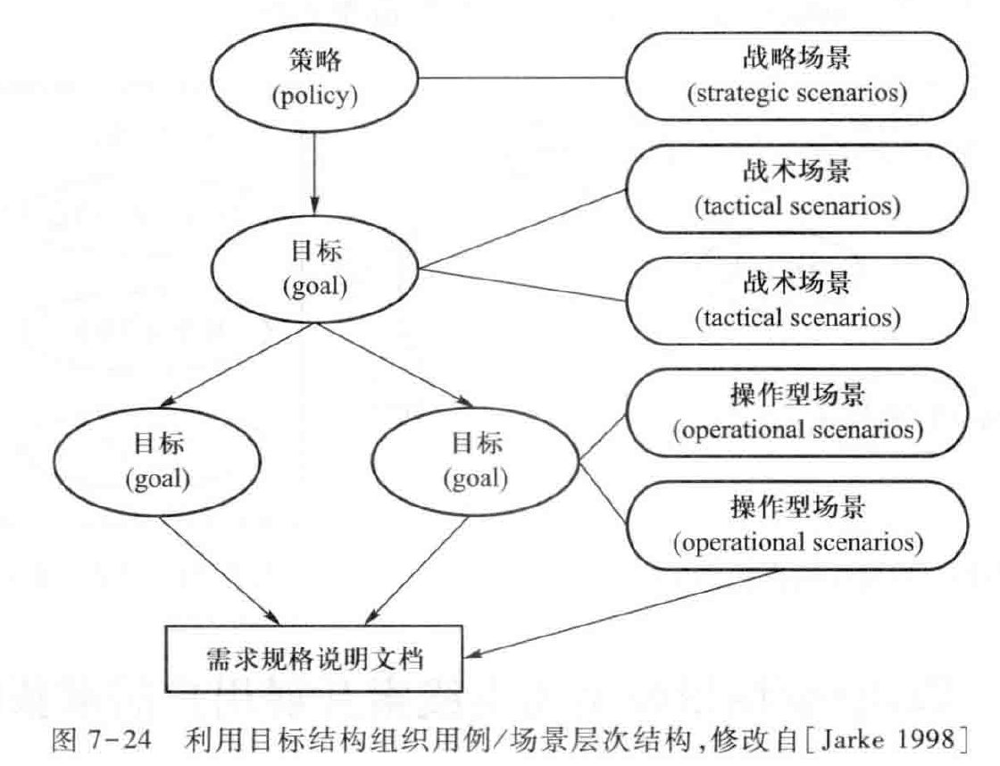
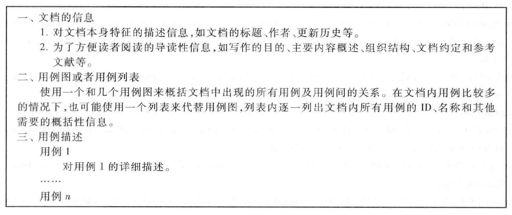
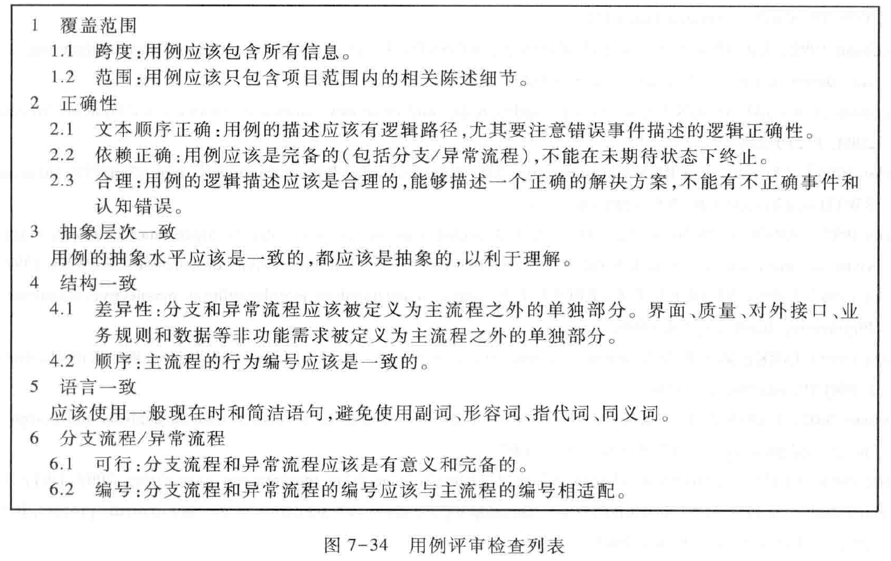

Book7-基于用例/场景模型展开用户需求获取
---

# 1. 相关新闻
1. 上市
   1. 千亿市值的泡泡玛特（12.11）
      1. 投资人对王宁的评价：学历平平，没正经上过班，说起话来表情平静，没感染力，团队也没有精英。
      2. 上市后：王宁性格沉稳，话不多，喜怒不形于色，拥有“消费创业者”的许多优秀品格。
   2. Airbnb上市（12.10）
      1. 12年，30-68-144（164）美元/股
      2. 国内：途家、小猪短租、美团民宿
2. 社区团购
   1. 京东入股兴盛，美团优选查贪腐
   2. 永辉超市彩食鲜获10亿腾讯投资：类似河马
3. B站跨年晚会
   1. 元气森林, TVB，武汉文旅，湖北广电
   2. 央视频（未来电视）–学而思 – 题拍拍

2. 宣传海报如下，包含了商业模式多种元素

# 2. 用户需求获取活动的展开

1. 需求获取前半段：确定项目前景与范围
2. 需求获取后半段：以场景/用例模型展开获取
3. 三大要素：确定范围，模型与流程，获取方法

## 2.1. 注意事项
1. 要保持项目范围，不能有需求遗漏：参照系统特性，围绕系统边界设计获取活动计划
2. 多轮次获取
3. 根据内容合理安排获取方法
4. 及时组织已获取需求，为后续获取提供指导
   1. 充足的背景阅读
   2. 1+轮前景与范围，2+轮获取：开放 -> 封闭

## 2.2. 多轮次获取要点
1. 前景与范围阶段
   1. 准备：背景资料获取与分析
   2. 第一轮：问题分析（深入）
   3. 第二轮：高层解决方案制定（确认）
2. 用户需求获取阶段
   1. 准备：明确主题与内容，准备材料
   2. 第一轮：明确任务与任务中主要问题（深入）
   3. 第二轮：明确任务细节，澄清困难内容（技巧、困难）
   4. 第三轮：明确解决方案（确认）

## 2.3. 获取方法安排
1. 面谈：常规方法
   1. 集体面谈：快速方法
   2. 调查表：用户分散
   3. 头脑风暴："发明"需求
2. 不确定性：原型
3. 情景性：观察

## 2.4. 用户需求的组织
1. 场景/用例模型驱动
   1. 整理和归类需求获取行为得到的信息（框架） 
   2. 指导和组织需求获取行为的开展
   3. 为详细信息的分析提供背景基础和上下文知识 
2. 承上启下
   1. 展开上一层（业务需求）
   2. 准备下一层的展开（系统级需求）

# 3. 场景/用例

## 3.1. 为什么需要“用例与场景”
> 需求获取内容的处理？

1. 获取笔录：权宜之计
  1. 用户需求+问题域特性
  2. 混杂，不清晰等特性
2. 用例与场景
  1. 场景为单位
  2. 问题域特性或者用户需求+问题域特性
  3. 组织清晰

## 3.2. 场景
1. [Zorman1995]将场景定义为对系统和环境行为的局部描述
2. [Plihon1998]将场景定义为对行为或者事件序列的描述，序列中的行为和事件是系统需要完成的一个任务的特殊示例。
3. [Jarke1996]认为场景包含有行为序列和行为发生的环境，环境描述了行为的主体、客体和上下文设置
4. 以上的描述都不足以作为场景的准确定义，人们也很难给场景下一个非常准确的定义[Rolland1998a]
5. **场景强调系统同外部环境互动以完成预期任务**
6. 具有重点描述真实世界（商业模式设计：讲故事->场景）的特征，它利用**情景、行为者之间的交互、事件随时间的演化**等方式来叙述性的描述系统的使用 

## 3.3. 用例定义
1. 用例
   1. 相关场景集合的叙述性的文本描述 
   2. 用例的概念是[Jacobson1992]最先在Objectory方法中提出的
2. UML将用例定义为“在**系统（或者子系统或者类）和外部对象的交互**当中所执行的**行为序列**的描述，包括各种**不同的序列和错误的序列**，它们能够联合提供一种**有价值的服务**”[Rumbaugh2004]。

## 3.4. 用例与场景
1. 以用例/场景为单位组织用户需求（和问题域特性）
2. 很受实践者欢迎
   1. 易于接受
   2. 易于使用
   3. 用例驱动！
3. 方法多样，差异性很大
   1. 也可以用来处理 业务需求 和  系统级需求
   2. 还可以用来处理 设计问题、测试问题……

## 3.5. 用例与场景的广泛应用

## 3.6. 组织特点

1. 它只考虑其他内容与功能需求之间的联系，却无法描述其他内容相互之间的联系，例如质量需求的相互依赖（目标模型）、界面需求的跳转（对外接口中的人机交互文档）、对外接口需求与质量需求的联系（IF作为主体承载目标实现）…
2. 只考虑存在联系的事实，却无法分析联系的合理性，例如有无遗漏功能需求、数据需求及业务规则是否充分、质量需求是否可行（需求分析）
3. 所以，虽然用例/场景的优点非常明显，但它毕竟只是一种组织形式，不能寄希望于单凭用例/场景模型解决所有问题[Gottesdiener2002]，目标模型、面向对象分析模型或结构化模型等其他的模型形式仍然是必要的。

# 4. 场景/用例场景模型
> 场景方法的分类

## 4.1. 场景定位
1. 场景的形式：场景的表达模式  
   1. 描述（Description） 
      1. 表示法的正规性 
         1. 非形式化语言、半形式化语言和形式化语言
      2. 媒介形式（Medium）
         1. 叙述性的自由文本、结构化文本、强限制文本、表格、图表、图像等  
   2. 外观
      1. 动态、静态、交互

2. 场景的内容
   1. 主要关注点：关于现在的，关于未来的，**关于解决方案的**
   2. 环境范围：系统内部，系统外部，**系统和环境的交互**
   3. 抽象层次：具体的、**抽象的**、混合的
   4. 覆盖范围：**功能需求**，非功能需求 
   5. 粒度：整个业务过程；**某个任务的完成过程**；某个交互行为的详细处理步骤 
   6. 示例类型：**正常流程**，异常流程
3. 场景的目的
   1. 描述（descriptive）
      1. 需求的文档化
      2. 需求协商
   2. 探索（exploratory）
      1. 需求获取 
      2. 需求建模与分析 
   3. 解释（explanatory） 
      1. 需求的验证 

## 4.2. 用例定位
1. 场景与用例
   1. 用例是**静态的结构化文本**描述。
   2. 用例的内容可以是对当前世界的描述，也可以是对将来确定的解系统的内部行为描述，还可以是对一种**期待的解决方案的描述**。
   3. 用例可能会被用于描述系统内部的交互（系统级需求），也可能被用于**描述系统和环境的交互（用户需求）**，还可能会被用于描述行为的环境和背景（业务需求）
   4. 用例是类型层次的事件描述，**主要用来描述功能需求**。
      1. **可以包含其他类型的需求**
   5. 用例的内容既包含有正常流程，又包含有异常流程。
   6. 用例可以用于各种目的的应用**（同场景）** ，包括描述、探索和解释。需求获取和需求验证是它在需求工程中的主要应用阶段，它也可以用于需求的建模、交流和协商。

## 4.3. 用例模型
1. 用例模型
   1. 用例
   2. 参与者
   3. 关联
   4. 系统边界
   5. **用于关联各项用例**
      1. 通过用例模型语义复用、简化用例的文本描述

### 4.3.1. 用例图的包含关系
1. 抽取共同文本，实现复用

### 4.3.2. 用例图的扩展关系
1. 满足文本可扩展性 或 分解复杂文本

### 4.3.3. 用例图的泛化关系
1. 复用文本

# 5. 基于场景/用例模型展开需求获取

1. 基于前景与范围建立初始用例模型
   1. 依据系统用例图、目标模型建立初始用例/场景模型
2. （迭代）展开用例
   1. 据用例/场景模型指导获取，完善层次结构
      1. 选择合适的需求获取方法获得用例的详细描述
         1. 面谈、原型、头脑风暴、观察…
   2. 使用用例/场景组织获取内容
   3. 分析用例/场景发现仍需获取的需求内容
      1. 选择合适的模型分析用例描述
      2. 类图、顺序图、实体关系图、业务规则模型……
3. 验证场景/用例模型
   1. 评审用例描述
4. 维护用例/场景模型
   1. 用新组织或修正的用例/场景完善用例/场景模型
   2. 依据用例/场景模型组织需求分析模型

## 5.1. 建立初始场景/用例模型
1. 场景的逐层展开不等于用例！

## 5.2. 用例展开：指导获取
1. 初始系统用例涉及的主题需要获取。
2. 概要用例描述中发现的新主题需要获取。
3. 具体用例中发现的模糊、不正确、不完备等细节内容需要再获取

## 5.3. 初始用例
1. 正常流程（触发条件，每天晚上）
   1. **车队**报勤，包括**人员**报勤和**车辆**报勤
   2. 如果有新任务，新建用车计划。
   3. 根据用车计划，开具路单
   4. 为路单开具出门证。
2. 扩展流程
   1. `3a`没有用车计划，也有可能开路单。
   2. `3b`开路单的车辆选择也可能不算报勤车辆
   3. `4`没有路单，也有可能单开出门证。

## 5.4. 展开用例

### 5.4.1. 用例展开：组织获取内容

### 5.4.2. 指导进一步获取

### 5.4.3. 用例展开：组织获取内容
1. 面谈报告：面谈对象：调度人员-车辆报勤

### 5.4.4. 使用分析模型（行为+结构）分析用例描述
1. 收银员输入会员编号；
2. 收银员输入商品；
3. 系统显示购买信息；
收银员重复2-3步，直至完成所有输入
4. 系统显示总价和赠品信息；
5. 顾客付款；
6. 系统找零；
7. 系统更新数据；
8. 系统打印收据；
9. 顾客离开

### 5.4.5. 流程细化改进

### 5.4.6. 交互明晰(信息传递)改进

## 5.5. 用例文档

## 5.6. 依据用例/场景模型组织需求分析

# 6. 本章小结
1. 需求获取的展开过程是递进、迭代的，场景/用例模型在其中起着重要的作用
2. 场景/用例是需求的组织手段，是一种更为用户接受的需求线索表达方式
3. 在实践中，场景/用例模型有很大的差异性，要正确掌握和使用需求的场景/用例特点
4. 围绕场景/用例模型为核心，可以展开用户需求的获取活动
