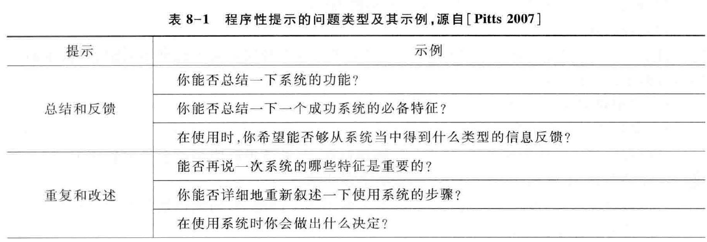
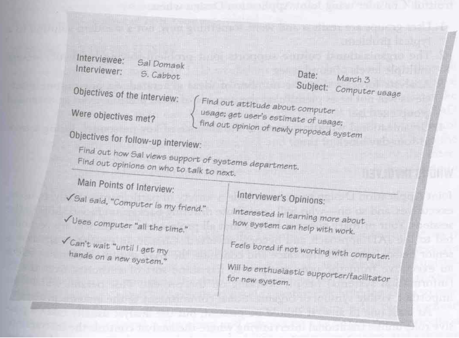

book8-面谈
---

# 1. 需求获取概述
1. 困难
   1. 用户背景/立场不同
   2. 缺乏概括综合能力
   3. 有**认知困难**
   4. 越俎代庖
   5. 缺乏参与(大多/不愿/抵制/无明确用户)
2. 要点
   1. 范围内的**内容**
   2. (不同系统)多方向的**来源**
   3. 应对由明确到不确定内容的**方法**
   4. 不稳定、含探索、防遗漏、判断结束的过程，完成从笔录到文档之后得到的结果。

# 2. 面谈中的问题
1. 面对面的会见(face-to-face meeting)被认为是**最具丰富内容**的交流方法
2. 面谈是在实践当中应用最为广泛的需求获取方法之一 
3. 可以获得的信息内容包括 
   1. **事实和问题**
   2. 被会见者的**观点** 
   3. 被会见者的**感受** 
   4. 组织和个人的目标
4. 形成面谈报告后，去形成具体的用户需求

# 3. 面谈的过程

## 3.1. 第一步：准备面谈
> 面谈的准备过程是很重要的。

1. 阅读**背景资料**
   1. 注重**权威性**与**第一手资料**：
      1. 图书馆、官网
      2. 上市报表(注意权威性)
      3. 花钱购买上市公司的五百股(一般可能会成为中小股东，可以获取更多的信息)
      4. 论文引用的注意，抉择是选择引用原文还是引用其引文
   2. 同时展开**手机与分析**，多做分类、坐标、时间趋势
   3. 事无巨细的调查三家最感兴趣的**企业**
      1. 1家公司比较偏颇
      2. 2家公司比较对立
      3. 3家公司才有多样性
   4. 通过互联网一定能够获得任意一个领域的业务流程、相关专家、知识获取途径
2. 确定面谈**主题和目标**
3. 选择**被会见者**
4. 通知被会见者：**用电话或邮件等正式的途径**
5. **确定问题和类型**

### 3.1.1. 面谈准备的关键：问题类型
1. 准备问题不仅仅是要清楚**面谈的内容**，更要清楚**提问题的方法**
2. 问题类型
   1. 开放式问题(Open-Ended / Closed)
   2. 封闭式问题
   3. 程序性提示
   4. 探究式问题
   5. 诱导式问题
   6. 元问题

#### 3.1.1.1. 开放式问题
1. 被会见者对答复的选择可以是开放和不受限制的。
2. 问题的答案可能包含两个词，也可能是两段话。
3. 在希望得到丰富(具有一定深度和广度)信息时，开放式问题比较合适，一般可以用在前面的面谈中。

##### 3.1.1.1.1. 开放式问题示例
1. 你觉得把所有的经理都置于一个内联网内怎么样？
2. 请解释你是如何做进度决策的？
3. 对公司中企业对企业电子商务的当前状态有何看法？

##### 3.1.1.1.2. 优点
1. 让被会见者感到自在
2. 会见者可以收集被会见者使用的词汇，这能反应他的教育、价值标准、态度和信念
3. 提供丰富的细节
4. 对没采用的进一步的提问有启迪作用
5. 让被会见者更感兴趣
6. 容许更多的自发性
7. 会见者可以在没有太多准备的情况下进行面谈

##### 3.1.1.1.3. 缺点
1. 提问此类问题可能会产生太多不相干的细节
2. 面谈可能失控
3. 开放式的回答会花费大量的时间才能获得有用的信息量
4. 可能会使会见者看上去没有准备

#### 3.1.1.2. 封闭式问题
1. 答案有基本的形式，被会见者的回答是受限的 

##### 3.1.1.2.1. 封闭式问题示例
1. 项目存储库每个星期更新多少次？
2. 电话中心一个月平均收到多少个电话？
3. 下列信息中哪个对你最有用
   1. 填好的客户投诉单
   2. 访问web站点的客户的电子邮件投诉
   3. 与客户面对面的交流
   4. 退回的货物。
4. 列出头两项需要优先考虑的改善技术基础设施的事项。

##### 3.1.1.2.2. 优点
1. 节省时间
2. 切中要点
3. 保持对面谈的控制
4. 快速探讨大范围问题
5. 得到贴切的数据

##### 3.1.1.2.3. 缺点
1. 使得被会见者厌烦
2. 得不到丰富的细节
3. 出于上述原因，失去主要思想
4. 不能建立和面谈者的友好关系

#### 3.1.1.3. 探究式问题
1. 为什么？
2. 你能举个例子吗？
3. 你能详细描述一下？

#### 3.1.1.4. 诱导式问题(不好的问题)
1. 你和其他经理一样，都同意把财产管理计算机化，是吗？

#### 3.1.1.5. 双筒问题(n筒问题，不好的问题)
1. 每天你通常会做什么决策，你怎样做的？
2. 如上的问题是很多个问题的组合，n * m个回答，会导致回答比较混乱。

#### 3.1.1.6. 元问题
1. 我的问题看起来相关吗？
2. 你的回答正式吗？
3. 你是回答这些问题的最佳人选吗？
4. 我问了太多的问题吗？
5. 我还应该见什么人？ 

### 3.1.2. 程序性提示

### 3.1.3. 注意事项
1. 前期
   1. 开放式问题为主
   2. 决策层与专家为主，保证快速收敛
   3. 遵循：问题->目标->解决方案路线
      1. 问题、目标
      2. 目标、任务(流程任务)
   4. 分析基本的涉众特点
      1. 角色、任务、个人目标、频率、优先级
2. 后期
   1. 封闭式问题为主
   2. 抓住主题与线索
      1. 例如，任务分解、流程图、界面示意…
   3. 问题针对性
      1. 任务分解关系
      2. 流程正确性、异常
      3. 界面中的行为、数据项
   4. 事先准备面谈记录材料
3. 前几个问题会有几个比较固定答案的问题，则可以调整面谈的走向。
4. 如果有提问者提问之后的内容，那么可以进行小规模研讨或告知提问者之后的内容中有，而不是不应答

### 3.1.4. 面谈的问题准备示例一
> 面谈对象：投资人、管理者

1. 目前的业务主要碰到了哪些问题？
2. 预计：销售效率低；积压、缺货、报废现象严重；成本较高；竞争力不足
3. 希望新系统能够帮助达成哪些目标？
4. 预计：提高销售效率；减少积压、缺货、报废现象；降低成本；提高竞争力；提升销售额，如果存在销售效率问题
5. 销售工作是怎样进行的？
6. 哪些人会参与销售过程？
7. 哪些人的哪些工作是最为瓶颈的？

### 3.1.5. 面谈的问题准备示例二
> 面谈对象销售人员

1. 销售人员的主要工作是什么？
2. 预计：销售处理、退货处理
3. 销售处理的主要过程是怎样的？
4. 销售处理工作目前的困难有哪些？
5. 销售处理的频率怎么样？
6. 平均多长时间完成一次销售处理？

### 3.1.6. 面谈的问题准备示例三
1. 用例/场景描述
   1. 收银员输入会员编号；
   2. 系统显示会员信息；
   3. 收银员输入商品；
   4. 系统显示输入商品的信息；
   5. 系统显示所有已输入商品的信息；
   收银员重复3-5步，直至完成所有输入
   1. 收银员结束商品输入；
   2. 系统显示总价和赠品信息；
   3. 收银员请求顾客付款；
   4. 顾客支付，收银员输入支付数额；
   5. 系统显示应找零数额，收银员找零；
   6. 收银员结束销售；
   7. 系统更新数据，并打印收据。
2. 问题：
   1. 会员编号的格式是怎样的？
   2. 需要显示的会员信息有哪些？
   3. 商品是怎样输入的？
   4. 需要显示的商品信息有哪些？
   5. 系统应该怎样显示已输入商品的信息？
   6. 总价是怎样计算的？
   7. 需要显示的赠品信息有哪些？
   8. 收据的格式是怎样的？
   9. 有可能不输入会员编号吗？
   10. 有可能不输入商品吗？
   11. 有可能不结束销售吗？
   12. 付款时有其他非现金方式吗？
   13. 必须打印收据吗？

### 3.1.7. 例子：金城战役

### 3.1.8. 面谈背后的要点：取得共情与目标的平衡
1. 共情：
   1. 取得信任
   2. 激发主动性
   3. 获得更全面的问题域背景(主观)和业务意向(个人)
   4. 客户洞察：功能-认知-情感：面谈可以作为反向的客户洞察。
2. 目标：
   1. 充分、正确地获取用户需求
   2. 在项目前景和范围指号下充分获取用户需求与问题域知识
   3. 利用开放式问题，探元式问题和程序性提示增强覆盖范围
   4. 利用封团式问题确认细节
   5. 主动控制面读过程
3. 电影：在云端

### 3.1.9. 面谈分析示例
1. 背景：在电商的竞争压力下，实体书店越来越难以生存，为此某实体书店计划进行转型，从单纯卖书转为阅读、会友、休闲、购书为一体的书吧，书吧仍将以图书为中心，但不再以卖书为盈利手段，而是以服务作为主要盈利手段，书只是服务的一个切入点。
2. 假设你需要为该书店开发一个相应的管理系统，你如何设计和店长的第一次面谈？
   1. 可以从利润入手进行分析
   2. 可以从理想入手进行分析，为什么会转化到服务
3. 背景：一个二手货物的交易平台中的交易功能，预计其交易流程与一般电商的交易流程相似，请你设计一个与交易平台顾客的面谈问题清单
4. 背景：一个财务系统要实现费用报销功能，你得到了之前用户使用的单据，请依此设计与财务人员的面谈问题清单

## 3.2. 第二步：主持面谈
1. 开始：建立一个理想的氛围和环境来促进会见者和被会见者之间的交流和沟通 
2. 主体：通过提问和倾听来完成和被会见者的信息交流，按照计划控制面谈的进行，并在必要时进行适当的调整 
3. 结束：表示感谢并回答被会见者提出的问题，保持与被会见者的亲善和信任关系 

### 3.2.1. 面谈开始前注意事项
1. 记得和被会见者联系并确认面谈的安排
2. 着装正式
3. 不要迟到
4. 表现出来你已经准备好参加面谈了

### 3.2.2. 面谈开始阶段
1. 开场**仪式**：握手
2. 简要**重申**面谈的目标
3. 准备好笔记本、录音机或者其他记录设备 
4. 用一些**非常一般的、轻松的、开放式**的问题作为开始

### 3.2.3. 面谈主题阶段
1. 保持**有礼貌的倾听**：遵循交流模式
2. 控制**面谈过程**：主动打破交流模式
3. 保持**面谈主题**：以面谈问题为主线索
4. 使用**探究式问题 **
5. 观察被会见者：在一个人的全部感觉中，只有7％是通过口头(语言)交流的，38％是通过语调交流的，55％是通过面部表情和肢体语言交流的
6. 使用**道具支持**

### 3.2.4. 面谈结束阶段
1. 面谈应该在**45分钟到1小时**内结束，并非要在提出所有关心的问题后才能结束面谈，相反，结束面谈应该比开始面谈更自然
2. 总结谈话的**要点**，如果有记录笔记的话可以请被会见者进行快速的检查，确保记录下了面谈的所有重要信息
3. **感谢被会见者**，并且给时间让他们询问一些他们自己关心的问题
4. 握手话别

## 3.3. 第三步：处理面谈结果
1. **复查**面谈记录：整理出内容要点，进行分类 
2. **总结**面谈信息
3. **评估**面谈中所得到的信息
4. **完成**面谈报告 

## 3.4. 面谈报告
1. 应该尽快的复查面谈记录，总结面谈信息，完成面谈报告

# 4. 面谈的类型：是否能够有效控制
1. **结构化面谈**：安全按照事先的问题和结构来控制面谈 
2. **半结构化面谈**：事先需要根据面谈内容准备面谈的问题和面谈结构，但在面谈过程当中，会见者可以根据实际情况采取一些灵活的策略 
3. **非结构化面谈**：
   1. 没有事先预定的议程安排 
   2. 甚至会在没有太多事前准备的情况下就直接到访被会见者的工作地，就某个主题开展会谈 
   3. 会见者和被会见者谈话的主题可能非常广泛，而且每个主题都不会非常深入 
   4. 也可能在非结构面谈中仅就某个特殊的主题进行深入的讨论

# 5. 面谈的优点
1. 面谈的开展条件较为简单，经济成本较低
2. 能获得包括事实、问题、被会见者观点、被会见者态度和被会见者信仰等各种信息类型在内的广泛内容
3. 通过面谈，需求工程师可以和涉众(尤其是用户)建立相互之间的友好关系
4. 通过参与面谈，被会见者会产生一种主动为项目做出贡献的感觉，提高涉众的项目参与热情

# 6. 面谈的缺点和局限性
1. 面谈比较耗时，时间成本较高
2. 在被会见者地理分散的情况下往往难以实现面谈
3. 面谈参与者的记忆和交流能力对结果影响较大，尤其是面谈的成功较高的依赖于需求工程师的人际交流能力
4. 交谈当中常见的概念结构不同、模糊化表述、默认知识、潜在知识和态度偏见等各种问题在面谈中都不可避免，进而影响面谈的效果，导致产生不充分的、不相关的或者错误的数据
5. 在会见者不了解被会见者认知结构的情况下，面谈不可能取得令人满意的效果

# 7. 相关方法

## 7.1. 群体面谈
1. 群体面谈的方法是将所有的涉众方集中起来，选择一个合适的地点，集中一段时间，召开一个多方共同参与的会议，一起进行需求的讨论、分析和获取。
2. 群体面谈的需求获取方法
   1. 联合应用程序设计JAD(Joint Application Development)
   2. 需求专题讨论会(Requirement Workshop)
   3. 需求中心小组(Requirement Focus Group)
   4. 联合需求规划JRP(Joint Requirements Planning)
3. 优点：节约时间，有着更低的时间成本。
4. 缺点：主持群体面谈比主持一对一面谈要困难的多。
5. 计划面谈
   1. 确定参与人员：涉众、主持人、负责人、分析人员、记录人员、观察员
   2. 安排会谈时间
      1. 全职的2-4天参与会议
      2. 拟定一份议程
   3. 选择会谈地点：充足的空间，道具支持，良好的餐饮服务 
   4. 准备会谈内容：面谈的主题和范围，会议的议程，需求的预期和会谈的目标，各种材料 
6. 主持面谈
   1. 建立基本规则
      1. 按时开始和结束会议；
      2. 中途休息(例如午餐)后要尽快进入状态；
      3. 一次只讨论一个主题；
      4. 期望每个人都为会议做出自己的贡献；
      5. 要关注于问题，不要有人身批评和攻击；
      6. 限制发言时间，不要个人把持会议。 
   2. 保持会议的气氛
   3. 确保每个人都积极地参与讨论
   4. 控制会议的主题
7. 分析结果

## 7.2. 调查问卷
1. 面谈方法以口头语言为主要的交流媒介，而调查问卷以文档为主要的交流媒介 
2. 适用调查问卷的情况
   1. 系统的涉众在地理上是分布的；
   2. 系统的涉众数量众多，而且了解所有涉众的统计倾向是非常重要的；
   3. 需要进行一项探索性的研究，并希望在确定具体方向之前了解当前的总体状况；
   4. 为后续的面谈标识问题和主题，建立一个开展工作的基础框架。
3. 调查问卷也是面谈
   1. 适用于面谈的基本要求
   2. 基于选择题的开放式问题域与基于主观题的封闭性问题
   3. 留意内容导向
4. 但是调查问卷最后才会是主观题，在前几个题是比较简单的(以上都不选、都对这种来让你沉浸进来)

## 7.3. 头脑风暴
1. 它的目的不是发现需求，而是发明需求，或者说是发现潜在需求
2. 它鼓励参与者在无约束的环境下进行某些问题的自由思考和自由讨论，以产生新的想法 
3. 适用情况
   1. 发明并描述以前不存在的全新的业务功能 
   2. 明确模糊的业务 
   3. 在信息不充分的情况做出决策 
4. 包括两个阶段
   1. 想法产生阶段
   2. 想法精减阶段

### 7.3.1. 想法产生阶段
1. 目的是产生出尽可能多的新的想法 
2. 基本规则
   1. 充分发挥想像力，不要有任何的羁绊；
   2. 产生尽可能多的想法，想法重在数量而不是质量，不要顾及想法是否荒诞；
   3. 自由讨论，目的是产生新的想法，不要争吵和批评；
   4. 在自由讨论当中，可以转换和组合所有已提出的想法，以产生新的想法 
3. 通常持续1个小时左右，特殊情况下持续2～3个小时 

### 7.3.2. 想法精减阶段
1. 第一步是去除那些不值得进一步讨论的想法 
2. 第二步是把类似的意见进行归类 
3. 第三步是主持人遍历每一个未被删除的想法，确保所有参与者都对其有共同的理解 
4. 利用投票或类似方法，评估现有想法的优先级 
5. 最后，根据评估的数据，从中筛选出符合一定标准的想法作为头脑风暴方法的成果 

## 7.4. 面谈可能勉励你的问题
1. 一是事先没有充分做好面谈的相关准备工作，没有带着问题去调研。在调研前，仅组织进行了半天的简单培训，并发了一份简单的调研计划和调研内容表，就要求开展调研，导致获取的需求不全面，不细致。
2. 二是没有征对不同的涉众对象，制定不同的面谈策略，更没有事先策划好问题组织的使用技巧，最终导致面谈效果不好。
   1. 总以为是在内部，一定能获得详细的需求。事实上，很多都是应付式的回答。
   2. 我们问：你对这个软件开发有什么希望和建议？大部分人的回答是没有建议或者建议“操作要简单”。
3. 三是在具体面谈过程中，没有注重面谈技巧。
   1. 造成了“上面要怎样”的现象，从而被动式应付，问什么就回答什么
   2. 无论回答问题还是填写问卷调查，不能充分表达出真实意图，导致在需求分析过程中出现很多模糊需求，从而影响了开发进度。

## 7.5. 思考题
1. 在重新浏览面谈日程的时候，你发现有几个问题看上去不合适。下面是准备问Sampson纸产品公司销售经理的原问题。这家公司想把它的一些销售信息放到Web上去，以便经理们可以交互地评论它，从而优化他们的销售方案。用更合适的方式，重新写下面的问题。
   1. 你的下属告诉我，你非常渴望有一台计算机。这是真的么？
   2. 我是这个领域的新手，我有没有忽略什么呢？
   3. 你在销售计算中最常用的信息资源是什么，使用频度如何？
   4. 其它销售经理认为，把一些月度销售商品放到Web上，然后做趋势分析，将会是一种主要改进，你同意他们的做法吗？
   5. 没有比你现在使用的陈旧的方法更好的销售方案吗？

# 8. 小结
1. 面谈是需求获取当中最为常用的手段，效果显著
2. 成功的面谈需要很多的面谈技巧
   1. 对问题类型和组织结构的掌握是其中最为重要的技巧
   2. 面谈的组织和进行当中也要注意很多事项
3. 按照完整的过程执行面谈可以更好的保证面谈的效果
4. 经过长期的实践，面谈发展出了多种不同的形式和类似的需求获取方法
   1. 三种类型的面谈
   2. 群体面谈、调查问卷和头脑风暴
