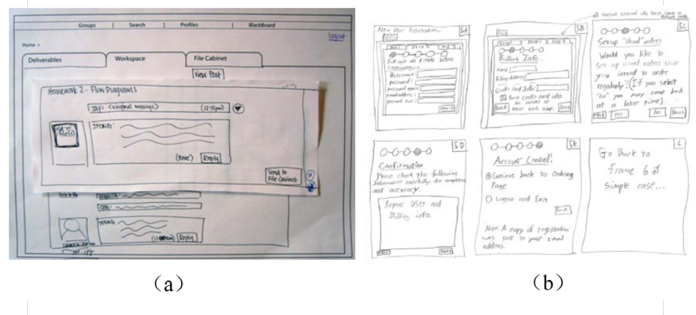
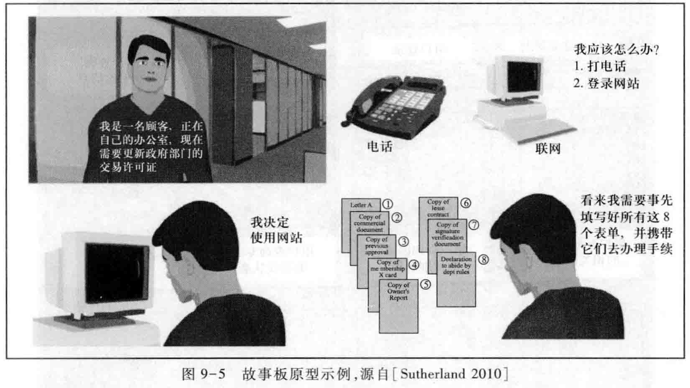

Book9-原型
---

# 1. 课程回顾
1. 需求获取的后半段：基于场景/用例，结合获取手段，展开需求获取
2. 获取手段之面谈：从用户处获得明确的要求
   1. 准备：背景资料，主题目标，选择通知对象，确定问题和类型
   2. 问题类型：开放，封闭，程序性提示，探究，诱导，双筒，元问题
      1. 问题准备：问题-目标-特征，角色-任务，开放-封闭
   3. 主持：开始，主体，结束（礼貌，倾听，握手，控制，探究，观察，道具）
      1. 能够获得：事实和问题，对象的观点和感受，组织和个人的目标
   4. 整理面谈报告，（半/非）结构化面谈
   5. 优缺点：条件简单，内容丰富，建立友谊，主动参与=>耗时，地理分散难实现，记忆与交流能力要求高，数据有偏差
   6. 相关手段：群体面谈，调查问卷，头脑风暴

# 2. 原型以及原型法

## 2.1. 什么是原型
1. “原型是一个系统，它内化了（capture）一个更迟系统（later system）的本质特征。原型系统通常被构造为不完整的系统，以在将来进行改进、补充或者替代。” 
2. 如果在最终的物件（final artifact）产生之前，一个中间物件（mediate artifact）被用来在一定广度和深度范围内表现这个最终物件，那么这个中间物件就被认为是最终物件在该广度和深度上的原型。
3. 包括书面描绘、场景叙述、情节串联图板、幻灯演示、动画模拟、屏幕快照和程序代码等在内的各种被用来探索和论证软件系统功能的物件都是软件的原型 
4. 原型为涉众提供了一些真实的东西，或者至少提供了具有真实外观的东西。 原型使产品具有足够的真实性，可以使利益相关者提出否则可能会遗漏的要求。

## 2.2. 为什么要使用原型
1. 不确定性
   1. 因为对未来知识有限，而无法确定某种决策的结果
2. 不确定性是广泛存在的
   1. 科学的目的是限定、解释不确定性，不是将不确定性转换为确定性
   2. 人们厌恶不确定性：不确定性意味着不完全可控
3. 软件工程中存在着大量的不确定性，原型、迭代和（方法）验证是人们解决不确定性的主要手段
4. 软件工程中的不确定性
   1. 需求的不确定性
   2. 需求原型、迭代需求、需求分析技术
   3. 设计的不确定性（设计约束与设计决策）
   4. 设计原型（体系结构原型）、迭代设计、设计技术
   5. 构造的不确定性（编译错误与运行表现）
   6. 算法原型、调试、程序语言
   7. 测试的不确定性（缺陷分布）
   8. 测试环境、测试技术
   9. 管理的不确定性（时间、成本、风险…）
   10. 管理技术

## 2.3. 软件工程中的原型
1. 演示原型（presentation prototype）
   1. 主要被用在启动项目阶段 
   2. 目的是让用户相信应用系统的开发是可行的 
2. 严格意义上的原型（prototype proper）
   1. 主要被用在分析需求阶段 
   2. 用来阐明用户界面或者系统功能的某些特定方面 
3. 试验原型（breadboard prototype） 
   1. 主要被用在构建系统阶段 
   2. 帮助开发者澄清他们所面对的一些和系统构建相关的技术问题 
4. 引示系统原型（pilot system prototype） 
   1. 会被开发在系统开发的各个阶段 
   2. 用作最终系统的构建核心 

## 2.4. 为什么要利用原型：需求工程
1. 帮助需求工程师及早解决需求的不确定性：
   1. 产品的用户对相关类别的产品没有经验，产品的细节需求存在着不确定性；
   2. 用户在完成工作的方式上仍然存在障碍，产品在整体方案的可行性上存在着不确定性；
   3. 用户在清晰说明他们的需求方面存在困难，这些相关的需求是有着不确定性的需求；
   4. 需求工程师在理解用户的需求上存在困难，在澄清和理解之前，这些需求存在着不确定性；
   5. 需求的可行性值得怀疑，即具体需求的可满足性存在着不确定性。  
   6. 创新性产品，它们的基本需求是潜在的，有着很大的不确定性；

# 3. 使用原型法获取需求

## 3.1. 原型方法过程

## 3.2. 原型方法过程——确定原型需求
1. 界定不确定性
   1. 可能发生的需求变更；
   2. 存在冲突的地方；
   3. 信息不充分的地方。
2. 明确不确定的维度：外观（Look and Feel）、角色（Role）和实现（Implementation） 
   1. 外观是指用户对原型物件的具体感觉体验，即用户在使用原型物件时会看到什么、听到什么和感觉到什么 
   2. 角色是指原型物件在用户工作中的价值，也就是说它为什么是对用户有用的。 
   3. 原型物件到底能够帮助用户完成什么样的工作 
   4. 实现是指原型物件完成功能的细节技术和方法 

## 3.3. 原型方法过程——原型开发 
1. 将探索不确定功能需求的原型构建得易于修改
2. 让探索可行性的原型收集充分的数据
3. 控制开发成本

## 3.4. 原型方法过程——原型评估 
1. 需要获取的评估者反馈
   1. 评估者反应
   2. 评估者建议
   3. 创新思想
2. 可以创建一些脚本来指导评估者的体验活动 
3. 务必要让合适的人从恰当的角度来评估原型 
4. 观察评估人员使用原型的过程 
5. 创造一个无偏见的环境，让评估人员畅所欲言 

## 3.5. 原型方法过程——原型修正
1. 一方面要依据评估人员的反馈
2. 另一方面也要考虑事先的原型调整计划 
3. **原型一定要开发的容易修改！**

# 4. 原型法的使用要点
1. 坚决抛弃抛弃式原型
2. 控制原型成本
3. 善用故事板原型
4. 控制原型法风险

## 4.1. 抛弃式原型与演化式原型
1. 探索式（exploratory） 
   1. 以缺陷需求开始继而不断调整和修正需求的原型开发方式称为探索式 
   2. 要尽可能的调整各种设计选项 
2. 实验式（experimental） 
   1. 以清晰的用户需求和模糊的实现方法、实现效果、可行性开始，明确需求的可行性和技术实现方案 
   2. 定义一个对原型的评估方法，确定评估的属性 
3. 演化式（evolutionary） 
   1. 以清晰的原型化需求和项目积累下来的原型资产为开始
   2. 原型化的需求，也有项目积累下来的原型资产 
4. 探索式和实验式方法产生的原型产品又被称为抛弃式原型 
   1. 花费最小的代价，争取最快的速度 
   2. 可能会使用简易的开发工具和不成熟的构造技术 
   3. 可能会忽略或简化处理原型目的不相关的功能特征 
   4. 要坚决的抛弃
5. 演化式原型方法产生的原型产品被称为演化式原型（evolutionary prototype） 
   1. 质量要从一开始就能达到最终系统的要求 
   2. 要易于进行扩展和频繁改进，因此开发者必须重视演化式原型的设计 
   3. 仅应该被用于处理清晰的需求、规格说明和技术方案
6. 因为基于不确定的需求基础，所以抛弃式原型难免反复修改，导致代码质量较低，应该坚决抛弃
7. 抛弃式原型的贡献不在于它的代码，而是它所包含的内容，它说明了正确的需求和正确的技术方案，如果认识不到这一点，他们就只能得到低质量的代码，而丢失真正宝贵的内容

## 4.2. 控制原型开发成本
1. 控制抛弃式原型的成本：不要过于详细地构建抛弃式原型，只要它能够满足原型制作的目标就足够了。要抵制住诱惑，也要顶住用户的压力，不要向抛弃式原型添加更多的功能。[Wiegers2003]

### 4.2.1. 控制水平原型开发成本
1. 水平原型方法（horizontal prototyping）
   1. 它仅仅实现选定功能所有层次中的某些特定层次 
   2. 建立的原型产品称为水平原型（horizontal prototype） 
   3. 要把注意力集中在概括性需求和工作流问题上 
2. 垂直原型方法（vertical prototyping）
   1. 它会触及到选定功能实现的所有层次
   2. 建立的原型产品称为垂直原型（vertical prototype） 
   3. 要保证真实实现它的各种功能 
3. 用尽可能低的成本开发水平原型

### 4.2.2. 抛弃式原型：“鲲鹏起兮―大型运输机运20研制纪实”
1. 一天，唐长红去结构所，进门前看到设计员小李站在那里望着大楼发呆，嘴里还念念有词，关切地问：“小李，哪儿不舒服？”小李笑了笑：“**我负责的那条长桁，尽管设定了尺寸，但在电脑上怎么也体会不出它有多大，我出来找找感觉。**”唐长红心里“咯噔”了一下：**缺乏感性认识，设计师开始怀疑自己了**，缺乏自信绝对不是什么好现象。
2. 所谓**物理样机**，是**根据设计方案**制作出一个**与真实飞机完全相同的大模型**，**让人直观了解未来飞机的样子**。在数字化技术没有广泛应用之前，物理样机是飞机研制中的一个重要环节，在设计方案通过评审后，先搞一个物理样机，然后再转入工程研制阶段。
3. 使用数字化手段在**计算机上建立一个与物理样机功能相当的数字化模型**，**这个模型具有和真飞机一样的真实度**。我国首架虚拟样机就是由一飞院建立的耿汝光通过深入调查，**觉得搞物理样机实有必要，貌似耽误了一些时间，但可以大大降低风险**

## 4.3. 善用故事板原型

### 4.3.1. 原型的表现

### 4.3.2. 故事板原型
1. 故事板最早是好莱坞在设计电影场景和卡通故事时使用的，卡通制作者通过勾画出一系列相连的图片来展示一个卡通故事，具有更直观、可视化的故事叙述能力
2. 将原来分散的功能与步骤组织成故事，让普通人能够更好地体验与评估
3. 原型和用例/场景通常结合使用[Mannio2001]：为需要探索和澄清的用例/场景建立故事板原型，或者依据故事板原型的评估结果建立清晰、明确的用例/场景描述

### 4.3.3. 故事版原型构建
1. 明确故事板原型要素
   1. 角色（Who）；
   2. 内容（What）；
   3. 方法（How）。
2. 建不同类型的故事板原型
   1. 被动（Passive）故事板原型 - 连环画
   2. 主动（Active）故事板原型 – 漫画
   3. 交互（Interactive）故事板原型 – 网页

## 4.4. 控制原型法风险
1. 原型开发工作投入太多的工作，使得开发团队消耗了过多的时间和过大的成本 
2. 涉众看到了一个正在运行的原型，得出产品几乎已经完成的结论，从而提出快速交付产品的不当要求：不要将原型的功能开发的太好，以免用户提出“交付”的要求
3. 用户可能会被原型所表现出来的非功能特性遮蔽了眼睛，从而忽略了他们更应该重视的功能特性 
4. 在澄清需求不确定性的同时也可能会掩盖一些用户的假设，这些假设将会无从发现 

# 5. 总结
1. 原型是软件开发当中消除不确定性风险的有效工具，是一种有效的需求获取方法
2. 原型的体系是复杂的，不同类型的原型具有不同的作用和创建要求，实践当中应该综合考虑各种应用因素选择合适的类别
3. 一个完整的原型方法过程可以帮助更有效的应用原型方法
4. 原型方法的应用可能会给项目带来相应的风险，需要妥善的加以解决

# 6. 实例分析
1. 在开发过程中，因都是平时工作中接触的业务范围，因此开发时以为满足了功能需要，实现了软件预定的管理和统计功能，那么开发就是成功的
2. 其结果是，在软件测试阶段，各等级的用户都反映出相对一致的意见。其中，反映最多的就是系统维护和操作太复杂，甚至经常报告说服务器和软件不稳定，不匹配。经认真调研，发现问题虽然有一点，但绝非基层报告的那么严重，软件应该是可以满足日常工作的。
3. 结果：2003年，我处信息化还没有普及，尤其是基层领导，个别甚至是电脑盲。而我们的软件，为提高使用效率，设置了大量的快捷键操作方式，这让个别领导感觉难以接受。后来，我们对软件的操作界面和菜单进行了优化和简化，而用单选框选择代替了审批。通过一系列的修改和完善，反对该软件的人渐渐少了。
4. 在系统上线后，首先表达不满的是申请接水及变更业务的用户。我们发现，由于柜面人员需要向系统中录入申请信息并且扫描、上传部分重要文件，这延长了柜面办理业务的时间，造成用户业务申请的等待时间增长。
5. 我们在涉众识别的时候，遗漏那些不使用系统（非参与者）但是被影响的人，——在本项目中就是直接到柜面申请接水及变更业务的人。然而接水及变更业务的申请人是自来水公司的客户，非常重要。
6. 系统上线后，一线用户普遍向我们反映系统操作的风格不符合他们的习惯，使用起来不方便，造成他们操作效率很低。
7. 经过了解分析，我们发现：在对外服务平台项目之前，自来水公司内部开发人员开发了一套简单的对外服务管理系统。虽然该系统非常简单，功能有限，但是该系统已经使用了相当长的一段时间，用户已经习惯了该系统的操作风格。然而我们直接判断该系统是落后的，功能不健全的，我们要作一个全新的系统，所以没有过多的关注该系统
8. 当业务流程进入到与施工方相关的任务时，流程多半停滞下来，但现实中的因为仍在继续办理。经过了解，我们得知：由于系统中要求施工方填写的部分信息属于机密信息，但系统中并未对这些内容作保密处理。
9. 在系统上线前，我们需要将用户收集积累的水表信息导入到系统中。在导入时，我们发现用户提供的水表号信息有大量的重复现象。而在系统设计时，水表号是主键。这是一个非常严重的问题。

# 7. 场景/用例模型使用的注意事项<Top Ten Ways Project Teams Misuse Use Cases>
1. 不要打扰任何其他需求表示。
   1. 简而言之，使用多个视图将为您提供更丰富的上下文来满足用户需求
   2. 用例不包括其他模型中发现的详细信息，例如数据属性和业务规则
2. 让读者了解您的用例目标。
   1. 用例旨在模拟Actor与您的软件的交互。
   2. 人类行为者不与系统交互以对数据库中的行进行CRUD。他们不考虑行和数据库。
   3. 相反，Actor是根据更高级别的目标来考虑的，例如找出给予特定客户的折扣；这些目标反过来又为业务目标服务。
3. 对用例的范围不明确。
   1. 用例范围的错误通常有两种：
      1. 用例未解决单个Actor目标，
      2. 或用例不在您项目的范围之内，并且永远不应该首先进行详细说明。
4. 在用例文本中包括非功能性要求和用户界面详细信息。
   1. 团队在用例中常犯的一个错误是合并非功能性需求，例如响应时间和吞吐量信息，以及用户界面或原型详细信息，例如小部件操纵以及对窗口，按钮和图标的引用。
   2. 您应该将该信息与相关用例相关联。
5. 使用大量扩展，并将其包含在初始用例图中。
   1. 尽管具有包含和扩展语义的用例图可能对某些复杂的用例有用，但花时间指定用例文本，可视化用例内部和用例之间的关系以及使用多个需求模型会更有效率。
6. 不必担心定义业务规则。
   1. 严重的误解：业务规则应该是用例的核心，并提供用例描述的过程背后的控制，推理，指导和决策。
   2. 如果您未明确定义和分隔业务规则，则几乎肯定会导致它们错误，遗漏或难以更改。
7. 不要让主题专家参与创建，审查或验证用例。
   1. 直接最终用户，业务主题专家，客户
   2. 最终用户至少应通过用例演练来验证需求
8. 如果让用户完全涉及用例定义，则只需“执行”即可。
   1. 用户要求不是凭空产生的。
      1. 业务目标，逆向工程，客户投诉和变更请求清单……
   2. 在将用户聚集在一起之前，您需要起草一些需求模型，即使它们是错误的或不完整的。
9. 撰写详细的第一个也是唯一的用例草稿。

10. 不要验证或验证您的用例。

