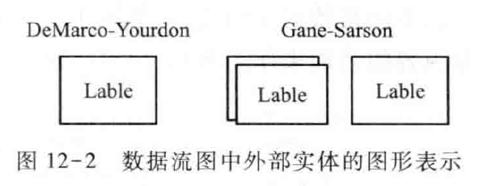
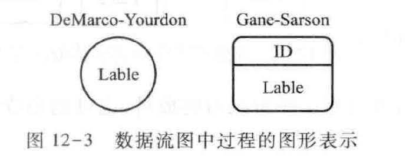
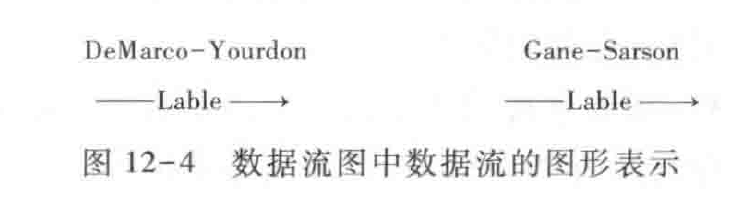
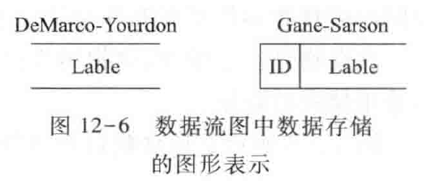
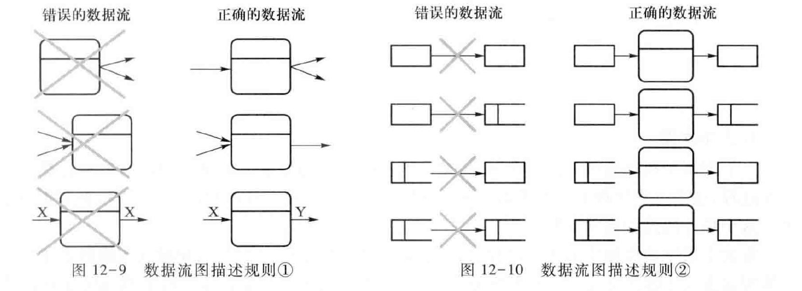
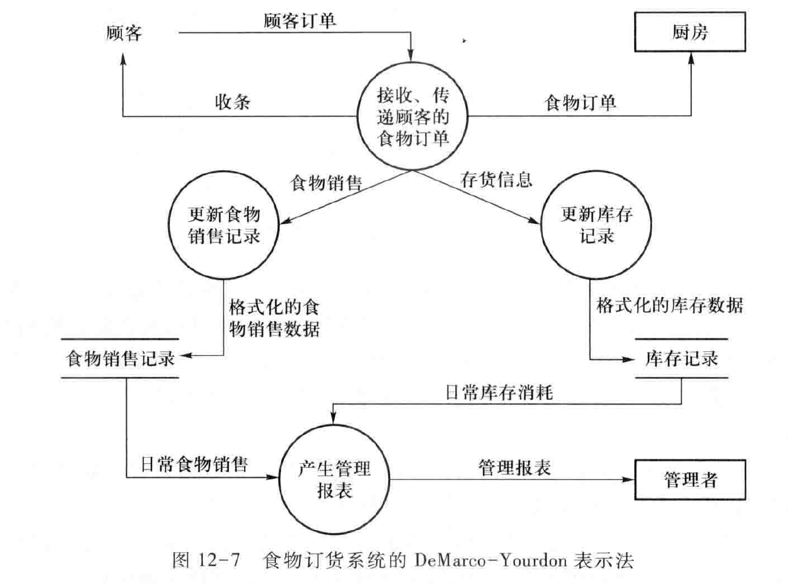
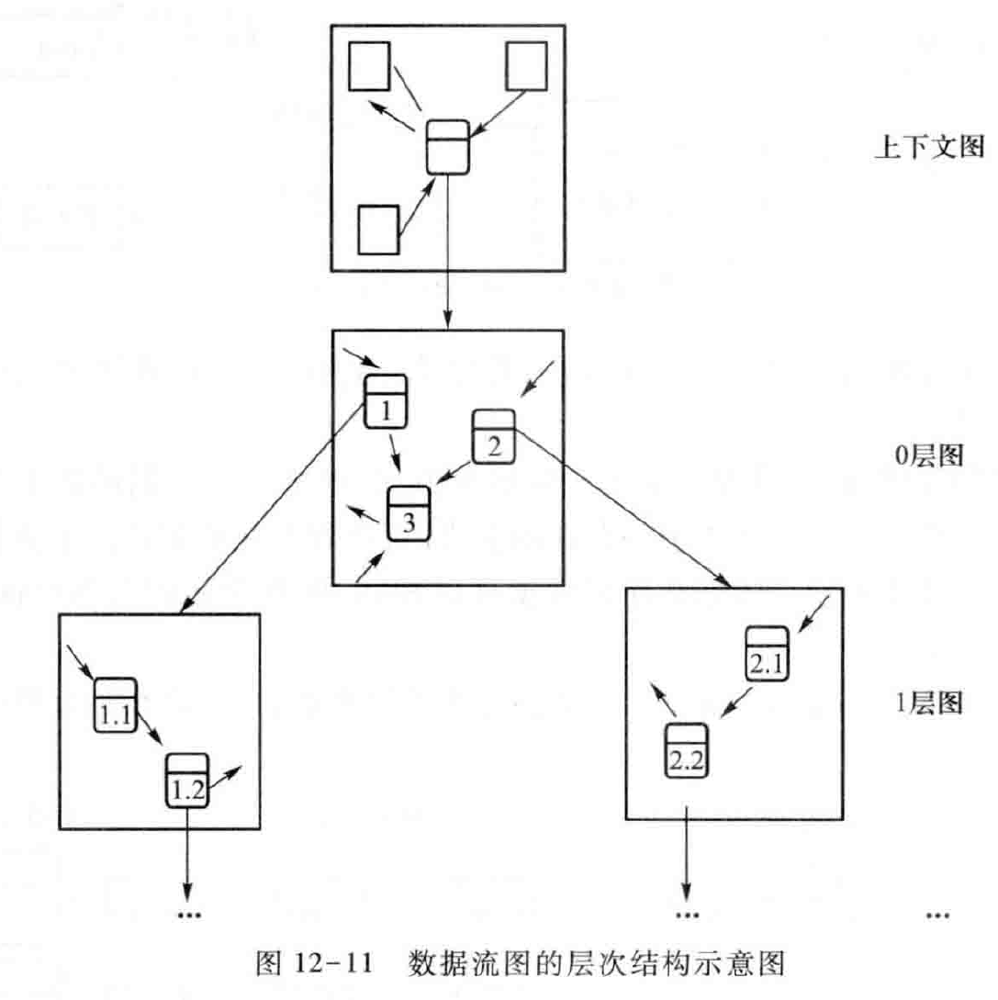
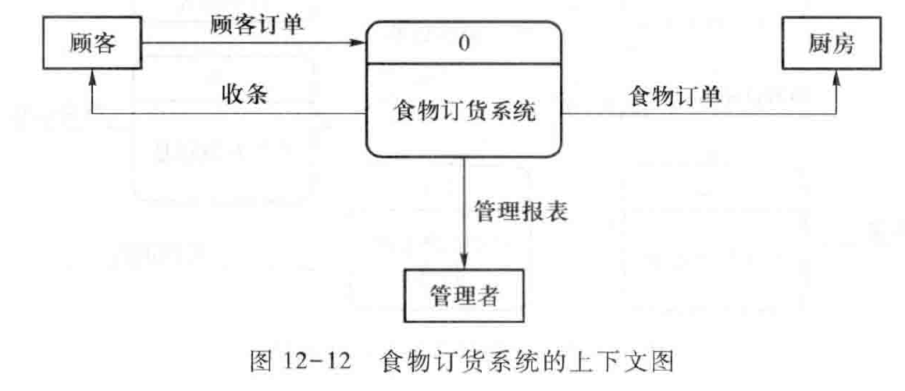
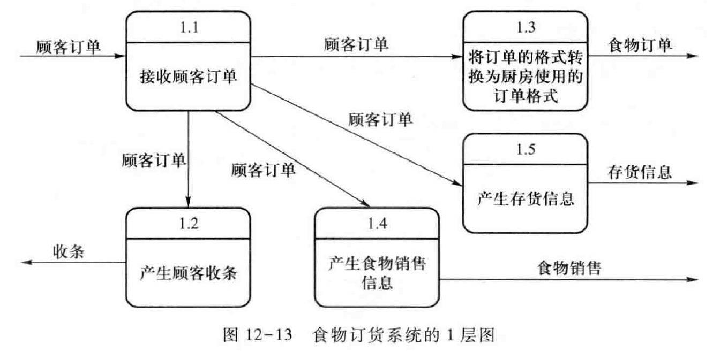

Book12-面向过程建模
---

# 1. 课程回顾

## 1.1. 过程建模：世界是复杂过程的集合
1. 过程建模是分析需求获取活动获得的信息，发现系统的功能以及和外界的交互，建立能够实现系统功能的过程分解模型，形成系统的过程模型。
2. 复杂过程逐步分解为小过程，并建立过程之间的联系

### 1.1.1. 数据流图
1. DFD图基本元素
   1. 外部实体：待构建系统之外的人、组织、设备或其他软件系统，不受系统的控制，联合构成外部上下文环境
   2. 过程：施加于数据的动作或行为，被转换、被存储或被分布
   3. 数据流：数据的运动，是系统与其环境之间或者系统内两个过程之间的通信形式，可以完成数据流合并和组合
   4. 数据存储：软件系统内部的收集和保存

|  |  |
| ---------------------- | ---------------------- |
|  |  |

2. 规则
   1. 过程是对数据的处理，必须有输入，也必须有输出，而且输入数据集和输出数据集应该存在差异
   2. 数据流必须和过程关联
   3. 唯一标识(过程动词，数据和实体名词)

### 1.1.2. 上下文图

1. (用例图)转换为上下文图
2. 上下文图：数据流图最高层次的图

3. 0层图：
   1. 上下文图单一过程的描述
   2. 单一过程的第一次功能分解
   3. 系统的功能概图
4. N层图：
   1. 更细节的分解，父图与子图
   2. 低于0层图的子图一般不显示外部实体
   3. 平衡、分解停止条件：原始过程和数据

4. 微规格说明：伪码、决策表/树
5. 数据字典：名称、使用地点与方法、描述、格式
6. DFD的验证：语法、结构、语义
7. 模块结构图：功能分解图与过程依赖图

## 1.2. 数据建模-ERD图
1. 概念模型-逻辑模型-规范化逻辑模型
2. ERD：实体-属性-关系
3. ERD建模：简单情况-硬数据-复杂情况
4. 与DFD关系：功能/实体矩阵